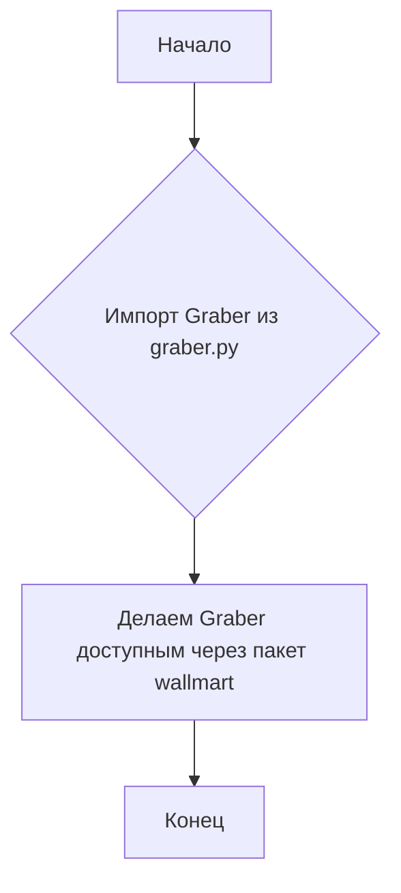

## Анализ кода `hypotez/src/suppliers/wallmart/__init__.py`

### 1. <алгоритм>

Файл `__init__.py` в пакете `src.suppliers.wallmart` содержит импорт класса `Graber` из модуля `graber.py`. Этот файл служит точкой входа в пакет `wallmart`, делая класс `Graber` доступным для использования вне пакета.

**Блок-схема:**



### 2. <mermaid>

```mermaid
flowchart TD
    A[Начало] --> B{Импорт Graber из graber.py};
    B --> C[Делаем Graber доступным через пакет wallmart];
    C --> D[Конец];
    
    subgraph graber.py
    G[Graber класс <br> (сбор данных)]
    end
    
    B --> G
```

**Объяснение зависимостей:**

- Импортируется класс `Graber` из модуля `graber.py` в текущем пакете. Это позволяет использовать функциональность класса `Graber` через интерфейс пакета `wallmart`.

### 3. <объяснение>

#### Импорты:

- `from .graber import Graber`: Импортирует класс `Graber` из модуля `graber.py`, расположенного в той же директории. Это позволяет использовать класс `Graber` для работы с данными Wallmart.

#### Классы:

- `Graber`: Класс, отвечающий за сбор данных с сайта Wallmart. Подробная информация о его атрибутах и методах находится в файле `graber.py`.

#### Функции:

- В данном файле функции отсутствуют, но класс `Graber` содержит методы для сбора и обработки данных.

#### Переменные:

- В данном файле переменные отсутствуют.

**Потенциальные улучшения и области для рассмотрения:**

- Можно добавить дополнительную документацию для пакета `wallmart` в `__init__.py`, чтобы объяснить его назначение и предоставить примеры использования.
- Рассмотрение возможности добавления других классов или функций, связанных с Wallmart, в этот пакет для расширения функциональности.