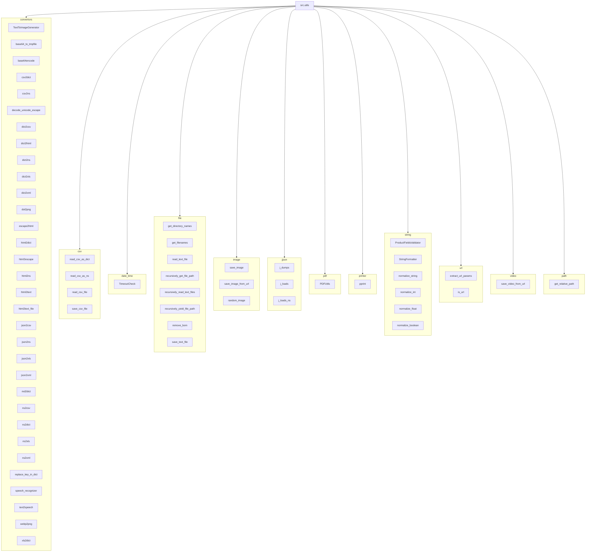

## Проект `hypotez`
# Роль `code explainer`
## ИНСТРУКЦИЯ  :

Анализируй предоставленный код подробно и объясни его функциональность. Ответ должен включать три раздела:  

1. **<алгоритм>**: Опиши рабочий процесс в виде пошаговой блок-схемы, включая примеры для каждого логического блока, и проиллюстрируй поток данных между функциями, классами или методами.  
2. **<mermaid>**: Напиши код для диаграммы в формате `mermaid`, проанализируй и объясни все зависимости, 
    которые импортируются при создании диаграммы. 
    **ВАЖНО!** Убедитесь, что все имена переменных, используемые в диаграмме `mermaid`, 
    имеют осмысленные и описательные имена. Имена переменных вроде `A`, `B`, `C`, и т.д., не допускаются!  
    
    **Дополнительно**: Если в коде есть импорт `import header`, добавьте блок `mermaid` flowchart, объясняющий `header.py`:\
    ```mermaid\
    flowchart TD\
        Start --> Header[<code>header.py</code><br> Determine Project Root]\
    \
        Header --> import[Import Global Settings: <br><code>from src import gs</code>] \
    ```

3. **<объяснение>**: Предоставь подробные объяснения:  
   - **Импорты**: Их назначение и взаимосвязь с другими пакетами `src.`.  
   - **Классы**: Их роль, атрибуты, методы и взаимодействие с другими компонентами проекта.  
   - **Функции**: Их аргументы, возвращаемые значения, назначение и примеры.  
   - **Переменные**: Их типы и использование.  
   - Выдели потенциальные ошибки или области для улучшения.  

Дополнительно, постройте цепочку взаимосвязей с другими частями проекта (если применимо).  

Это обеспечивает всесторонний и структурированный анализ кода.
## Формат ответа: `.md` (markdown)


## Твое поведение при анализе кода:
- всегда смотри системную инструкцию для обработки кода проекта `hypotez`;
- анализируй расположение файла в проекте. Это поможет понять его назначение и взаимосвязь с другими файлами. Расположение файла ты найдешь в самой превой строке кода, начинающейся с `## \\file /...`;
- запоминай предоставленный код и анализируй его связь с другими частями проекта `hypotez`;

**КОНЕЦ ИНСТРУКЦИИ**
```

## Анализ кода `hypotez/src/utils/__init__.py`

### 1. <алгоритм>

Этот файл (`__init__.py`) в директории `src/utils` служит для организации иерархии модулей и пакетов в Python. Он собирает в себе импорты из различных подмодулей (таких как `convertors`, `csv`, `date_time`, `file`, `image`, `jjson`, `pdf`, `printer`, `string`, `url`, `video`, `path`) и делает их доступными для использования через единый модуль `src.utils`.

**Блок-схема:**


**Примеры для каждого логического блока:**

- **Импорт из `.convertors`**:
  ```python
  from .convertors import csv2dict, json2xls
  # Пример использования:
  data = csv2dict('data.csv')  # Преобразование CSV файла в словарь
  ```

- **Импорт из `.csv`**:
  ```python
  from .csv import read_csv_as_dict, save_csv_file
  # Пример использования:
  csv_data = read_csv_as_dict('data.csv')  # Чтение CSV файла как словарь
  save_csv_file('output.csv', csv_data)  # Сохранение данных в CSV файл
  ```

- **Импорт из `.date_time`**:
  ```python
  from .date_time import TimeoutCheck
  # Пример использования:
  timeout = TimeoutCheck(timeout=10)  # Создание объекта для проверки таймаута в 10 секунд
  ```

- **Импорт из `.file`**:
  ```python
  from .file import read_text_file, save_text_file
  # Пример использования:
  content = read_text_file('file.txt')  # Чтение текстового файла
  save_text_file('output.txt', 'Hello, world!')  # Сохранение текста в файл
  ```

- **Импорт из `.image`**:
  ```python
  from .image import save_image
  # Пример использования:
  save_image('image.png', image_data)  # Сохранение изображения
  ```

- **Импорт из `.jjson`**:
  ```python
  from .jjson import j_loads, j_dumps
  # Пример использования:
  data = j_loads('data.json')  # Чтение JSON файла
  json_string = j_dumps(data)  # Преобразование данных в JSON строку
  ```

- **Импорт из `.pdf`**:
  ```python
  from .pdf import PDFUtils
  # Пример использования:
  pdf_util = PDFUtils()  # Инициализация утилит для работы с PDF
  ```

- **Импорт из `.printer`**:
  ```python
  from .printer import pprint
  # Пример использования:
  data = {'key': 'value'}
  pprint(data)  # Красивый вывод данных
  ```

- **Импорт из `.string`**:
  ```python
  from .string import normalize_string
  # Пример использования:
  normalized = normalize_string('  Hello World!  ')  # Нормализация строки
  ```

- **Импорт из `.url`**:
  ```python
  from .url import is_url
  # Пример использования:
  is_valid = is_url('https://example.com')  # Проверка, является ли строка URL
  ```

- **Импорт из `.video`**:
  ```python
  from .video import save_video_from_url
  # Пример использования:
  save_video_from_url('https://example.com/video.mp4', 'video.mp4')  # Сохранение видео с URL
  ```

- **Импорт из `.path`**:
  ```python
  from .path import get_relative_path
  # Пример использования:
  relative_path = get_relative_path('/path/to/file', '/path')  # Получение относительного пути
  ```

### 2. <mermaid>



**Объяснение зависимостей `mermaid`:**

Диаграмма `mermaid` показывает структуру модуля `src.utils` и его подмодулей. Каждый подмодуль (например, `convertors`, `csv`, `date_time` и т.д.) содержит набор функций или классов, которые предоставляют определенные утилиты.

- `src.utils`: Главный модуль, который агрегирует все подмодули.
- `convertors`: Содержит функции для преобразования данных из одного формата в другой (например, `csv2dict`, `json2xls`).
- `csv`: Включает функции для чтения и записи CSV файлов.
- `date_time`: Содержит утилиты для работы с датой и временем (например, `TimeoutCheck`).
- `file`: Предоставляет функции для работы с файлами и директориями (например, `read_text_file`, `save_text_file`).
- `image`: Включает функции для работы с изображениями (например, `save_image`).
- `jjson`: Содержит функции для работы с JSON (например, `j_loads`, `j_dumps`).
- `pdf`: Включает утилиты для работы с PDF файлами (например, `PDFUtils`).
- `printer`: Содержит функции для форматированного вывода данных (например, `pprint`).
- `string`: Предоставляет функции для работы со строками (например, `normalize_string`).
- `url`: Включает функции для работы с URL (например, `is_url`).
- `video`: Содержит функции для работы с видео (например, `save_video_from_url`).
- `path`: Включает функции для работы с путями к файлам (например, `get_relative_path`).

### 3. <объяснение>

**Импорты**:

- Импорты в этом файле служат для агрегации различных утилитных функций и классов, расположенных в подмодулях директории `src.utils`. Это позволяет пользователям импортировать все необходимые утилиты из одного места (`from src.utils import ...`), вместо того чтобы импортировать их из каждого подмодуля отдельно.

**Классы**:

- `TextToImageGenerator` (из `.convertors`): Класс для генерации изображений из текста.
- `TimeoutCheck` (из `.date_time`): Класс для проверки таймаутов.
- `PDFUtils` (из `.pdf`): Класс, предоставляющий утилиты для работы с PDF файлами.
- `ProductFieldsValidator` (из `.string`): Класс для валидации полей продукта.
- `StringFormatter` (из `.string`): Класс для форматирования строк.

**Функции**:

- Множество функций для конвертации данных (например, `csv2dict`, `json2xls`, `dict2xml`).
- Функции для работы с файлами (`read_text_file`, `save_text_file`, `get_filenames`).
- Функции для работы с изображениями (`save_image`, `save_image_from_url`).
- Функции для работы с JSON (`j_loads`, `j_dumps`, `j_loads_ns`).
- Функции для работы со строками (`normalize_string`, `normalize_int`, `normalize_float`, `normalize_boolean`).
- Функции для работы с URL (`is_url`, `extract_url_params`).
- Функции для работы с видео (`save_video_from_url`).
- Функции для работы с путями (`get_relative_path`).

**Переменные**:

- В данном файле переменные не используются, так как он служит для агрегации импортов.

**Потенциальные ошибки и области для улучшения**:

- Большое количество импортируемых функций может привести к увеличению времени загрузки модуля `src.utils`. Можно рассмотреть возможность использования ленивой загрузки или разделения модуля на более мелкие подмодули.
- Отсутствие явной документации для каждой функции в `__init__.py` может затруднить понимание их назначения. Рекомендуется добавить краткое описание каждой импортируемой функции.

**Взаимосвязи с другими частями проекта**:

- Модуль `src.utils` используется во многих частях проекта `hypotez` для выполнения различных задач, таких как преобразование данных, работа с файлами, обработка строк и т.д. Он предоставляет централизованный набор утилит, которые могут быть переиспользованы в разных модулях проекта.

Пример использования в другом модуле проекта:

```python
from src.utils import j_loads, normalize_string

def process_data(file_path: str) -> dict:
    """
    Загружает данные из JSON файла и нормализует строки.

    Args:
        file_path (str): Путь к JSON файлу.

    Returns:
        dict: Словарь с обработанными данными.
    """
    data = j_loads(file_path)
    for key, value in data.items():
        if isinstance(value, str):
            data[key] = normalize_string(value)
    return data