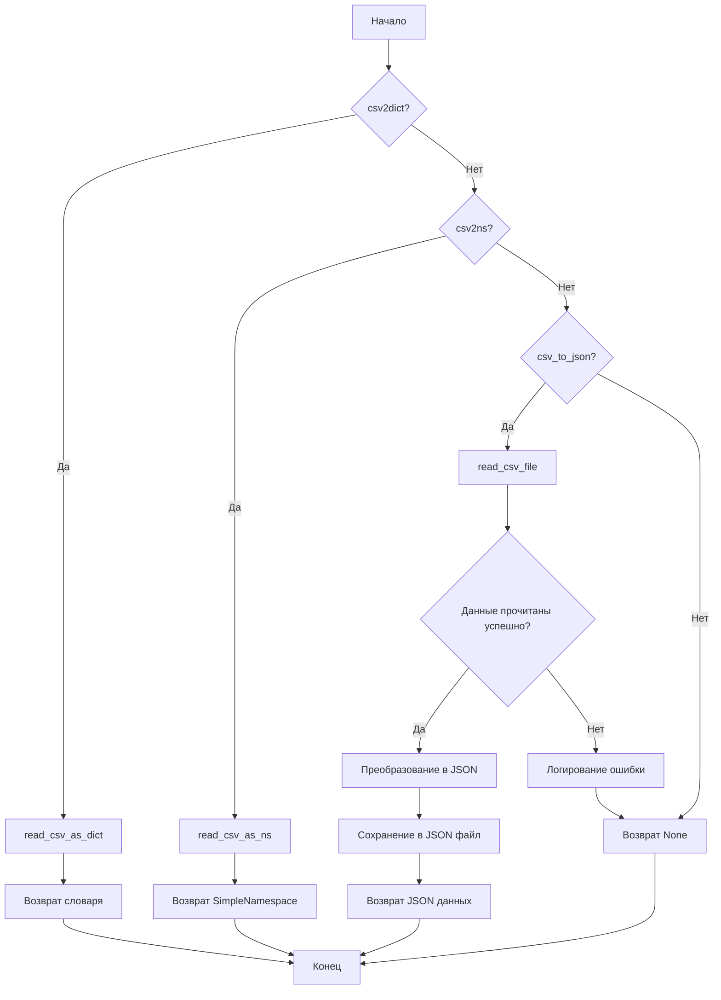

## Анализ кода `hypotez/src/utils/convertors/csv.py`

### 1. <алгоритм>

**Общий рабочий процесс:**

1.  **Чтение CSV файла:**
    *   Функции `csv2dict` и `csv2ns` используют вспомогательные функции `read_csv_as_dict` и `read_csv_as_ns` соответственно для чтения CSV файла.
    *   Функция `csv_to_json` использует `read_csv_file` для чтения CSV файла.
2.  **Преобразование данных:**
    *   `csv2dict` преобразует CSV данные в словарь.
        *   Пример: `CSV: name,age\nJohn,30` -> `Dict: {'name': 'John', 'age': '30'}`
    *   `csv2ns` преобразует CSV данные в объект `SimpleNamespace`.
        *   Пример: `CSV: name,age\nJohn,30` -> `SimpleNamespace: namespace(name='John', age='30')`
    *   `csv_to_json` преобразует CSV данные в JSON формат (список словарей).
        *   Пример: `CSV: name,age\nJohn,30` -> `JSON: [{'name': 'John', 'age': '30'}]`
3.  **Сохранение JSON (в `csv_to_json`):**
    *   Функция `csv_to_json` сохраняет преобразованные JSON данные в файл, указанный в `json_file_path`.
4.  **Логирование ошибок:**
    *   В случае возникновения исключений, ошибки логируются с использованием `logger.error`.

**Блок-схема:**



### 2. <mermaid>

```mermaid
flowchart TD
    A[csv2dict] --> B[read_csv_as_dict]
    C[csv2ns] --> D[read_csv_as_ns]
    E[csv_to_json] --> F[read_csv_file]
    F --> G{Данные прочитаны?}
    G -- Да --> H[json.dump]
    G -- Нет --> I[logger.error]
    H --> J[Сохранение JSON в файл]
    B --> K[Возврат dict]
    D --> L[Возврат SimpleNamespace]
    J --> M[Возврат List[Dict[str, str]]]
    I --> N[Возврат None]
    A --> K
    C --> L
    E --> F
```

**Зависимости:**

*   `csv2dict`: Зависит от `read_csv_as_dict` для чтения и преобразования CSV в словарь.
*   `csv2ns`: Зависит от `read_csv_as_ns` для чтения и преобразования CSV в `SimpleNamespace`.
*   `csv_to_json`: Зависит от `read_csv_file` для чтения CSV файла, `json.dump` для преобразования данных в JSON и сохранения в файл, а также от `logger.error` для логирования ошибок.

### 3. <объяснение>

#### Импорты:

*   `json`: Используется для работы с JSON данными, в частности для преобразования данных в JSON формат и сохранения в файл.
*   `csv`: Используется для работы с CSV файлами.
*   `pathlib.Path`: Используется для представления путей к файлам и директориям в виде объектов.
*   `typing.List`, `typing.Dict`: Используются для аннотации типов, указывая, что функция возвращает список словарей.
*   `types.SimpleNamespace`: Используется для создания объектов, атрибуты которых могут быть доступны через точку (например, `obj.name`).
*   `src.logger.logger.logger`: Используется для логирования ошибок и отладочной информации.
*   `src.utils.csv`: Содержит функции `read_csv_as_dict`, `read_csv_as_ns`, `save_csv_file`, `read_csv_file`, которые используются для чтения и сохранения CSV файлов в различных форматах.

#### Функции:

*   **`csv2dict(csv_file: str | Path, *args, **kwargs) -> dict | None`**:
    *   Аргументы:
        *   `csv_file` (str | Path): Путь к CSV файлу.
        *   `*args`: Произвольные позиционные аргументы, передаваемые в `read_csv_as_dict`.
        *   `**kwargs`: Произвольные именованные аргументы, передаваемые в `read_csv_as_dict`.
    *   Возвращает:
        *   `dict | None`: Словарь с данными из CSV файла или `None` в случае ошибки.
    *   Назначение:
        *   Преобразует CSV файл в словарь, используя функцию `read_csv_as_dict`.
    *   Пример:
        ```python
        data = csv2dict('data.csv')
        print(data)  # {'name': 'John', 'age': '30'}
        ```
*   **`csv2ns(csv_file: str | Path, *args, **kwargs) -> SimpleNamespace | None`**:
    *   Аргументы:
        *   `csv_file` (str | Path): Путь к CSV файлу.
        *   `*args`: Произвольные позиционные аргументы, передаваемые в `read_csv_as_ns`.
        *   `**kwargs`: Произвольные именованные аргументы, передаваемые в `read_csv_as_ns`.
    *   Возвращает:
        *   `SimpleNamespace | None`: Объект `SimpleNamespace` с данными из CSV файла или `None` в случае ошибки.
    *   Назначение:
        *   Преобразует CSV файл в объект `SimpleNamespace`, используя функцию `read_csv_as_ns`.
    *   Пример:
        ```python
        data = csv2ns('data.csv')
        print(data)  # namespace(name='John', age='30')
        ```
*   **`csv_to_json(csv_file_path: str | Path, json_file_path: str | Path, exc_info: bool = True) -> List[Dict[str, str]] | None`**:
    *   Аргументы:
        *   `csv_file_path` (str | Path): Путь к CSV файлу.
        *   `json_file_path` (str | Path): Путь к JSON файлу.
        *   `exc_info` (bool, optional): Флаг, указывающий, нужно ли включать информацию об исключении в лог. По умолчанию `True`.
    *   Возвращает:
        *   `List[Dict[str, str]] | None`: Список словарей с данными из CSV файла или `None` в случае ошибки.
    *   Назначение:
        *   Преобразует CSV файл в JSON формат и сохраняет его в файл, используя функции `read_csv_file` для чтения CSV и `json.dump` для записи JSON.
    *   Пример:
        ```python
        json_data = csv_to_json('data.csv', 'data.json')
        print(json_data)  # [{'name': 'John', 'age': '30'}]
        ```

#### Переменные:

*   `csv_file` (str | Path): Путь к CSV файлу.
*   `json_file_path` (str | Path): Путь к JSON файлу.
*   `data` (List[Dict[str, str]] | None): Данные, прочитанные из CSV файла и преобразованные в список словарей.
*   `exc_info` (bool): Флаг для логирования информации об исключениях.

#### Потенциальные ошибки и области для улучшения:

*   Обработка исключений: В функции `csv_to_json` обрабатывается общее исключение `Exception`. Было бы полезно обрабатывать более конкретные исключения, такие как `FileNotFoundError`, `csv.Error`, чтобы предоставлять более точные сообщения об ошибках.
*   Функции `csv2dict` и `csv2ns` просто вызывают другие функции. Можно рассмотреть вопрос об их объединении или удалении, если они не предоставляют дополнительной ценности.
*   Отсутствует обработка больших файлов: Если CSV файлы очень большие, чтение всего файла в память может привести к проблемам с производительностью. Рассмотрите возможность использования итераторов или генераторов для обработки больших файлов по частям.