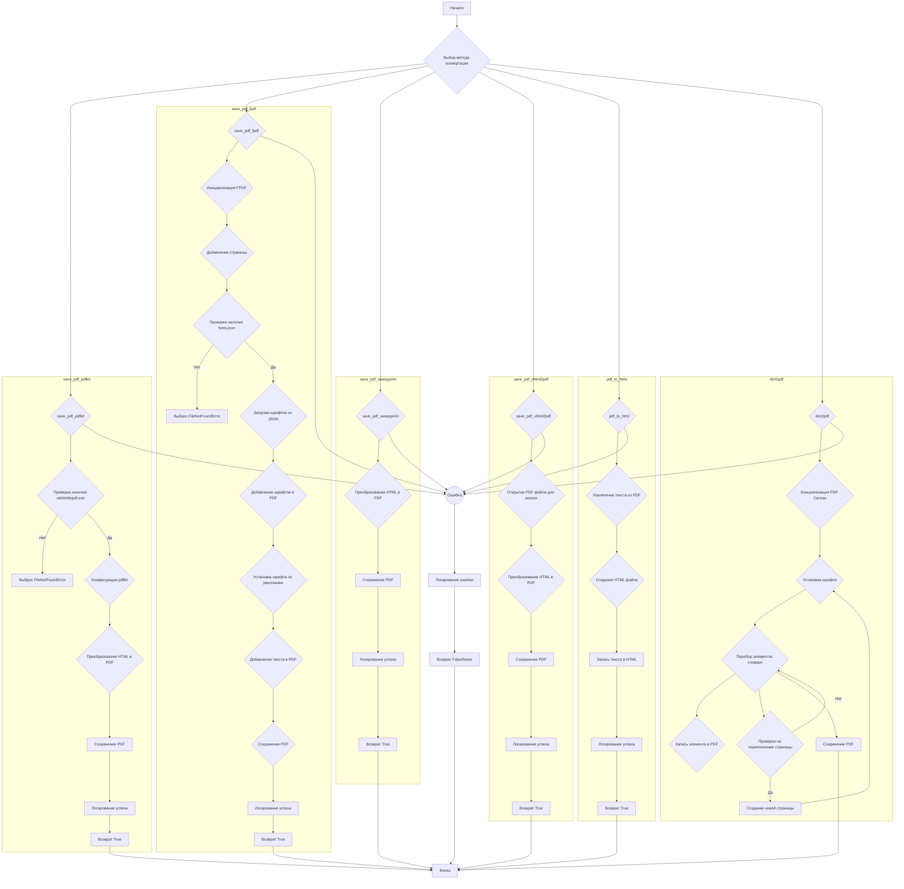
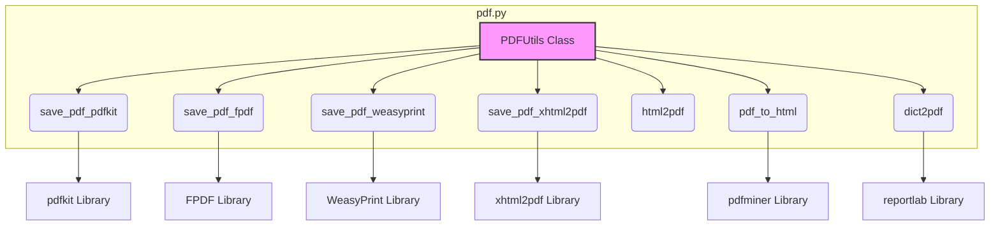
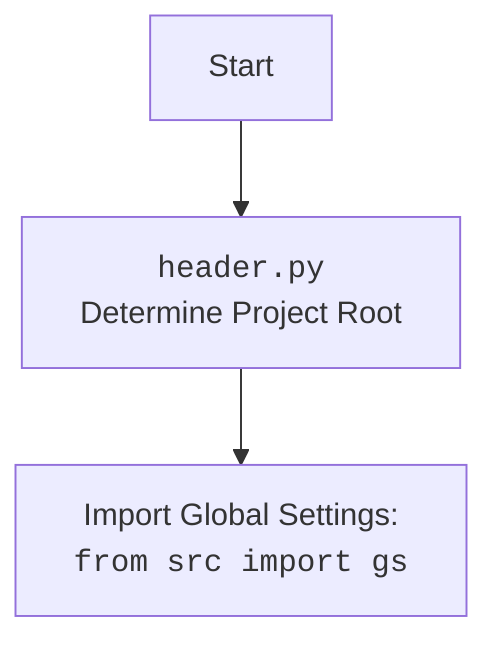

# Проект `hypotez`
# Роль `code explainer`
## АНАЛИЗ КОДА: `hypotez/src/utils/pdf.py`

### 1. <алгоритм>

#### Общее описание
Модуль `pdf.py` предоставляет инструменты для преобразования HTML-контента или файлов в PDF, используя различные библиотеки Python. Он включает методы для сохранения HTML в PDF с использованием `pdfkit`, `FPDF`, `WeasyPrint` и `xhtml2pdf`, а также метод для конвертации PDF в HTML. Также есть метод для сохранения данных из словаря в PDF.

#### Блок-схема



### 2. <mermaid>



#### Объяснение зависимостей:
- **`pdfkit`**: Используется в методе `save_pdf_pdfkit` для конвертации HTML в PDF с использованием `wkhtmltopdf`.
- **`FPDF`**: Используется в методе `save_pdf_fpdf` для создания PDF-файлов, позволяет добавлять текст и шрифты.
- **`WeasyPrint`**: Используется в методе `save_pdf_weasyprint` для преобразования HTML/CSS в PDF.
- **`xhtml2pdf`**: Используется в методе `save_pdf_xhtml2pdf` для конвертации HTML в PDF.
- **`pdfminer`**: Используется в методе `pdf_to_html` для извлечения текста из PDF-файлов.
-  **`reportlab`**: Используется в методе `dict2pdf` для создания PDF-файлов из данных словаря.



### 3. <объяснение>

#### Импорты:
- `sys`: Предоставляет доступ к некоторым переменным и функциям, взаимодействующим с Python runtime environment.
- `os`: Предоставляет функции для взаимодействия с операционной системой.
- `json`: Используется для работы с JSON-данными, например, для загрузки конфигурации шрифтов.
- `pathlib.Path`: Предоставляет способ представления путей к файлам и директориям.
- `typing.Any`: Используется для обозначения типа переменной, которая может быть любого типа.
- `pdfkit`: Библиотека для конвертации HTML в PDF с использованием wkhtmltopdf.
- `reportlab.pdfgen.canvas`: Используется для создания PDF-файлов и добавления текста и графики.
- `header`: Локальный модуль, предположительно, содержащий общие настройки и переменные проекта, включая корневой путь.
- `src.logger.logger`: Модуль для логирования сообщений.
- `src.utils.printer`: Модуль для форматированного вывода данных.

#### Классы:
- **`PDFUtils`**:
    - Предоставляет статические методы для сохранения HTML-контента в PDF с использованием различных библиотек.
    - Не имеет атрибутов экземпляра.

#### Функции:
- **`save_pdf_pdfkit(data: str | Path, pdf_file: str | Path) -> bool`**:
    - Конвертирует HTML-контент или HTML-файл в PDF с использованием библиотеки `pdfkit`.
    - `data`: HTML-контент (строка) или путь к HTML-файлу (Path).
    - `pdf_file`: Путь для сохранения PDF-файла.
    - Возвращает `True` в случае успеха, `False` в случае ошибки.
    - Использует `wkhtmltopdf.exe` для конвертации.
    - Пример использования:
        ```python
        html_content = "<html><body><h1>Hello</h1></body></html>"
        pdf_file = "output.pdf"
        PDFUtils.save_pdf_pdfkit(html_content, pdf_file)
        ```

- **`save_pdf_fpdf(data: str, pdf_file: str | Path) -> bool`**:
    - Конвертирует текст в PDF с использованием библиотеки `FPDF`.
    - `data`: Текст для сохранения в PDF.
    - `pdf_file`: Путь для сохранения PDF-файла.
    - Возвращает `True` в случае успеха, `False` в случае ошибки.
    - Загружает шрифты из `fonts.json` и добавляет их в PDF.
    - Пример использования:
        ```python
        text_data = "Hello, world!"
        pdf_file = "output_fpdf.pdf"
        PDFUtils.save_pdf_fpdf(text_data, pdf_file)
        ```

- **`save_pdf_weasyprint(data: str | Path, pdf_file: str | Path) -> bool`**:
    - Конвертирует HTML-контент или HTML-файл в PDF с использованием библиотеки `WeasyPrint`.
    - `data`: HTML-контент (строка) или путь к HTML-файлу (Path).
    - `pdf_file`: Путь для сохранения PDF-файла.
    - Возвращает `True` в случае успеха, `False` в случае ошибки.
    - Пример использования:
        ```python
        html_content = "<html><body><h1>Hello</h1></body></html>"
        pdf_file = "output_weasyprint.pdf"
        PDFUtils.save_pdf_weasyprint(html_content, pdf_file)
        ```

- **`save_pdf_xhtml2pdf(data: str | Path, pdf_file: str | Path) -> bool`**:
    - Конвертирует HTML-контент или HTML-файл в PDF с использованием библиотеки `xhtml2pdf`.
    - `data`: HTML-контент (строка) или путь к HTML-файлу (Path).
    - `pdf_file`: Путь для сохранения PDF-файла.
    - Возвращает `True` в случае успеха, `False` в случае ошибки.
    - Обеспечивает кодировку UTF-8 для корректной обработки текста.
    - Пример использования:
        ```python
        html_content = "<html><body><h1>Hello</h1></body></html>"
        pdf_file = "output_xhtml2pdf.pdf"
        PDFUtils.save_pdf_xhtml2pdf(html_content, pdf_file)
        ```
        
- **`html2pdf(html_str: str, pdf_file: str | Path) -> bool | None`**:
    - Конвертирует HTML-контент или HTML-файл в PDF с использованием библиотеки `WeasyPrint`.
    - `html_str`: HTML-контент (строка).
    - `pdf_file`: Путь для сохранения PDF-файла.
    - Возвращает `True` в случае успеха, `None` в случае ошибки.
        
- **`pdf_to_html(pdf_file: str | Path, html_file: str | Path) -> bool`**:
    - Конвертирует PDF-файл в HTML-файл.
    - `pdf_file`: Путь к PDF-файлу.
    - `html_file`: Путь для сохранения HTML-файла.
    - Возвращает `True` в случае успеха, `False` в случае ошибки.
    - Использует `pdfminer.high_level.extract_text` для извлечения текста из PDF.
    - Пример использования:
        ```python
        pdf_file = "input.pdf"
        html_file = "output.html"
        PDFUtils.pdf_to_html(pdf_file, html_file)
        ```

- **`dict2pdf(data: Any, file_path: str | Path) -> None`**:
    - Сохраняет данные из словаря в PDF-файл.
    - `data`: Словарь с данными.
    - `file_path`: Путь для сохранения PDF-файла.
    - Использует `reportlab.pdfgen.canvas` для создания PDF.
    - Поддерживает перенос на новую страницу, если данные не помещаются на текущей.
     - Пример использования:
        ```python
        data = {"name": "John", "age": 30}
        pdf_file = "data.pdf"
        PDFUtils.dict2pdf(data, pdf_file)
        ```

#### Переменные:
- `wkhtmltopdf_exe`: Путь к исполняемому файлу `wkhtmltopdf.exe`, необходимому для `pdfkit`.
- `fonts_file_path`: Путь к файлу `fonts.json`, содержащему информацию о шрифтах для `FPDF`.

#### Потенциальные ошибки и области для улучшения:
- **Обработка исключений**:
    - В методе `save_pdf_pdfkit` блок `except Exception as ex:` содержит `...`, что затрудняет отладку. Желательно конкретизировать обработку исключений или предоставить более информативное логирование.
    - Аналогичные проблемы с обработкой исключений есть в методах `save_pdf_fpdf`, `save_pdf_xhtml2pdf`.
- **Кодировка**:
    - В методе `save_pdf_xhtml2pdf` происходит преобразование кодировки в UTF-8, что может быть избыточным, если данные уже в UTF-8.
- **Пути к файлам**:
    - Пути к исполняемым файлам и файлам шрифтов жестко заданы, что может вызвать проблемы при переносе проекта на другую систему. Желательно использовать относительные пути или переменные окружения.
- **Логирование**:
    - В некоторых методах логирование недостаточно информативное. Желательно добавить больше контекстной информации в сообщения лога.
- **Общая структура**:
    - Рассмотреть возможность использования абстрактной фабрики или другого паттерна проектирования для выбора библиотеки конвертации PDF.

#### Взаимосвязи с другими частями проекта:
- **`header.py`**: Используется для определения корневого пути проекта (`__root__`), что позволяет находить необходимые файлы, такие как `wkhtmltopdf.exe` и `fonts.json`.
- **`src.logger.logger`**: Используется для логирования ошибок и информационных сообщений.
- **`src.utils.printer`**: Хотя и импортирован, но не используется в данном модуле. Возможно, остался от предыдущих версий кода.