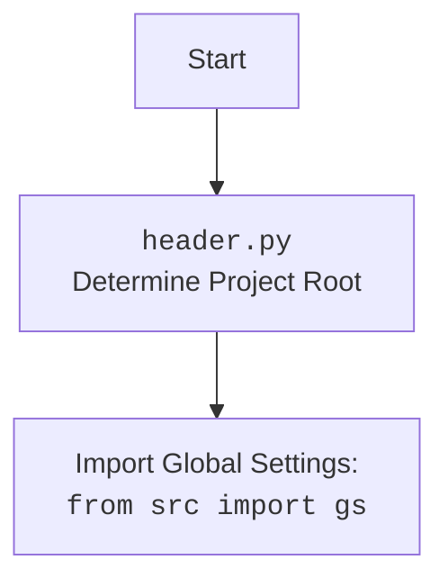

# Анализ кода `example_pprint.py`

## 1. <алгоритм>

### Блок-схема:

1.  **Начало**: Старт программы.
2.  **Импорт `header`**: Импортируется модуль `header`.

    *   Пример: `import header`
3.  **Импорт `pprint` из `pprint`**: Импортируется функция `pprint` из стандартной библиотеки `pprint` и переименовывается в `pretty_print`.

    *   Пример: `from pprint import pprint as pretty_print`
4.  **Импорт `pprint` из `src.printer`**: Импортируется функция `pprint` из модуля `src.printer`.

    *   Пример: `from src.printer import pprint`
5.  **Вызов `pprint`**: Вызывается функция `pprint` из модуля `src.printer` с аргументом `"Hello, world!"`.

    *   Пример: `pprint("Hello, world!")`
6.  **Конец**: Завершение программы.

### Поток данных:

1.  Импорт модуля `header`.
2.  Импорт и переименование функции `pprint` из стандартной библиотеки `pprint` в `pretty_print`.
3.  Импорт функции `pprint` из модуля `src.printer`.
4.  Вызов функции `pprint` из `src.printer` для вывода строки "Hello, world!".

## 2. <mermaid>

```mermaid
flowchart TD
    Start --> Header[<code>header.py</code><br> Determine Project Root]

    Header --> import_gs[Import Global Settings: <br><code>from src import gs</code>]
    Start --> Import_pprint[Import pretty_print from pprint]
    Start --> Import_src_pprint[Import pprint from src.printer]
    Import_src_pprint --> Call_pprint[Call pprint("Hello, world!")]
    classDef import fill:#f9f,stroke:#333,stroke-width:2px;
    classDef call fill:#ccf,stroke:#333,stroke-width:2px;
    class Header,Import_pprint,Import_src_pprint import;
    class Call_pprint call;
```

### Объяснение зависимостей:

*   **`header`**: Предположительно, модуль `header` выполняет какие-то предварительные настройки или определяет корневую директорию проекта.
*   **`pprint` (из стандартной библиотеки)**: Используется для красивого вывода данных. Импортируется и переименовывается в `pretty_print`, но в дальнейшем не используется.
*   **`src.printer.pprint`**: Функция `pprint` из пользовательского модуля `src.printer`, вероятно, предоставляет специализированную реализацию для красивого вывода, адаптированную под нужды проекта.

Дополнительный блок `mermaid` для `header.py`:



## 3. <объяснение>

### Импорты:

*   `import header`: Предположительно, модуль `header` выполняет какие-то предварительные настройки или определяет корневую директорию проекта. Этот модуль важен для инициализации среды выполнения скрипта.
*   `from pprint import pprint as pretty_print`: Импортирует функцию `pprint` из стандартной библиотеки `pprint` и переименовывает ее в `pretty_print`. Стандартная библиотека `pprint` предоставляет инструменты для красивого и структурированного вывода данных, что может быть полезно при отладке и логировании.
*   `from src.printer import pprint`: Импортирует функцию `pprint` из модуля `src.printer`. Это пользовательская реализация функции `pprint`, которая, вероятно, адаптирована под нужды проекта.  Этот модуль может содержать специфические настройки форматирования или логики вывода, необходимые для корректной работы в контексте `hypotez`.

### Функции:

*   `pprint("Hello, world!")`: Вызывает функцию `pprint` из модуля `src.printer` для вывода строки "Hello, world!". Это основная операция, демонстрирующая использование пользовательской функции `pprint`.

### Переменные:

В данном коде нет явно определенных переменных, кроме импортированных функций.

### Потенциальные ошибки и области для улучшения:

*   Импорт `pprint as pretty_print` не используется.  Этот импорт можно удалить, чтобы избежать путаницы и уменьшить количество неиспользуемого кода.
*   Отсутствует обработка ошибок.  В реальном приложении следует добавить обработку исключений, чтобы обеспечить стабильность и информативность при возникновении проблем.
*   Отсутствует описание модуля.  Добавление docstring в начале файла с описанием назначения модуля и его основных функций улучшит понимание кода.
*   Непонятно назначение `header`.  Нужно изучить модуль `header` и добавить описание его функциональности.

### Взаимосвязи с другими частями проекта:

*   `src.printer`:  Модуль `src.printer` предоставляет специализированную реализацию функции `pprint`, которая может использоваться во всем проекте для обеспечения единообразного и информативного вывода данных.
*   `header`:  Модуль `header` (судя по названию) выполняет инициализацию проекта.