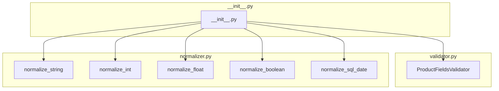

### **Анализ кода `hypotez/src/utils/string/__init__.py`**

#### **1. <алгоритм>**:

Файл `__init__.py` в пакете `src.utils.string` предназначен для организации и упрощения доступа к модулям, входящим в этот пакет. Он выполняет роль точки входа, позволяя импортировать нужные классы и функции из пакета напрямую.

1.  **Импорт модулей**:
    *   Импортируется класс `ProductFieldsValidator` из модуля `validator`.
    *   Импортируются функции нормализации (`normalize_string`, `normalize_int`, `normalize_float`, `normalize_boolean`, `normalize_sql_date`) из модуля `normalizer`.
2.  **Экспорт**:
    *   Все импортированные сущности становятся доступными для импорта из пакета `src.utils.string`.

#### **2. <mermaid>**:

*   `ProductFieldsValidator` класс для валидации полей продукта.
*   `normalize_string`, `normalize_int`, `normalize_float`, `normalize_boolean`, `normalize_sql_date` - функции для приведения данных к определенному типу или формату.
*   `__init__.py` - файл инициализации, который импортирует и делает доступными вышеуказанные компоненты пакета.

#### **3. <объяснение>**:

*   **Импорты**:
    *   `from .validator import ProductFieldsValidator`: Импортирует класс `ProductFieldsValidator` из модуля `validator`, находящегося в той же директории. Этот класс, вероятно, используется для проверки корректности данных, связанных с продуктами.
    *   `from .normalizer import (...)`: Импортирует набор функций для нормализации различных типов данных из модуля `normalizer`. Эти функции преобразуют входные данные к определенному формату (строка, целое число, число с плавающей точкой, булево значение, дата в формате SQL).

*   **Классы**:
    *   `ProductFieldsValidator`: Предназначен для валидации полей, связанных с продуктами. Он может содержать методы для проверки типов данных, форматов и других ограничений.

*   **Функции**:
    *   `normalize_string(value)`: Функция нормализации строковых данных. Может включать обрезку пробелов, приведение к нижнему регистру или другие преобразования.
    *   `normalize_int(value)`: Функция нормализации целочисленных данных.
    *   `normalize_float(value)`: Функция нормализации чисел с плавающей точкой.
    *   `normalize_boolean(value)`: Функция нормализации булевых данных.
    *   `normalize_sql_date(value)`: Функция нормализации даты в формат, подходящий для SQL.

*   **Переменные**:
    *   В данном файле переменные не определены.

**Взаимосвязи с другими частями проекта**:

Этот модуль предоставляет инструменты для обработки и валидации данных. Он может использоваться в других частях проекта, где требуется проверка и нормализация данных, например, при обработке данных из базы данных, API или пользовательского ввода.