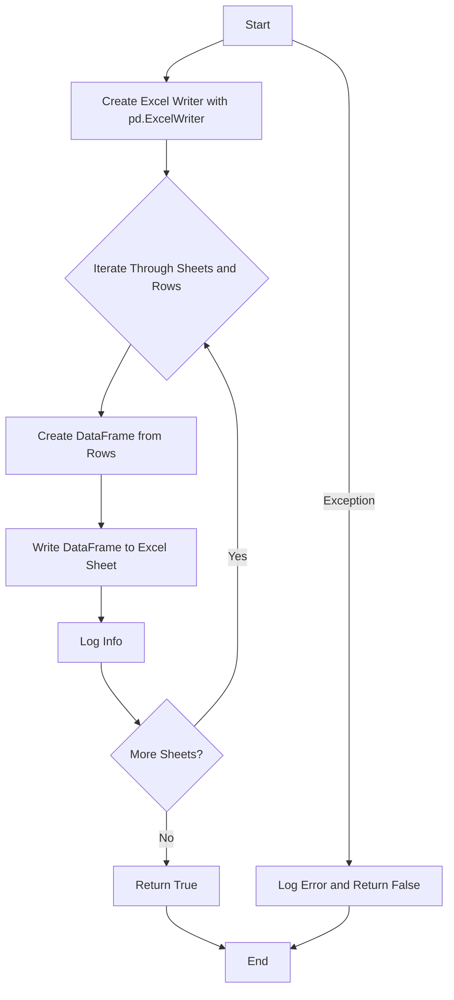

# Проект `hypotez`
# Роль `code explainer`
## АНАЛИЗ КОДА: `src/utils/xls.py`

### 1. <алгоритм>

**`read_xls_as_dict`**:

1.  **Начало**: Функция `read_xls_as_dict` принимает путь к Excel-файлу (`xls_file`), опциональный путь для сохранения JSON (`json_file`) и имя листа (`sheet_name`).
2.  **Проверка файла**: Проверяет, существует ли файл по указанному пути. Если файл не найден, записывает сообщение об ошибке в лог и возвращает `False`.

    ```python
    xls_file_path = Path(xls_file)
    if not xls_file_path.exists():
        logging.error(f"Excel file not found: {xls_file}")
        return False
    ```
3.  **Чтение Excel-файла**: Использует `pd.ExcelFile` для открытия Excel-файла.

    ```python
    xls = pd.ExcelFile(xls_file)
    ```
4.  **Обработка листов**:
    *   Если `sheet_name` не указано, перебирает все листы в Excel-файле.

        ```python
        if sheet_name is None:
            data_dict = {}
            for sheet in xls.sheet_names:
                ...
        ```
    *   Для каждого листа читает данные с помощью `pd.read_excel` и преобразует их в словарь с ориентацией записей (`orient='records'`).

        ```python
        df = pd.read_excel(xls, sheet_name=sheet)
        data_dict[sheet] = df.to_dict(orient='records')
        ```
    *   Если `sheet_name` указано, читает данные только с указанного листа.

        ```python
        else:
            df = pd.read_excel(xls, sheet_name=sheet_name)
            data_dict = df.to_dict(orient='records')
        ```
5.  **Сохранение в JSON (опционально)**: Если указан `json_file`, сохраняет полученные данные в JSON-файл с отступами и кодировкой UTF-8.

    ```python
    if json_file:
        with open(json_file, 'w', encoding='utf-8') as f:
            json.dump(data_dict, f, ensure_ascii=False, indent=4)
            logging.info(f"JSON data saved to {json_file}")
    ```
6.  **Возврат данных**: Возвращает словарь с данными из Excel-файла.
7.  **Обработка ошибок**: В случае возникновения ошибок при чтении файла или обработке листов, записывает сообщение об ошибке в лог и возвращает `False`.

**`save_xls_file`**:

1.  **Начало**: Функция `save_xls_file` принимает словарь с данными (`data`) и путь для сохранения Excel-файла (`file_path`).
2.  **Создание Excel-файла**: Использует `pd.ExcelWriter` для создания Excel-файла с использованием движка `xlsxwriter`.

    ```python
    with pd.ExcelWriter(file_path, engine='xlsxwriter') as writer:
        ...
    ```
3.  **Запись данных по листам**: Перебирает листы в словаре `data`.

    ```python
    for sheet_name, rows in data.items():
        ...
    ```
4.  **Создание DataFrame**: Для каждого листа создает DataFrame из списка строк.

    ```python
    df = pd.DataFrame(rows)
    ```
5.  **Запись DataFrame в Excel**: Записывает DataFrame в Excel-файл на соответствующий лист без записи индексов.

    ```python
    df.to_excel(writer, sheet_name=sheet_name, index=False)
    logging.info(f"Sheet '{sheet_name}' saved to {file_path}")
    ```
6.  **Возврат результата**: Возвращает `True` в случае успешной записи данных.
7.  **Обработка ошибок**: В случае возникновения ошибок при записи файла, записывает сообщение об ошибке в лог и возвращает `False`.

### 2. <mermaid>

```mermaid
graph TD
    A[Start] --> B{File Exists?};
    B -- No --> C[Log Error and Return False];
    B -- Yes --> D[Open Excel File with pd.ExcelFile];
    D --> E{Sheet Name Provided?};
    E -- No --> F[Iterate Through Sheets];
    F --> G[Read Sheet with pd.read_excel];
    G --> H[Convert to Dict (orient='records')];
    H --> I[Store Data];
    I --> J{More Sheets?};
    J -- Yes --> F;
    J -- No --> K{JSON File Provided?};
    E -- Yes --> L[Read Specific Sheet with pd.read_excel];
    L --> M[Convert to Dict (orient='records')];
    M --> K;
    K -- Yes --> N[Save to JSON File];
    N --> O[Log Info];
    O --> P[Return Data Dict];
    K -- No --> P;
    C --> Q[End];
    P --> Q;
```

**Объяснение зависимостей**:

*   `pandas` (импортируется как `pd`): Используется для чтения и записи Excel-файлов, а также для преобразования данных в формат DataFrame и обратно.
*   `json`: Используется для сохранения данных в JSON-файл.
*   `typing`: Используется для аннотации типов.
*   `pathlib.Path`: Используется для работы с путями к файлам.
*   `logging`: Используется для логирования ошибок и информации о процессе.



**Объяснение зависимостей**:

*   `pandas` (импортируется как `pd`): Используется для создания DataFrame из данных и записи его в Excel-файл.
*   `logging`: Используется для логирования ошибок и информации о процессе.

### 3. <объяснение>

**Импорты**:

*   `pandas` (as `pd`): Библиотека для анализа данных, предоставляет структуру данных DataFrame, удобную для работы с табличными данными. Используется для чтения данных из Excel-файлов в DataFrame и записи DataFrame в Excel-файлы.
*   `json`: Модуль для работы с JSON-данными. Используется для сохранения данных в JSON-файл.
*   `typing`: Модуль для аннотации типов. Используется для указания типов аргументов и возвращаемых значений функций.
*   `pathlib.Path`: Класс для представления путей к файлам и каталогам. Используется для проверки существования Excel-файла.
*   `logging`: Модуль для логирования. Используется для записи сообщений об ошибках и информации о процессе.

**Функции**:

*   `read_xls_as_dict(xls_file: str, json_file: str = None, sheet_name: Union[str, int] = None) -> Union[Dict, List[Dict], bool]`:
    *   Аргументы:
        *   `xls_file` (str): Путь к Excel-файлу.
        *   `json_file` (str, optional): Путь для сохранения JSON-файла. По умолчанию `None`.
        *   `sheet_name` (Union[str, int], optional): Имя листа для чтения. Если `None`, читаются все листы. По умолчанию `None`.
    *   Возвращаемое значение:
        *   `Union[Dict, List[Dict], bool]`: Словарь с данными из Excel-файла, список словарей (если указан `sheet_name`) или `False` в случае ошибки.
    *   Назначение:
        *   Чтение данных из Excel-файла и преобразование их в JSON-подобный формат.
    *   Пример:

        ```python
        data = read_xls_as_dict('input.xlsx', 'output.json', 'Sheet1')
        if data:
            print(data)
        ```
*   `save_xls_file(data: Dict[str, List[Dict]], file_path: str) -> bool`:
    *   Аргументы:
        *   `data` (Dict[str, List[Dict]]): Словарь, где ключи - имена листов, а значения - списки словарей с данными.
        *   `file_path` (str): Путь для сохранения Excel-файла.
    *   Возвращаемое значение:
        *   `bool`: `True` в случае успешной записи, `False` в случае ошибки.
    *   Назначение:
        *   Сохранение данных из JSON-подобного формата в Excel-файл.
    *   Пример:

        ```python
        data_to_save = {'Sheet1': [{'column1': 'value1', 'column2': 'value2'}]}
        success = save_xls_file(data_to_save, 'output.xlsx')
        if success:
            print("Successfully saved to output.xlsx")
        ```

**Переменные**:

*   `xls_file` (str): Путь к Excel-файлу.
*   `json_file` (str): Путь к JSON-файлу.
*   `sheet_name` (str или int): Имя листа в Excel-файле.
*   `data` (Dict[str, List[Dict]]): Словарь, содержащий данные для сохранения в Excel-файл.
*   `file_path` (str): Путь для сохранения Excel-файла.

**Потенциальные ошибки и области для улучшения**:

1.  **Обработка исключений**: Обработка исключений в функциях `read_xls_as_dict` и `save_xls_file` достаточно общая. Можно добавить более специфичные блоки `except` для обработки различных типов исключений (например, `pd.errors.EmptyDataError` при чтении пустого листа).
2.  **Логирование**: Можно добавить логирование на уровне DEBUG для более детальной информации о процессе чтения и записи файлов.
3.  **Валидация данных**: Перед сохранением данных в Excel-файл можно добавить валидацию данных, чтобы убедиться, что они соответствуют ожидаемому формату.
4.  **Использование `j_loads` или `j_loads_ns`**: В данном коде отсутствует чтение JSON файлов, поэтому использование `j_loads` или `j_loads_ns` не требуется.

**Взаимосвязи с другими частями проекта**:

*   Этот модуль предоставляет утилиты для работы с Excel-файлами, которые могут быть использованы в других частях проекта для импорта и экспорта данных.
*   Логирование осуществляется с использованием модуля `logging`, который может быть настроен в соответствии с общими настройками логирования проекта.