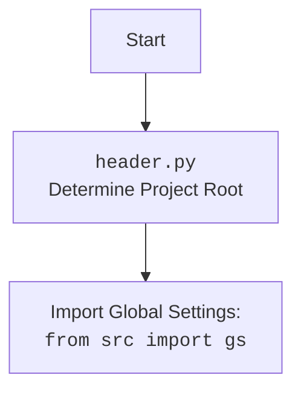

# Проект `hypotez`
# Роль `code explainer`

## АНАЛИЗ КОДА: `hypotez/src/webdriver/bs/bs.py`

### 1. <алгоритм>

1.  **Инициализация парсера `BS`**:
    *   При создании экземпляра класса `BS` можно указать URL, из которого будет загружено HTML-содержимое. Если URL не указан, парсер инициализируется без контента.
    *   Пример:
        ```python
        parser = BS('https://example.com')
        ```

2.  **Получение HTML-контента (`get_url`)**:
    *   Функция `get_url` используется для получения HTML-контента из указанного URL или файла. Поддерживает протоколы `file://` и `https://`.
    *   Для `file://` URL:
        *   Извлекается путь к файлу, проверяется его существование.
        *   Если файл существует, содержимое считывается и сохраняется в `self.html_content`.
        *   Пример:
            ```python
            parser.get_url('file:///c:/path/to/file.html')
            ```
    *   Для `https://` URL:
        *   Выполняется HTTP-запрос, проверяется статус ответа.
        *   В случае успешного запроса, содержимое сохраняется в `self.html_content`.
        *   Пример:
            ```python
            parser.get_url('https://example.com')
            ```

3.  **Выполнение локатора (`execute_locator`)**:
    *   Функция `execute_locator` принимает локатор (в виде `SimpleNamespace` или `dict`) и URL. Если URL указан, сначала происходит загрузка контента.
    *   Преобразует HTML-контент в структуру, пригодную для XPath запросов, используя `BeautifulSoup` и `lxml`.
    *   Выполняет XPath запрос на основе типа локатора (`ID`, `CSS`, `TEXT` или произвольный XPath).
    *   Возвращает список найденных элементов.
    *   Пример:
        ```python
        locator = SimpleNamespace(by='ID', attribute='element_id', selector='//*[@id="element_id"]')
        elements = parser.execute_locator(locator)
        ```

4.  **Обработка ошибок**:
    *   В функциях `get_url` и `execute_locator` используются блоки `try-except` для обработки исключений, таких как ошибки при чтении файлов или HTTP-запросах.
    *   Ошибки логируются с помощью модуля `logger`.

5.  **Пример использования (`if __name__ == "__main__":`)**:
    *   В блоке `if __name__ == "__main__":` демонстрируется пример использования класса `BS` для парсинга HTML-контента с сайта `https://example.com` и выполнения XPath запроса для поиска элемента с `id="element_id"`.

### 2. <mermaid>

```mermaid
flowchart TD
    A[Начало] --> B{url?}
    B -- Да --> C{url.startswith('file://')?}
    B -- Нет --> D{url.startswith('https://')?}
    C -- Да --> E[Очистка URL]
    C -- Нет --> F[Логирование ошибки и выход]
    D -- Да --> G[HTTP запрос]
    D -- Нет --> F
    E --> H{Существование файла?}
    H -- Да --> I[Чтение файла]
    H -- Нет --> J[Логирование ошибки и выход]
    I --> K[Сохранение контента]
    G --> L{Успешный HTTP запрос?}
    L -- Да --> M[Сохранение контента]
    L -- Нет --> N[Логирование ошибки и выход]
    K --> O[Завершение]
    M --> O
    F --> O
    J --> O
    N --> O
    O[Конец]
```

**Объяснение диаграммы `mermaid`**:

*   `A` (Начало): Начало процесса.
*   `B` (url?): Проверка, передан ли URL.
*   `C` (url.startswith('file://')?): Проверка, начинается ли URL с `file://`.
*   `D` (url.startswith('https://')?): Проверка, начинается ли URL с `https://`.
*   `E` (Очистка URL): Очистка URL от префикса `file:///`.
*   `F` (Логирование ошибки и выход): Логирование ошибки и завершение процесса.
*   `G` (HTTP запрос): Выполнение HTTP-запроса к URL.
*   `H` (Существование файла?): Проверка, существует ли локальный файл.
*   `I` (Чтение файла): Чтение содержимого файла.
*   `J` (Логирование ошибки и выход): Логирование ошибки и завершение процесса.
*   `K` (Сохранение контента): Сохранение содержимого файла в `self.html_content`.
*   `L` (Успешный HTTP запрос?): Проверка, был ли HTTP-запрос успешным.
*   `M` (Сохранение контента): Сохранение HTML-контента, полученного по HTTP.
*   `N` (Логирование ошибки и выход): Логирование ошибки и завершение процесса.
*   `O` (Конец): Конец процесса.



### 3. <объяснение>

**Импорты**:

*   `re`: Используется для работы с регулярными выражениями, например, для извлечения пути к файлу из URL.
*   `pathlib.Path`: Используется для работы с путями к файлам и директориям.
*   `typing.Optional, typing.Union, typing.List`: Используются для аннотации типов, указывая, что переменная может быть `Optional` (т.е. может принимать значение `None`), `Union` (т.е. может принимать значения разных типов), и `List` (список элементов определенного типа).
*   `types.SimpleNamespace`: Используется для создания объектов, атрибуты которых можно устанавливать произвольно.  Полезно для создания простых объектов для хранения данных.
*   `bs4.BeautifulSoup`: Используется для парсинга HTML-содержимого.
*   `lxml.etree`: Используется для работы с XML и HTML, предоставляет возможность выполнения XPath запросов.
*   `requests`: Используется для выполнения HTTP-запросов к веб-серверам.
*   `src.gs`: Импортирует глобальные настройки проекта.
*   `src.logger.logger.logger`: Импортирует модуль логирования для записи информации об ошибках и других событиях.
*   `src.utils.jjson.j_loads_ns`: Используется для загрузки JSON-файлов и преобразования их в объекты `SimpleNamespace`.

**Класс `BS`**:

*   Роль: Предоставляет функциональность для парсинга HTML-контента с использованием `BeautifulSoup` и XPath.
*   Атрибуты:
    *   `html_content` (str): HTML-контент, который будет парситься.
*   Методы:
    *   `__init__(self, url: Optional[str] = None)`: Инициализирует экземпляр класса `BS` с возможностью указания URL для загрузки контента.
    *   `get_url(self, url: str) -> bool`: Загружает HTML-контент из файла или URL.
    *   `execute_locator(self, locator: Union[SimpleNamespace, dict], url: Optional[str] = None) -> List[etree._Element]`: Выполняет XPath запрос на HTML-контенте и возвращает список найденных элементов.

**Функции**:

*   `get_url(self, url: str) -> bool`:
    *   Аргументы:
        *   `url` (str): URL или путь к файлу для загрузки HTML-контента.
    *   Возвращаемое значение:
        *   `bool`: `True`, если контент успешно загружен, `False` в противном случае.
    *   Назначение: Загружает HTML-контент из файла или URL.
    *   Пример:
        ```python
        parser = BS()
        success = parser.get_url('https://example.com')
        if success:
            print('Content loaded successfully')
        ```
*   `execute_locator(self, locator: Union[SimpleNamespace, dict], url: Optional[str] = None) -> List[etree._Element]`:
    *   Аргументы:
        *   `locator` (Union[SimpleNamespace, dict]): Объект, содержащий информацию о локаторе (тип, атрибут, селектор).
        *   `url` (Optional[str]): URL или путь к файлу для загрузки HTML-контента (необязательный).
    *   Возвращаемое значение:
        *   `List[etree._Element]`: Список элементов, соответствующих локатору.
    *   Назначение: Выполняет XPath запрос на HTML-контенте и возвращает список найденных элементов.
    *   Пример:
        ```python
        parser = BS('https://example.com')
        locator = SimpleNamespace(by='ID', attribute='element_id', selector='//*[@id="element_id"]')
        elements = parser.execute_locator(locator)
        print(elements)
        ```

**Переменные**:

*   `html_content` (str): Атрибут класса `BS`, содержащий HTML-контент для парсинга.
*   `logger`: Объект логгера, используемый для записи информации об ошибках и других событиях.

**Потенциальные ошибки и области для улучшения**:

*   Обработка исключений: В блоках `try-except` в функции `get_url` логируются только исключения.  Было бы полезно добавить более детальную обработку, например, повторные попытки при HTTP-запросах или альтернативные способы загрузки контента.
*   Валидация URL:  Можно добавить более строгую валидацию URL, чтобы убедиться, что переданный URL соответствует ожидаемому формату.
*   Типы локаторов: Поддерживаются только `ID`, `CSS` и `TEXT`.  Можно добавить поддержку других типов локаторов, таких как `NAME`, `TAG_NAME` и т.д.

**Взаимосвязи с другими частями проекта**:

*   `src.gs`: Используется для получения глобальных настроек проекта, которые могут влиять на поведение парсера.
*   `src.logger.logger`: Используется для логирования ошибок и других событий, что позволяет отслеживать работу парсера и выявлять проблемы.
*   `src.utils.jjson`: Используется для загрузки конфигурационных файлов, которые могут содержать настройки для парсера или локаторы.