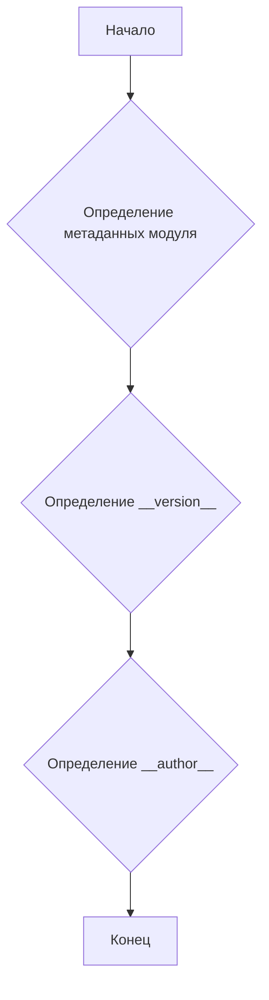

## Анализ кода `hypotez/src/webdriver/edge/extentions/version.py`

### 1. <алгоритм>

Этот модуль `version.py` содержит метаданные о версии и авторстве, используемые в проекте `hypotez`. Он определяет несколько переменных, таких как `__version__`, `__author__` и `__doc__`, которые описывают модуль.

**Блок-схема:**

```mermaid
graph TD
    A[Начало] --> B{Определение __name__};
    B --> C{Определение __version__ = "3.12.0.0.0.4"};
    C --> D{Определение __doc__};
    D --> E{Определение __details__ = "Details about version for module or class"};
    E --> F{Определение __annotations__};
    F --> G{Определение __author__ = 'hypotez'};
    G --> H[Конец];
```

### 2. <mermaid>



В данном коде нет импортов, поэтому диаграмма зависимостей не требуется.

### 3. <объяснение>

**Общее описание:**
Файл `version.py` содержит метаданные о версии и авторстве для использования внутри проекта `hypotez`. В основном, это статические определения переменных.

**Переменные:**
- `__name__`: Строковая переменная, содержащая имя модуля. Если файл запущен напрямую, будет `"__main__"`.
- `__version__`: Строка, представляющая версию модуля, в данном случае `"3.12.0.0.0.4"`.
- `__doc__`: Строка документации модуля.
- `__details__`: Строка, содержащая дополнительные детали о версии, `"Details about version for module or class"`.
- `__annotations__`: Переменная для хранения аннотаций типов.
- `__author__`: Строка, содержащая имя автора, в данном случае `'hypotez'`.

**Потенциальные области для улучшения:**
- Добавить описание в `__doc__`.
- Указать тип для `__annotations__`, например, `dict`.
- Добавить описание для `__name__` и `__annotations__`.

```python
__name__:str
__version__="3.12.0.0.0.4"
__doc__:str
__details__:str="Details about version for module or class"
__annotations__
__author__='hypotez '