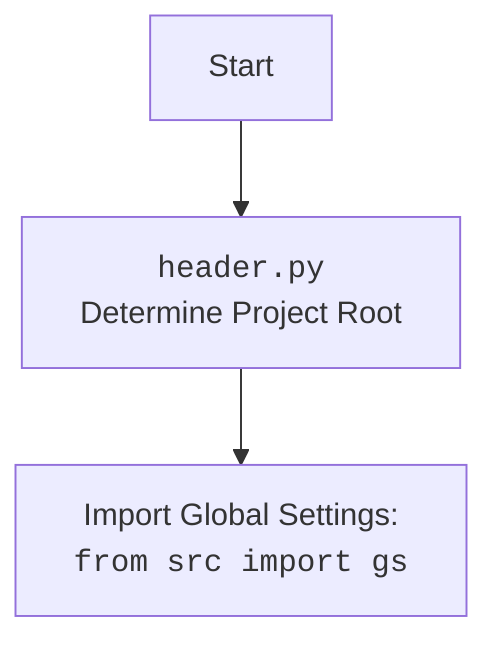

### **Анализ кода `hypotez/src/webdriver/js.py`**

#### 1. **<алгоритм>**

1.  **Класс JavaScript**:
    *   Инициализация: Принимает экземпляр `WebDriver`.
    *   `unhide_DOM_element`: Принимает `WebElement`, выполняет JavaScript для изменения стилей элемента, чтобы сделать его видимым.
    *   `ready_state`: Выполняет JavaScript для получения состояния готовности документа (`document.readyState`).
    *   `window_focus`: Выполняет JavaScript для установки фокуса на окно браузера.
    *   `get_referrer`: Выполняет JavaScript для получения URL-адреса реферера документа (`document.referrer`).
    *   `get_page_lang`: Выполняет JavaScript для получения языка страницы (`document.documentElement.lang`).

2.  **Блок-схема `unhide_DOM_element`**:

    ```mermaid
    flowchart TD
        A[Начало] --> B{Попытка выполнить JavaScript для изменения стилей элемента}
        B -- Успешно --> C[Возврат True]
        B -- Ошибка --> D[Логирование ошибки]
        D --> E[Возврат False]
    ```

    Пример:

    ```python
    element = driver.find_element(By.ID, 'hiddenElement')
    result = js.unhide_DOM_element(element)
    if result:
        print('Element is now visible')
    else:
        print('Failed to make element visible')
    ```

3.  **Блок-схема `ready_state`**:

    ```mermaid
    flowchart TD
        A[Начало] --> B{Попытка выполнить JavaScript для получения document.readyState}
        B -- Успешно --> C[Возврат document.readyState]
        B -- Ошибка --> D[Логирование ошибки]
        D --> E[Возврат '']
    ```

    Пример:

    ```python
    state = js.ready_state
    print(f'Document ready state: {state}')
    ```

4.  **Блок-схема `window_focus`**:

    ```mermaid
    flowchart TD
        A[Начало] --> B{Попытка выполнить JavaScript для установки фокуса на окно}
        B -- Успешно --> C[Конец]
        B -- Ошибка --> D[Логирование ошибки]
        D --> C
    ```

    Пример:

    ```python
    js.window_focus()
    print('Window focus set')
    ```

5.  **Блок-схема `get_referrer`**:

    ```mermaid
    flowchart TD
        A[Начало] --> B{Попытка выполнить JavaScript для получения document.referrer}
        B -- Успешно --> C{Возврат document.referrer или ''}
        B -- Ошибка --> D[Логирование ошибки]
        D --> E[Возврат '']
    ```

    Пример:

    ```python
    referrer = js.get_referrer()
    print(f'Referrer URL: {referrer}')
    ```

6.  **Блок-схема `get_page_lang`**:

    ```mermaid
    flowchart TD
        A[Начало] --> B{Попытка выполнить JavaScript для получения document.documentElement.lang}
        B -- Успешно --> C{Возврат document.documentElement.lang или ''}
        B -- Ошибка --> D[Логирование ошибки]
        D --> E[Возврат '']
    ```

    Пример:

    ```python
    lang = js.get_page_lang()
    print(f'Page language: {lang}')
    ```

#### 2. **<mermaid>**

```mermaid
flowchart TD
    A[JavaScript Class] --> B(WebDriver Instance)
    B --> C{execute_script()}
    A --> D{unhide_DOM_element(element: WebElement)}
    A --> E{ready_state()}
    A --> F{window_focus()}
    A --> G{get_referrer()}
    A --> H{get_page_lang()}
    D --> C
    E --> C
    F --> C
    G --> C
    H --> C
```

**Объяснение зависимостей:**

*   `JavaScript` класс зависит от экземпляра `WebDriver` для выполнения JavaScript-кода в контексте браузера.
*   Методы `unhide_DOM_element`, `ready_state`, `window_focus`, `get_referrer` и `get_page_lang` используют метод `execute_script` объекта `WebDriver` для выполнения JavaScript-кода.



#### 3. **<объяснение>**

*   **Импорты**:
    *   `header`: Предположительно, содержит общие функции или настройки проекта.
    *   `src`: Содержит основные модули проекта `hypotez`.
    *   `src.gs`: Глобальные настройки, используемые во всем проекте.
    *   `src.logger.logger`: Модуль логирования для записи информации об ошибках и событиях.
    *   `selenium.webdriver.remote.webdriver.WebDriver`: Основной класс WebDriver из Selenium для управления браузером.
    *   `selenium.webdriver.remote.webelement.WebElement`: Класс, представляющий элемент веб-страницы.

*   **Класс JavaScript**:
    *   Роль: Предоставляет набор утилитных функций JavaScript для взаимодействия с веб-страницей через Selenium WebDriver.
    *   Атрибуты:
        *   `driver`: Экземпляр `WebDriver`, используемый для выполнения JavaScript.
    *   Методы:
        *   `__init__(self, driver: WebDriver)`: Инициализирует класс с экземпляром `WebDriver`.
        *   `unhide_DOM_element(self, element: WebElement) -> bool`: Делает невидимый DOM-элемент видимым, изменяя его стили. Возвращает `True` при успехе, `False` при неудаче.
        *   `ready_state(self) -> str`: Возвращает состояние готовности документа.
        *   `window_focus(self) -> None`: Устанавливает фокус на окно браузера.
        *   `get_referrer(self) -> str`: Возвращает URL-адрес реферера текущего документа.
        *   `get_page_lang(self) -> str`: Возвращает язык текущей страницы.

*   **Переменные**:
    *   `driver`: Экземпляр `WebDriver`, используемый для управления браузером.
    *   `element`: Экземпляр `WebElement`, представляющий DOM-элемент.
    *   `script`: Строка, содержащая JavaScript-код для выполнения.
    *   `ex`: Исключение, которое может быть поймано при выполнении JavaScript-кода.

*   **Потенциальные ошибки и области для улучшения**:
    *   Обработка исключений: В блоках `try...except` выполняется логирование ошибок, но можно добавить дополнительную обработку, например, повторные попытки или уведомления.
    *   Улучшение `unhide_DOM_element`: Можно добавить проверку, является ли элемент уже видимым, чтобы избежать ненужных операций.

*   **Взаимосвязи с другими частями проекта**:
    *   Этот модуль используется для выполнения JavaScript-кода в контексте браузера, управляемого Selenium WebDriver. Он может быть использован другими частями проекта для автоматизации взаимодействия с веб-страницами.