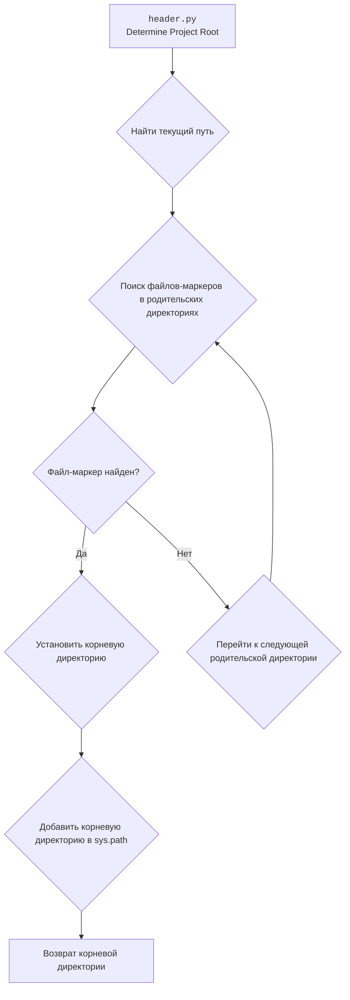

# Анализ кода `hypotez`

## 1. **<алгоритм>**

### Блок-схема рабочего процесса:

1.  **Начало**: Инициализация процесса определения корневой директории проекта.
2.  **Определение текущего пути**:
    *   Получение пути к текущему файлу (`__file__`) и определение родительской директории.

    ```python
    current_path:Path = Path(__file__).resolve().parent
    ```
3.  **Поиск корневой директории**:
    *   Итерирование по текущей директории и всем её родительским директориям.
    *   Проверка наличия одного из файлов-маркеров (`marker_files`) в каждой директории.

    ```python
    for parent in [current_path] + list(current_path.parents):
        if any((parent / marker).exists() for marker in marker_files):
            __root__ = parent
            break
    ```
4.  **Установка корневой директории**:
    *   Если один из файлов-маркеров найден, установка текущей директории в качестве корневой (`__root__`).
5.  **Добавление корневой директории в `sys.path`**:
    *   Проверка, что корневая директория не содержится в `sys.path`.
    *   Добавление корневой директории в `sys.path`, если её там нет.

    ```python
    if __root__ not in sys.path:
        sys.path.insert(0, str(__root__))
    ```
6.  **Завершение**: Возврат пути к корневой директории.

### Поток данных:

*   Функция `set_project_root` принимает кортеж `marker_files` в качестве аргумента.
*   Определяет текущий путь на основе расположения файла.
*   Производит поиск корневой директории, основываясь на наличии файлов-маркеров.
*   В случае успеха, возвращает путь к корневой директории.
*   Корневая директория добавляется в `sys.path`.

## 2. **<mermaid>**



### Объяснение:

*   `A`: Начало процесса в `header.py`.
*   `B`: Определение текущего пути к файлу.
*   `C`: Поиск файлов-маркеров в родительских директориях.
*   `D`: Условный оператор, проверяющий, найден ли файл-маркер.
*   `E`: Установка найденной директории как корневой.
*   `F`: Переход к следующей родительской директории, если файл-маркер не найден.
*   `G`: Добавление корневой директории в `sys.path`.
*   `H`: Возврат пути к корневой директории.

## 3. **<объяснение>**

### Импорты:

*   `sys`: Используется для работы с системными параметрами и функциями, такими как `sys.path`.
*   `json`: Используется для работы с JSON-объектами.
*   `packaging.version.Version`: Используется для работы с версиями пакетов.
*   `pathlib.Path`: Используется для работы с путями к файлам и директориям.

### Функция `set_project_root`:

*   **Аргументы**:
    *   `marker_files` (tuple): Кортеж, содержащий имена файлов или директорий, которые используются для определения корневой директории проекта. По умолчанию содержит `'__root__'` и `'.git'`.
*   **Возвращаемое значение**:
    *   `Path`: Путь к корневой директории проекта.
*   **Назначение**:
    *   Функция определяет корневую директорию проекта, начиная с директории текущего файла и двигаясь вверх по дереву директорий. Поиск останавливается, когда обнаруживается директория, содержащая один из файлов-маркеров.
    *   После обнаружения корневой директории, она добавляется в `sys.path`, если её там ещё нет. Это позволяет импортировать модули из корневой директории.
*   **Пример**:
    ```python
    root_path = set_project_root(marker_files=('__root__', '.git'))
    print(root_path)
    ```
### Переменные:

*   `__root__` (Path): Путь к корневой директории проекта.
*   `current_path` (Path): Путь к текущей директории.

### Потенциальные ошибки и области для улучшения:

*   **Обработка исключений**: В случае, если корневая директория не найдена, функция вернет директорию, где расположен скрипт.
*   **Оптимизация поиска**: Можно добавить ограничение на максимальную глубину поиска, чтобы избежать бесконечного цикла, если файлы-маркеры не найдены.

### Взаимосвязи с другими частями проекта:

*   Определение корневой директории важно для правильной работы импортов в проекте. Другие модули могут использовать `__root__` для определения путей к файлам и ресурсам.
*   Использование `sys.path.insert(0, str(__root__))` позволяет другим модулям импортировать модули из корневой директории, что обеспечивает гибкость в организации проекта.