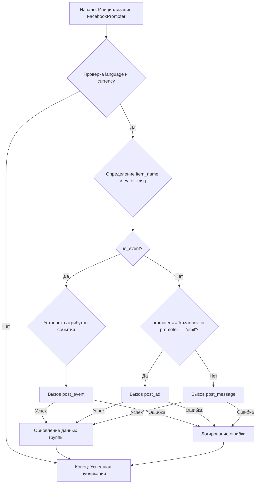
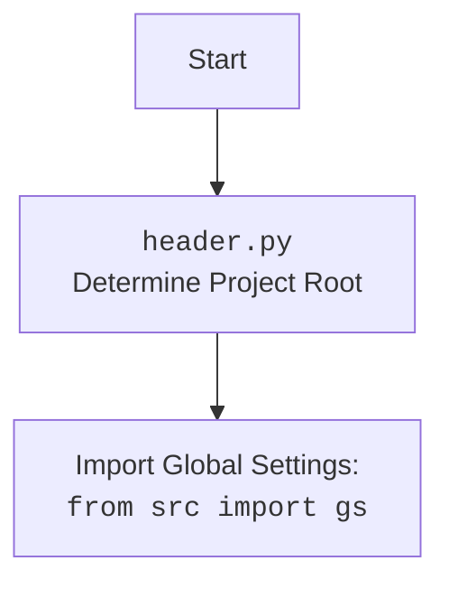

### **Алгоритм**

1.  **Инициализация `FacebookPromoter`**:

    *   Принимает экземпляр `Driver` (WebDriver), имя промоутера (`promoter`) и путь к файлам групп (`group_file_paths`).
    *   Инициализирует атрибуты, такие как `driver` (WebDriver), `group_file_paths`, `no_video` (отключает видео в постах) и `spinner` (анимация спиннера).

    ```python
    def __init__(self, d: Driver, promoter: str, group_file_paths: Optional[list[str | Path] | str | Path] = None, no_video: bool = False):
        self.promoter = promoter
        self.d = d
        self.group_file_paths = group_file_paths if group_file_paths else get_filenames(gs.path.google_drive / 'facebook' / 'groups')
        self.no_video = no_video
        self.spinner = spinning_cursor()
    ```

2.  **`promote`**:

    *   Принимает объект `group` (SimpleNamespace с данными группы), объект `item` (SimpleNamespace с данными категории или события), флаг `is_event` (является ли продвигаемым событием), `language` и `currency`.
    *   Проверяет `language` и `currency` группы, чтобы убедиться, что они совпадают с указанными. Если нет, функция завершается.
    *   Определяет, является ли продвигаемый элемент событием или сообщением, и извлекает соответствующий текст.
    *   Если `is_event`, вызывает `post_event` для публикации события. Если это не удается, записывает ошибку и завершается.
    *   Если это не событие, вызывает `post_message` для публикации сообщения. Если это не удается, завершается.
    *   Обновляет данные группы после успешной публикации.

    ```python
    def promote(self, group: SimpleNamespace, item: SimpleNamespace, is_event: bool = False, language: str = None, currency: str = None) -> bool:
        if language:
           if group.language.upper() != language.upper():
                return
        if currency:
            if group.currency.upper() != currency.upper():
                return

        item_name = item.event_name if is_event else item.category_name
        ev_or_msg = getattr(item.language, group.language) if is_event else item

        if is_event:
            ev_or_msg.start = item.start
            ev_or_msg.end = item.end
            ev_or_msg.promotional_link = item.promotional_link

            if not post_event(d=self.d, event=ev_or_msg):
                self.log_promotion_error(is_event, item_name)
                return
        else:
            if 'kazarinov' in self.promoter or 'emil' in self.promoter:
                if not post_ad(self.d, ev_or_msg):
                    return


            elif not post_message(d=self.d, message=ev_or_msg, no_video=self.no_video, without_captions=False):
                return

        self.update_group_promotion_data(group, ev_or_msg.name)
        return True
    ```

3.  **`log_promotion_error`**:

    *   Записывает сообщения об ошибках, если продвижение не удалось.

    ```python
    def log_promotion_error(self, is_event: bool, item_name: str):
        logger.debug(f"Error while posting {'event' if is_event else 'category'} {item_name}", None, False)
    ```

4.  **`update_group_promotion_data`**:

    *   Обновляет информацию о группе, такую как время последней публикации и список продвигаемых категорий или событий.

    ```python
    def update_group_promotion_data(self, group: SimpleNamespace, item_name: str, is_event: bool = False):
        timestamp = datetime.now().strftime("%d/%m/%y %H:%M")
        group.last_promo_sended = gs.now
        if is_event:
            group.promoted_events = group.promoted_events if isinstance(group.promoted_events, list) else [group.promoted_events]
            group.promoted_events.append(item_name)
        else:
            group.promoted_categories = group.promoted_categories if isinstance(group.promoted_categories, list) else [group.promoted_categories]
            group.promoted_categories.append(item_name)
        group.last_promo_sended = timestamp
    ```

5.  **`process_groups`**:

    *   Принимает имя кампании (`campaign_name`), список событий (`events`), флаг `is_event`, пути к файлам групп (`group_file_paths`), список продвигаемых категорий (`group_categories_to_adv`), `language` и `currency`.
    *   Выполняет итерацию по файлам групп, загружает данные группы и проверяет, следует ли продвигать группу в зависимости от интервала, категории и статуса.
    *   Вызывает `get_category_item` для получения элемента категории или выбирает событие из списка `events`.
    *   Проверяет, был ли элемент уже продвинут в этой группе.
    *   Вызывает `promote` для публикации элемента в группе.
    *   Сохраняет обновленные данные группы и ждет случайное количество времени.

    ```python
    def process_groups(self, campaign_name: str = None, events: list[SimpleNamespace] = None, is_event: bool = False, group_file_paths: list[str] = None, group_categories_to_adv: list[str] = ['sales'], language: str = None, currency: str = None):
        if not campaign_name and not events:
            logger.debug("Nothing to promote!")
            return

        for group_file in group_file_paths:
            path_to_group_file: Path = gs.path.google_drive / 'facebook' / 'groups' / group_file
            groups_ns: dict = j_loads_ns(path_to_group_file)

            if not groups_ns:
                logger.error(f"Проблема в файле групп {group_file=}")
                return

            for group_url, group in vars(groups_ns).items():
                group.group_url = group_url

                if not is_event and not self.check_interval(group):
                    logger.debug(f"{campaign_name=}\n Interval in group: {group.group_url}", None, False)
                    continue

                if not set(group_categories_to_adv).intersection(group.group_categories if isinstance(group.group_categories, list) else [group.group_categories]) or not 'active' in group.status:
                    continue

                if not is_event:
                    item = self.get_category_item(campaign_name, group, language, currency)
                else:
                    random.shuffle(events)
                    item = events.pop()

                if item.name in (group.promoted_events if is_event else group.promoted_categories):
                    logger.debug(f"Item already promoted")
                    continue

                if not group.language.upper() == language.upper() and group.currency.upper() == currency.upper():
                   continue

                self.driver.get_url(get_event_url(group.group_url) if is_event else group.group_url)

                if not self.promote(group = group, item = item, is_event = is_event, language = language, currency = currency):
                    continue

                j_dumps(groups_ns, path_to_group_file)
                t = random.randint(30, 420)
                print(f"sleeping {t} sec")
                time.sleep(t)
    ```

6.  **`get_category_item`**:

    *   Принимает имя кампании (`campaign_name`), объект `group`, `language` и `currency`.
    *   В зависимости от промоутера (`aliexpress` или другой), загружает данные о категории или события и возвращает элемент для продвижения.
    *   Для `aliexpress` использует `AliCampaignEditor` для получения данных о категории.
    *   Для других промоутеров загружает данные из JSON-файла и текстового файла описания.

    ```python
    def get_category_item(self, campaign_name: str, group: SimpleNamespace, language: str, currency: str) -> SimpleNamespace:
        if self.promoter == 'aliexpress':
            from src.suppliers.aliexpress.campaign import AliCampaignEditor
            ce = AliCampaignEditor(campaign_name=campaign_name, language=group.language, currency=group.currency)
            list_categories = ce.list_categories
            random.shuffle(list_categories)
            category_name = list_categories.pop()
            item = ce.get_category(category_name)
            item.name = category_name
            item.products = ce.get_category_products(item.category_name)
        else:
            base_path = gs.path.google_drive / self.promoter / 'campaigns' / campaign_name
            adv: SimpleNamespace = j_loads_ns(base_path / f"{language}_{currency}.json")
            adv_categories = list(vars(adv.category).items())  # Преобразуем в список для перемешивания
            random.shuffle(adv_categories)  # Перемешиваем категории

            for ad_name, ad in adv_categories:
                ad.description = read_text_file(base_path / 'category' / ad_name / 'description.txt')
                if not ad.description:
                    logger.error(f"ошибка чтения файла", None, False)
                    continue
                item = ad
                item.name = ad_name
                _img = get_filenames(base_path / 'category' / ad_name / 'images')
                if _img:
                    _img = _img if isinstance(_img, str) else _img[0]  # Беру только первое изображение
                    item.img_path = Path(gs.path.local) / _img
        return item
    ```

7.  **`check_interval`**:

    *   Проверяет, прошло ли достаточно времени с момента последней публикации в группе.

    ```python
    def check_interval(self, group: SimpleNamespace) -> bool:
        ...
        return True
    ```

8.  **`validate_group`**:

    *   Проверяет, является ли объект группы допустимым.

    ```python
    def validate_group(self, group: SimpleNamespace) -> bool:
        return group and hasattr(group, 'group_url') and hasattr(group, 'group_categories')
    ```

### **Mermaid**



**Объяснение `mermaid`:**

*   **A**: Начало процесса, инициализация класса `FacebookPromoter`.
*   **B**: Проверка соответствия `language` и `currency` группы.
*   **C**: Определение имени элемента (`item_name`) и сообщения (`ev_or_msg`).
*   **D**: Проверка, является ли продвигаемый элемент событием (`is_event`).
*   **E**: Если `is_event` равно `True`, устанавливаются атрибуты события.
*   **F**: Вызов функции `post_event` для публикации события.
*   **G**: Если `is_event` равно `False`, проверяется, является ли промоутер `'kazarinov'` или `'emil'`.
*   **H**: Вызов функции `post_ad` для публикации рекламного объявления.
*   **I**: Вызов функции `post_message` для публикации сообщения.
*   **J**: Обновление данных группы после успешной публикации.
*   **K**: Конец процесса, успешная публикация.
*   **L**: Логирование ошибки, если публикация не удалась.



### **Объяснение**

**Импорты**:

*   `random`: Используется для случайного выбора элементов.
*   `datetime, timedelta`: Используются для работы с датами и временем, например, для обновления данных о последней публикации в группе.
*   `pathlib.Path`: Используется для работы с путями к файлам и каталогам.
*   `urllib.parse.urlencode`: Используется для кодирования параметров URL.
*    `types.SimpleNamespace`: Предоставляет простой способ доступа к атрибутам объектов через точки.
*   `typing.Optional`: Используется для обозначения необязательных типов.

**Импорты из `src`**:

*   `src.gs`: Глобальные настройки проекта.
*   `src.endpoints.advertisement.facebook`: Содержит другие модули, связанные с Facebook-рекламой.
*   `src.webdriver.driver.Driver`: Класс для управления веб-драйвером.
*   `src.endpoints.advertisement.facebook.scenarios`: Содержит сценарии для публикации сообщений, событий и загрузки медиа.
*   `src.utils.file`: Утилиты для работы с файлами, такие как чтение текстовых файлов и получение имен файлов из каталогов.
*   `src.utils.jjson`: Утилиты для работы с JSON, такие как загрузка и сохранение JSON-файлов.
*   `src.utils.cursor_spinner`: Используется для отображения анимации спиннера в консоли.
*   `src.logger.logger`: Модуль для логирования событий и ошибок.

**Класс `FacebookPromoter`**:

*   **Роль**: Автоматизация процесса публикации рекламных материалов в группах Facebook.
*   **Атрибуты**:
    *   `d (Driver)`: Экземпляр WebDriver для управления браузером.
    *   `group_file_paths (str | Path)`: Путь к файлу или списку файлов, содержащих информацию о группах Facebook.
    *   `no_video (bool)`: Флаг, указывающий, следует ли отключать видео в постах.
    *   `promoter (str)`: Имя промоутера, определяющее стратегию продвижения.
*   **Методы**:
    *   `__init__`: Инициализирует объект `FacebookPromoter`.
    *   `promote`: Публикует категорию или событие в группе Facebook.
    *   `log_promotion_error`: Логирует ошибки, возникающие при публикации.
    *   `update_group_promotion_data`: Обновляет данные о группе после публикации.
    *   `process_groups`: Обрабатывает группы для текущей кампании или события.
    *   `get_category_item`: Получает элемент категории для продвижения на основе кампании и промоутера.
    *   `check_interval`: Проверяет, прошло ли достаточно времени для продвижения группы.
    *   `validate_group`: Проверяет, что данные группы корректны.
*   **Взаимодействие с другими компонентами**:
    *   Использует `Driver` для управления браузером и выполнения действий на страницах Facebook.
    *   Использует модули из `src.endpoints.advertisement.facebook.scenarios` для выполнения конкретных сценариев публикации.
    *   Использует `src.utils.file` для чтения данных о группах и категориях из файлов.
    *   Использует `src.utils.jjson` для загрузки и сохранения данных в формате JSON.
    *   Использует `src.logger.logger` для логирования событий и ошибок.

**Функции**:

*   `get_event_url(group_url: str) -> str`:
    *   **Аргументы**:
        *   `group_url (str)`: URL группы Facebook, содержащий `group_id`.
    *   **Возвращаемое значение**:
        *   `str`: Модифицированный URL для создания события.
    *   **Назначение**: Формирует URL для создания события в группе Facebook.

**Переменные**:

*   `d (Driver)`: Экземпляр WebDriver.
*   `group_file_paths (str | Path)`: Путь к файлу с данными о группах Facebook.
*   `no_video (bool)`: Флаг, отключающий видео в постах.
*   `promoter (str)`: Имя промоутера.

**Потенциальные ошибки и области для улучшения**:

*   Обработка ошибок при чтении файлов и загрузке данных.
*   Добавление проверок на наличие необходимых атрибутов в объектах `group` и `item`.
*   Улучшение логирования для более детальной информации об ошибках.
*   Реализация механизма повторных попыток при неудачной публикации.
*   Оптимизация процесса выбора категорий и событий для продвижения.