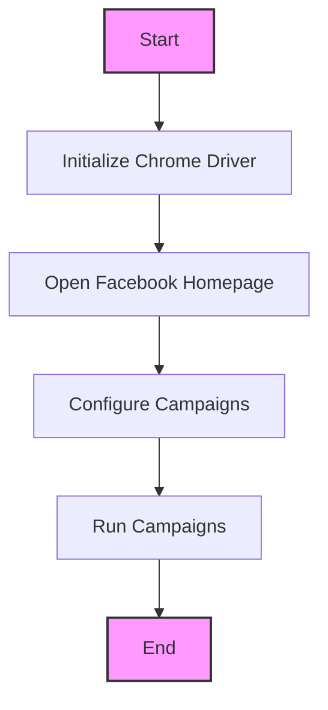
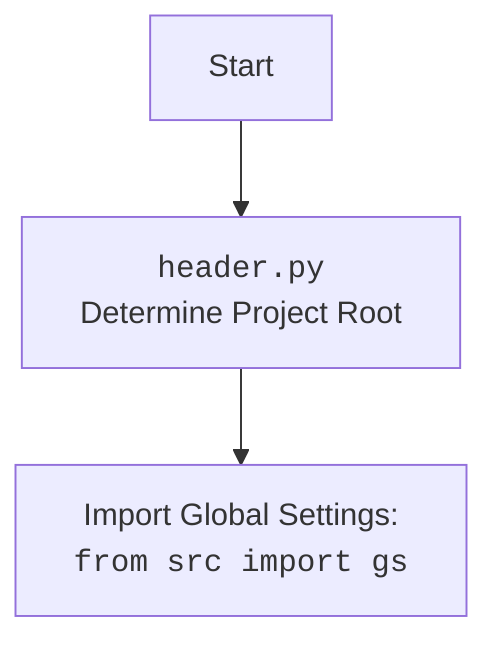

### Проект `hypotez`
### Роль `code explainer`

## АНАЛИЗ КОДА: `src/endpoints/advertisement/facebook/start_posting_katia.py`

### 1. <алгоритм>

1.  **Инициализация**:
    *   Импортируются необходимые модули, включая `header`, `Driver`, `Chrome`, `FacebookPromoter` и `logger`.
    *   Инициализируется веб-драйвер Chrome с помощью `Driver(Chrome)`.
    *   Открывается главная страница Facebook с использованием `d.get_url(r"https://facebook.com")`.

2.  **Настройка кампании**:
    *   Определяется список файлов конфигурации `filenames` и список кампаний `campaigns`.
        *   `filenames`: \['katia\_homepage.json'\]
        *   `campaigns`: \['sport\_and\_activity', 'bags\_backpacks\_suitcases', 'pain', 'brands', 'mom\_and\_baby', 'house'\]
    *   Создается экземпляр класса `FacebookPromoter` с передачей веб-драйвера, списка файлов конфигурации и указанием на отсутствие видео (`no_video = False`).

3.  **Запуск кампании**:
    *   Запускаются кампании с использованием метода `promoter.run_campaigns(campaigns)`.
    *   Если возникает прерывание с клавиатуры (`KeyboardInterrupt`), программа записывает сообщение в лог и завершает работу.

### 2. <mermaid>

**Объяснение диаграммы `mermaid`**:

*   **Start**: Начало процесса.
*   **InitDriver**: Инициализация веб-драйвера Chrome с помощью класса `Driver` и `Chrome`.
*   **OpenFacebook**: Открытие главной страницы Facebook с использованием метода `d.get_url()`.
*   **ConfigCampaign**: Конфигурация кампаний, включая определение файлов конфигурации и списка кампаний.
*   **RunCampaigns**: Запуск кампаний с использованием метода `promoter.run_campaigns(campaigns)`.
*   **End**: Завершение процесса.

### 3. <объяснение>

*   **Импорты**:
    *   `header`: Определяет корень проекта.
    *   `src.webdriver.driver.Driver`, `src.webdriver.driver.Chrome`: Классы для управления веб-драйвером Chrome.
    *   `src.endpoints.advertisement.facebook.promoter.FacebookPromoter`: Класс, отвечающий за запуск рекламных кампаний в Facebook.
    *   `src.logger.logger.logger`: Модуль для логирования событий.

*   **Переменные**:
    *   `d`: Экземпляр класса `Driver`, представляющий веб-драйвер Chrome.
    *   `filenames`: Список файлов конфигурации кампаний.
    *   `campaigns`: Список кампаний для запуска.
    *   `promoter`: Экземпляр класса `FacebookPromoter`, отвечающий за запуск кампаний.

*   **Классы**:
    *   `Driver(Chrome)`: Инициализирует веб-драйвер Chrome.
    *   `FacebookPromoter`: Запускает рекламные кампании в Facebook.

*   **Функции**:
    *   `d.get_url(r"https://facebook.com")`: Открывает главную страницу Facebook.
    *   `promoter.run_campaigns(campaigns)`: Запускает рекламные кампании.
    *   `logger.info("Campaign promotion interrupted.")`: Записывает сообщение в лог.

**Потенциальные ошибки и области для улучшения**:

*   Обработка исключений в `promoter.run_campaigns(campaigns)` может быть расширена для более детальной информации об ошибках.
*   Необходимо обеспечить обработку возможных ошибок, связанных с веб-драйвером и сетью.
*   Имена файлов конфигурации и кампаний заданы статически, что ограничивает гибкость.

**Взаимосвязи с другими частями проекта**:

*   `src.webdriver.driver`: Обеспечивает управление веб-драйвером, что позволяет автоматизировать действия в браузере.
*   `src.endpoints.advertisement.facebook.promoter`: Запускает рекламные кампании, используя веб-драйвер для взаимодействия с Facebook.
*   `src.logger.logger`: Обеспечивает логирование событий, что позволяет отслеживать ход выполнения программы и выявлять ошибки.