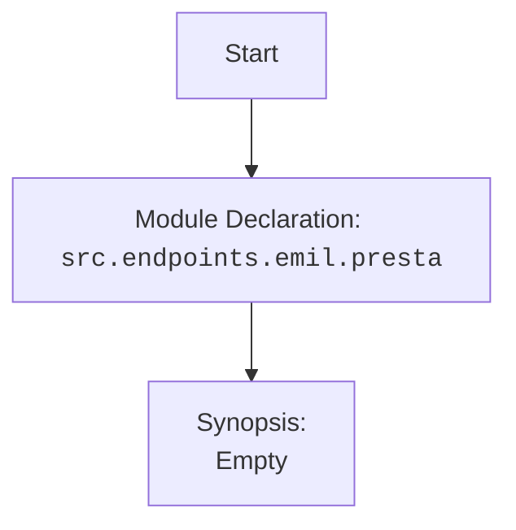

### Анализ кода `hypotez/src/endpoints/emil/presta.py`

#### 1. <алгоритм>

Этот файл, `presta.py`, кажется, предназначен для взаимодействия с PrestaShop, возможно, через API. Однако, предоставленный код является заглушкой и не содержит конкретной логики.

1.  **Начало**: Файл начинается с объявления модуля и общей информации о нем.
2.  **Импорты**: В данном коде отсутствуют импорты, что указывает на то, что он не зависит от внешних библиотек или модулей в текущем виде.
3.  **Классы/Функции**: Код не содержит определения классов или функций, что означает, что он не выполняет никаких конкретных операций.

Пример:
```python
# Начало файла
# -*- coding: utf-8 -*-
#! .pyenv/bin/python3

"""
.. module:: src.endpoints.emil.presta
    :platform: Windows, Unix
    :synopsis:
"""
```

#### 2. <mermaid>



**Объяснение:**

*   `Start`: Начало диаграммы, представляющее начало анализа файла.
*   `ModuleDeclaration`: Указывает на объявление модуля `src.endpoints.emil.presta`.
*   `Synopsis`: Отражает краткое описание модуля, которое в данном случае отсутствует (пустое).

Поскольку отсутствуют зависимости, диаграмма отражает только структуру модуля.

#### 3. <объяснение>

**Импорты**:
В предоставленном коде отсутствуют импорты. Обычно здесь были бы указаны импорты необходимых библиотек, например, `requests` для выполнения HTTP-запросов к API PrestaShop.

**Классы**:
Код не содержит классов. В реальном приложении здесь мог бы быть класс для представления подключения к PrestaShop и выполнения операций с ним.

**Функции**:
Код не содержит функций. В рабочей версии здесь могли бы быть функции для выполнения конкретных действий, таких как получение списка продуктов, создание заказа и т.д.

**Переменные**:
В данном коде отсутствуют переменные.

**Потенциальные ошибки и области для улучшения**:

*   **Отсутствие функциональности**: Код является заглушкой и не выполняет никаких полезных действий.
*   **Отсутствие обработки ошибок**: В реальном приложении необходимо добавить обработку ошибок, чтобы обеспечить стабильность и надежность.
*   **Отсутствие документации**: Необходимо добавить документацию для классов, функций и параметров, чтобы облегчить понимание и использование кода.

**Взаимосвязи с другими частями проекта**:
Так как код представлен только заглушкой, сложно определить его взаимосвязи с другими частями проекта. В контексте `hypotez` можно предположить, что этот модуль предназначен для интеграции с PrestaShop и может использоваться другими модулями для получения или отправки данных в PrestaShop.