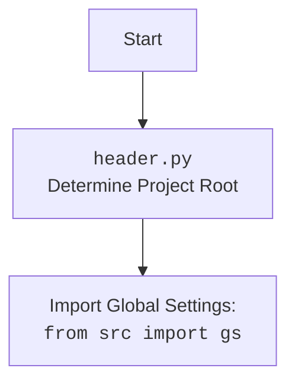

# Проект `hypotez`
# Роль `code explainer`

## АНАЛИЗ КОДА: `src/endpoints/prestashop/product.py`

### 1. <алгоритм>

Этот код предназначен для взаимодействия с PrestaShop API для управления продуктами. Он включает в себя классы для настройки API, управления продуктами и вспомогательные функции для преобразования данных между форматами XML и JSON.

**Блок-схема:**

1.  **Config**:
    *   Определяет параметры конфигурации для доступа к PrestaShop API.
    *   Пример:
        *   Если `USE_ENV` равно `True`, параметры API (`API_DOMAIN`, `API_KEY`) берутся из переменных окружения.
        *   Иначе, параметры API устанавливаются в зависимости от значения `MODE` (`dev`, `dev8` или по умолчанию).

2.  **PrestaProduct**:
    *   Класс для работы с продуктами через PrestaShop API.
    *   Пример:
        *   Метод `get_product_schema` получает схему продукта из PrestaShop.
        *   Метод `get_parent_category` рекурсивно получает родительские категории для заданной категории.
        *   Метод `add_new_product` добавляет новый продукт в PrestaShop.

3.  **ProductFields**:
    *   Используется для хранения и преобразования данных о продукте.
    *   Пример:
        *   Данные о продукте преобразуются в словарь для отправки в PrestaShop.
        *   Добавляются родительские категории для продукта.

4.  **Вспомогательные функции**:
    *   `dict2xml`, `xml2dict`, `presta_fields_to_xml`: Преобразование данных между форматами XML и JSON.
    *   `save_xml`: Сохранение XML данных в файл.
    *   `j_loads`, `j_loads_ns`, `j_dumps`: Работа с JSON файлами.
    *   `logger`: Логирование ошибок и действий.

**Поток данных:**

1.  Класс `Config` определяет параметры API.
2.  Класс `PrestaProduct` использует параметры API для инициализации соединения с PrestaShop.
3.  Метод `add_new_product` класса `PrestaProduct` получает данные о продукте из объекта `ProductFields`.
4.  Данные о продукте преобразуются в формат XML или JSON.
5.  Данные отправляются в PrestaShop API с использованием методов `create` или `_exec`.
6.  Полученный ответ от PrestaShop обрабатывается, и в случае успеха возвращается объект `ProductFields` с установленным `id_product`.
7.  В случае ошибки логируется информация об ошибке.

### 2. <mermaid>

```mermaid
flowchart TD
    subgraph Config
        USE_ENV[USE_ENV: bool]
        MODE[MODE: str]
        API_DOMAIN[API_DOMAIN: str]
        API_KEY[API_KEY: str]
    end

    subgraph PrestaProduct
        get_product_schema[get_product_schema(resource_id: Optional[str | int], schema: Optional[str]) : dict]
        get_parent_category[get_parent_category(id_category: int) : Optional[int]]
        _add_parent_categories[_add_parent_categories(f: ProductFields) : None]
        get_product[get_product(id_product: int, **kwards) : dict]
        add_new_product[add_new_product(f: ProductFields) : dict]
    end
    
    subgraph Utils
        xml2dict[xml2dict()]
        dict2xml[dict2xml()]
        presta_fields_to_xml[presta_fields_to_xml()]
        save_xml[save_xml()]
        j_loads[j_loads()]
        j_loads_ns[j_loads_ns()]
        j_dumps[j_dumps()]
        logger[logger]
    end
    
    Config --> PrestaProduct
    PrestaProduct --> Utils
    
    style Config fill:#f9f,stroke:#333,stroke-width:2px
    style PrestaProduct fill:#ccf,stroke:#333,stroke-width:2px
    style Utils fill:#ffc,stroke:#333,stroke-width:2px
```

**Объяснение зависимостей:**

*   **Config**: Класс `PrestaProduct` использует класс `Config` для получения параметров API (`API_KEY`, `API_DOMAIN`).
*   **PrestaProduct**: Класс `PrestaProduct` использует вспомогательные функции (`xml2dict`, `dict2xml`, `presta_fields_to_xml`, `save_xml`, `j_loads`, `j_loads_ns`, `j_dumps`, `logger`) для работы с данными и логирования.
*   **Utils**: Вспомогательные функции используются для преобразования данных между форматами XML и JSON, сохранения XML в файл, работы с JSON файлами и логирования ошибок и действий.



### 3. <объяснение>

**Импорты:**

*   `asyncio`: Используется для асинхронного программирования.
*   `os`: Используется для работы с операционной системой, например, для получения переменных окружения.
*   `dataclasses`: Используется для создания классов данных.
*   `typing`: Используется для аннотации типов.
*   `header`: Определяет корень проекта.
*   `src.gs`: Глобальные настройки проекта.
*   `src.endpoints.prestashop.api.PrestaShop`: Класс для взаимодействия с PrestaShop API.
*   `src.endpoints.prestashop.category.PrestaCategory`: Класс для работы с категориями PrestaShop.
*   `src.endpoints.prestashop.product_fields.ProductFields`: Класс для хранения данных о продукте.
*   `src.endpoints.prestashop.utils.xml_json_convertor`: Функции для преобразования данных между форматами XML и JSON.
*   `src.utils.xml.save_xml`: Функция для сохранения XML данных в файл.
*   `src.utils.jjson`: Функции для работы с JSON файлами.
*   `src.utils.printer.pprint`: Функция для красивой печати данных.
*   `src.logger.logger.logger`: Модуль логирования.
*   `src.USE_ENV`: Флаг, определяющий, использовать ли переменные окружения.

**Классы:**

*   **Config**:
    *   Роль: Определяет параметры конфигурации для доступа к PrestaShop API.
    *   Атрибуты:
        *   `USE_ENV`: Флаг, определяющий, использовать ли переменные окружения.
        *   `MODE`: Режим работы (`dev`, `dev8` или по умолчанию).
        *   `POST_FORMAT`: Формат данных для отправки в PrestaShop API (`XML` или `JSON`).
        *   `API_DOMAIN`: Домен PrestaShop API.
        *   `API_KEY`: Ключ API для доступа к PrestaShop.
    *   Методы: Нет.
    *   Взаимодействие: Используется классом `PrestaProduct` для получения параметров API.
*   **PrestaProduct**:
    *   Роль: Класс для работы с продуктами через PrestaShop API.
    *   Атрибуты:
        *   `API_KEY`: Ключ API для доступа к PrestaShop.
        *   `API_DOMAIN`: Домен PrestaShop API.
    *   Методы:
        *   `__init__`: Инициализирует объект `PrestaProduct`.
        *   `get_product_schema`: Получает схему продукта из PrestaShop.
        *   `get_parent_category`: Рекурсивно получает родительские категории для заданной категории.
        *   `_add_parent_categories`: Вычисляет и добавляет все родительские категории для списка идентификаторов категорий в объект `ProductFields`.
        *   `get_product`: Получает информацию о продукте из PrestaShop.
        *   `add_new_product`: Добавляет новый продукт в PrestaShop.
    *   Взаимодействие: Использует класс `Config` для получения параметров API, класс `ProductFields` для получения данных о продукте, вспомогательные функции для работы с данными и логирования.

**Функции:**

*   `example_add_new_product`: Пример добавления товара в Prestashop.
*   `example_get_product`: Пример получения информации о продукте из PrestaShop.

**Переменные:**

*   `Config.USE_ENV`: Флаг, определяющий, использовать ли переменные окружения.
*   `Config.MODE`: Режим работы (`dev`, `dev8` или по умолчанию).
*   `Config.POST_FORMAT`: Формат данных для отправки в PrestaShop API (`XML` или `JSON`).
*   `Config.API_DOMAIN`: Домен PrestaShop API.
*   `Config.API_KEY`: Ключ API для доступа к PrestaShop.

**Потенциальные ошибки и области для улучшения:**

*   Обработка ошибок: В коде есть обработка ошибок, но ее можно улучшить, добавив больше конкретных исключений и логируя больше информации об ошибках.
*   Конфигурация: Конфигурация API жестко задана в коде. Можно улучшить, добавив возможность загрузки конфигурации из файла.
*   Логирование: Логирование можно улучшить, добавив больше информации о действиях, выполняемых кодом.
*   Обработка `...`: В коде есть `...`, которые нужно заменить на конкретную реализацию.

**Взаимосвязи с другими частями проекта:**

*   Класс `PrestaProduct` использует класс `PrestaShop` из модуля `src.endpoints.prestashop.api` для взаимодействия с PrestaShop API.
*   Класс `PrestaProduct` использует класс `ProductFields` из модуля `src.endpoints.prestashop.product_fields` для хранения данных о продукте.
*   Класс `PrestaProduct` использует вспомогательные функции из модуля `src.endpoints.prestashop.utils.xml_json_convertor` для преобразования данных между форматами XML и JSON.
*   Код использует модуль `src.logger.logger` для логирования ошибок и действий.
*   Код использует модуль `src.gs` для получения глобальных настроек проекта.