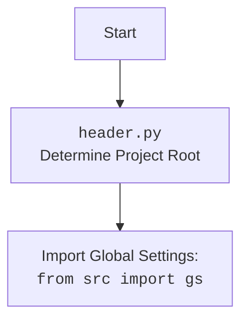

### **Анализ кода: `hypotez/src/endpoints/prestashop/warehouse.py`**

#### **1. <алгоритм>**:
1.  **Импорт модулей**: Импортируются необходимые модули для работы: `os`, `sys`, `attr`, `attrs`, `Path`, `header`, `gs`, `pprint`, `PrestaShop` и `logger`.
2.  **Определение класса `PrestaWarehouse`**: Создается класс `PrestaWarehouse`, наследующийся от класса `PrestaShop`.

#### **2. <mermaid>**:

```mermaid
flowchart TD
    A[<code>warehouse.py</code><br>Define PrestaWarehouse Class] --> B(Import modules: os, sys, attr, attrs, pathlib.Path, header, src.gs, src.utils.printer.pprint, .api.PrestaShop, src.logger.logger);
    B --> C(Class PrestaWarehouse(PrestaShop));
    style A fill:#f9f,stroke:#333,stroke-width:2px
```



**Объяснение зависимостей в `mermaid`**:
*   `warehouse.py`: Определяет класс `PrestaWarehouse`, который предназначен для работы с функциональностью склада PrestaShop.
*   Импортированные модули:
    *   `os`, `sys`: Используются для работы с операционной системой и системными параметрами.
    *   `attr`, `attrs`: Используются для определения классов данных.
    *   `pathlib.Path`: Используется для работы с путями к файлам и директориям.
    *   `header`: Содержит функциональность для определения корневой директории проекта.
    *   `src.gs`: Содержит глобальные настройки проекта.
    *   `src.utils.printer.pprint`: Используется для "красивого" вывода данных.
    *   `.api.PrestaShop`: Содержит базовый класс для работы с API PrestaShop.
    *   `src.logger.logger`: Используется для логирования событий.

#### **3. <объяснение>**:

*   **Импорты**:
    *   `os`, `sys`: Обеспечивают взаимодействие с операционной системой, например, для получения доступа к переменным окружения или для завершения работы программы.
    *   `attr`, `attrs`: Библиотека `attrs` используется для создания классов данных. Декоратор `@attrs` автоматически генерирует методы, такие как `__init__`, `__repr__`, `__eq__` и другие, на основе атрибутов класса.
    *   `pathlib.Path`: Предоставляет объектно-ориентированный способ работы с путями к файлам и директориям, упрощая операции, такие как чтение, запись и манипулирование файлами.
    *   `header`: Используется для определения корневой директории проекта. Это может быть полезно для относительной адресации файлов конфигурации и других ресурсов проекта.
    *   `src.gs`: Импортирует глобальные настройки проекта, которые могут включать параметры конфигурации, ключи API и другие общие параметры, необходимые для работы приложения.
    *   `src.utils.printer.pprint`: Функция `pprint` используется для "красивого" вывода структур данных, таких как словари и списки, что облегчает отладку и анализ данных.
    *   `.api.PrestaShop`: Импортирует класс `PrestaShop` из модуля `api`, который, вероятно, содержит базовую функциональность для взаимодействия с API PrestaShop. Класс `PrestaWarehouse` наследуется от этого класса.
    *   `src.logger.logger`: Модуль логирования, используемый для записи информации о работе программы, отладочных сообщений, предупреждений и ошибок.

*   **Классы**:
    *   `PrestaWarehouse(PrestaShop)`: Класс `PrestaWarehouse` наследуется от класса `PrestaShop`, что позволяет ему использовать функциональность для взаимодействия с API PrestaShop.

*   **Функции**:
    *   В предоставленном коде функции отсутствуют.

*   **Переменные**:
    *   `gs`: Глобальные настройки проекта.

*   **Потенциальные ошибки и области для улучшения**:
    *   В предоставленном коде отсутствует реализация класса `PrestaWarehouse`, что делает невозможным оценить его функциональность и потенциальные ошибки.
    *   Отсутствуют примеры использования импортированных модулей и классов.

*   **Взаимосвязи с другими частями проекта**:
    *   `PrestaWarehouse` зависит от `PrestaShop` для взаимодействия с API PrestaShop.
    *   Использует `logger` для логирования.
    *   Использует `gs` для получения глобальных настроек.