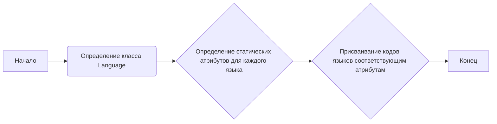
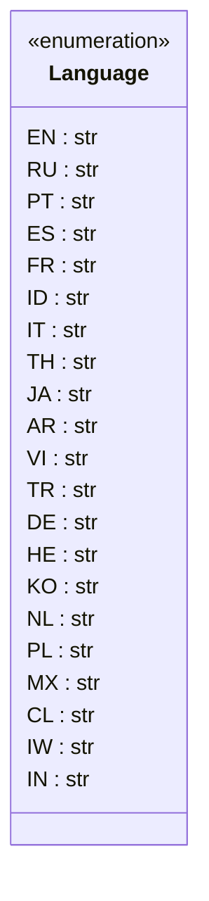

### **Анализ кода `hypotez/src/suppliers/aliexpress/api/models/languages.py`**

#### **1. <алгоритм>**:
Модуль `languages.py` определяет класс `Language`, который содержит статические атрибуты, представляющие коды языков.

Пример:
- Начинается определение класса `Language`.
- Внутри класса определяются статические атрибуты, такие как `EN`, `RU`, `PT` и т.д.
- Каждому атрибуту присваивается строковое значение, представляющее собой код языка.
- В конце класс `Language` завершен.

#### **2. <mermaid>**:

Диаграмма классов показывает класс `Language` и его статические атрибуты, представляющие коды языков.

#### **3. <объяснение>**:

- **Расположение файла**: Файл расположен в `hypotez/src/suppliers/aliexpress/api/models/languages.py`, что указывает на то, что он является частью подпроекта, связанного с поставщиками (suppliers), а именно AliExpress, и отвечает за модели API, в частности, за определение поддерживаемых языков.
- **Импорты**: Отсутствуют импорты, так как модуль содержит только определение класса с константами.
- **Классы**:
  - `Language`: Класс, предназначенный для хранения статических атрибутов, представляющих коды языков. Каждый атрибут является строкой, содержащей код языка.
    - Атрибуты:
      - `EN`, `RU`, `PT`, `ES`, `FR`, `ID`, `IT`, `TH`, `JA`, `AR`, `VI`, `TR`, `DE`, `HE`, `KO`, `NL`, `PL`, `MX`, `CL`, `IW`, `IN`: Статические атрибуты, представляющие коды языков.
- **Функции**:
  - Отсутствуют.
- **Переменные**:
  - `EN`, `RU`, `PT`, `ES`, `FR`, `ID`, `IT`, `TH`, `JA`, `AR`, `VI`, `TR`, `DE`, `HE`, `KO`, `NL`, `PL`, `MX`, `CL`, `IW`, `IN`: Статические переменные (атрибуты класса), представляющие собой коды языков в виде строк.

**Потенциальные ошибки или области для улучшения**:
- Отсутствуют. Класс выполняет свою функцию просто и эффективно.

**Взаимосвязь с другими частями проекта**:
- Этот модуль может использоваться другими частями проекта для указания языка при запросах к API AliExpress. Например, при формировании запросов на поиск товаров или при парсинге ответов API.