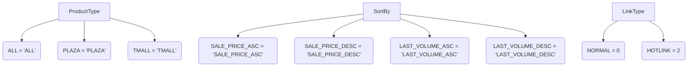

### <алгоритм>

1.  **Определение классов `ProductType`, `SortBy` и `LinkType`**:
    *   Класс `ProductType` определяет константы для различных типов продуктов: `ALL`, `PLAZA` и `TMALL`.
        *   Пример: `ProductType.ALL` представляет все типы продуктов.
    *   Класс `SortBy` определяет константы для различных способов сортировки продуктов: `SALE_PRICE_ASC`, `SALE_PRICE_DESC`, `LAST_VOLUME_ASC` и `LAST_VOLUME_DESC`.
        *   Пример: `SortBy.SALE_PRICE_ASC` представляет сортировку по возрастанию цены.
    *   Класс `LinkType` определяет константы для различных типов ссылок: `NORMAL` и `HOTLINK`.
        *   Пример: `LinkType.NORMAL` представляет обычную ссылку.

### <mermaid>

### <объяснение>

**Расположение файла:** `hypotez/src/suppliers/aliexpress/api/models/request_parameters.py`

Файл содержит определения классов, используемых для задания параметров запросов к API AliExpress.

**Импорты:**
В данном коде нет импортов.

**Классы:**

*   `ProductType`:
    *   Роль: Определяет константы для различных типов продуктов, которые могут быть запрошены через API AliExpress.
    *   Атрибуты:
        *   `ALL`: Представляет все типы продуктов.
        *   `PLAZA`: Представляет продукты, продаваемые на площадке Plaza.
        *   `TMALL`: Представляет продукты, продаваемые на площадке Tmall.
    *   Методы: Отсутствуют.
    *   Взаимодействие: Используется для указания типа продукта при формировании запроса к API AliExpress.
*   `SortBy`:
    *   Роль: Определяет константы для различных способов сортировки продуктов, которые могут быть запрошены через API AliExpress.
    *   Атрибуты:
        *   `SALE_PRICE_ASC`: Сортировка по возрастанию цены.
        *   `SALE_PRICE_DESC`: Сортировка по убыванию цены.
        *   `LAST_VOLUME_ASC`: Сортировка по возрастанию объема продаж.
        *   `LAST_VOLUME_DESC`: Сортировка по убыванию объема продаж.
    *   Методы: Отсутствуют.
    *   Взаимодействие: Используется для указания способа сортировки при формировании запроса к API AliExpress.
*   `LinkType`:
    *   Роль: Определяет константы для различных типов ссылок.
    *   Атрибуты:
        *   `NORMAL`: Обычная ссылка.
        *   `HOTLINK`: "Горячая" ссылка.
    *   Методы: Отсутствуют.
    *   Взаимодействие: Используется для указания типа ссылки при формировании запроса к API AliExpress.

**Функции:**
В данном коде нет функций.

**Переменные:**
Переменные определены как атрибуты классов и представляют собой строковые или целочисленные константы.

**Потенциальные ошибки и области для улучшения:**

*   В коде отсутствуют проверки на соответствие типов данных.
*   Можно добавить документацию к классам и их атрибутам для улучшения читаемости кода.

**Взаимосвязь с другими частями проекта:**

Данные классы используются в модулях, формирующих запросы к API AliExpress, для задания параметров запроса. Например, при запросе списка товаров можно указать тип продукта (`ProductType`) и способ сортировки (`SortBy`).