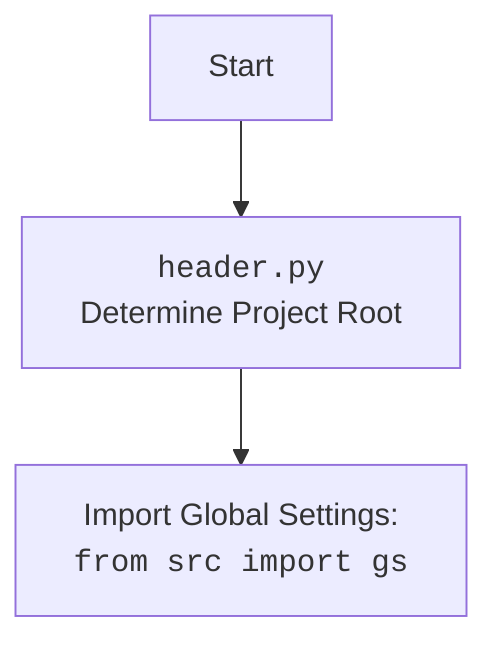

### **Анализ кода `hypotez/src/suppliers/aliexpress/campaign/header.py`**

#### 1. **<алгоритм>**

1.  **Определение корневой директории проекта (`set_project_root`)**:
    *   Функция `set_project_root` ищет корневую директорию проекта, начиная с директории, в которой находится текущий файл.
    *   Она поднимается по иерархии директорий, пока не найдет директорию, содержащую один из файлов-маркеров (например, `__root__` или `.git`).
    *   Если корневая директория найдена, она добавляется в `sys.path` для обеспечения возможности импорта модулей из этой директории.
    *   **Пример**: Если файл `header.py` находится в `/path/to/project/src/suppliers/aliexpress/campaign/`, и файл `.git` находится в `/path/to/project/`, то корневой директорией будет `/path/to/project/`.

2.  **Чтение настроек из `settings.json`**:
    *   После определения корневой директории, скрипт пытается прочитать настройки из файла `settings.json`, расположенного в директории `src` относительно корня проекта.
    *   Если файл существует и содержит корректный JSON, его содержимое загружается в переменную `settings`.
    *   Если файл не найден или содержит некорректный JSON, переменной `settings` присваивается `None`.
    *   **Пример**: Если `settings.json` содержит `{"project_name": "hypotez", "version": "1.0"}`, то переменная `settings` будет равна `{"project_name": "hypotez", "version": "1.0"}`.

3.  **Чтение документации из `README.MD`**:
    *   Скрипт пытается прочитать содержимое файла `README.MD`, расположенного в директории `src` относительно корня проекта.
    *   Если файл существует, его содержимое сохраняется в переменной `doc_str`.
    *   Если файл не найден, переменной `doc_str` присваивается `None`.
    *   **Пример**: Если `README.MD` содержит "Описание проекта hypotez", то переменная `doc_str` будет равна "Описание проекта hypotez".

4.  **Определение переменных проекта**:
    *   На основе содержимого `settings.json` (если он был успешно прочитан) определяются переменные проекта, такие как `__project_name__`, `__version__`, `__doc__`, `__author__`, `__copyright__`, `__cofee__`.
    *   Если `settings.json` не был прочитан, используются значения по умолчанию.
    *   **Пример**: Если `settings` содержит `{"project_name": "hypotez", "version": "1.0", "author": "John Doe"}`, то `__project_name__` будет равно "hypotez", `__version__` будет равно "1.0", а `__author__` будет равно "John Doe".

#### 2. **<mermaid>**

```mermaid
flowchart TD
    Start --> FindRoot[Find Project Root Directory using marker files]
    FindRoot --> CheckMarkers{Check for marker files (__root__, .git) in parent directories}
    CheckMarkers -- Found --> SetRoot[Set project root directory]
    CheckMarkers -- Not Found --> UseCurrent[Use current file's directory as root]
    SetRoot --> AddToPath[Add root to sys.path]
    UseCurrent --> AddToPath
    AddToPath --> ImportGS[Import Global Settings from src (gs)]
    ImportGS --> ReadSettings{Read settings.json}
    ReadSettings -- Success --> ParseSettings[Parse settings.json]
    ReadSettings -- Failure --> DefaultSettings[Use default settings]
    ParseSettings --> SetVars[Set project variables (__project_name__, __version__ etc.)]
    DefaultSettings --> SetVars
    ReadMD{Read README.MD}
    SetVars --> ReadMD
    ReadMD -- Success --> SetDocStr[Set __doc__ from README.MD]
    ReadMD -- Failure --> DefaultDocStr[Use default __doc__]
    SetVars --> SetDocStr
    SetVars --> DefaultDocStr
    SetDocStr --> End
    DefaultDocStr --> End
```

**Объяснение зависимостей `mermaid`:**

*   `pathlib`: Используется для работы с путями к файлам и директориям. Позволяет программе находить корневую директорию, а также читать файлы `settings.json` и `README.MD`.
*   `sys`: Используется для добавления корневой директории проекта в `sys.path`, что позволяет импортировать модули из этой директории.
*   `json`: Используется для чтения файла `settings.json`.
*   `src`: Импортируются глобальные настройки `gs` из `src`.

**Дополнительно**: Если в коде есть импорт `import header`, добавьте блок `mermaid` flowchart, объясняющий `header.py`:



#### 3. **<объяснение>**

*   **Импорты**:
    *   `pathlib (Path)`: Используется для работы с путями к файлам и директориям. Это позволяет находить корневую директорию проекта и выполнять операции чтения файлов.
    *   `sys`: Используется для модификации пути поиска модулей (`sys.path`), чтобы можно было импортировать модули из корневой директории проекта.
    *   `json`: Используется для чтения конфигурационных файлов в формате JSON (`settings.json`).
    *   `src.gs`: Импортирует глобальные настройки проекта.

*   **Классы**:
    *   Нет классов.

*   **Функции**:
    *   `set_project_root(marker_files: tuple[str, ...]=('__root__', '.git')) -> Path`:
        *   Аргументы:
            *   `marker_files (tuple)`: Список файлов или директорий, которые используются для определения корневой директории проекта. По умолчанию `('__root__', '.git')`.
        *   Возвращаемое значение:
            *   `Path`: Путь к корневой директории проекта.
        *   Назначение:
            *   Функция определяет корневую директорию проекта путем поиска файлов-маркеров в родительских директориях.
        *   Пример:
            ```python
            root_path = set_project_root()
            print(root_path) # /path/to/project
            ```

*   **Переменные**:
    *   `__root__ (Path)`: Путь к корневой директории проекта.
    *   `settings (dict)`: Словарь, содержащий настройки проекта, прочитанные из `settings.json`.
    *   `doc_str (str)`: Строка, содержащая документацию проекта, прочитанную из `README.MD`.
    *   `__project_name__ (str)`: Название проекта.
    *   `__version__ (str)`: Версия проекта.
    *   `__doc__ (str)`: Документация проекта.
    *   `__details__ (str)`: Дополнительная информация о проекте.
    *   `__author__ (str)`: Автор проекта.
    *   `__copyright__ (str)`: Информация об авторских правах.
    *   `__cofee__ (str)`: Сообщение о возможности угостить разработчика кофе.

*   **Потенциальные ошибки и области для улучшения**:
    *   Обработка исключений при чтении `settings.json` и `README.MD` выполнена с использованием `...`, что не является хорошей практикой. Следует логировать ошибки и, возможно, поднимать исключения более высокого уровня.

*   **Взаимосвязи с другими частями проекта**:
    *   Данный модуль является центральным для определения настроек и метаданных проекта. Он используется другими модулями для доступа к этим настройкам.
    *   Функция `set_project_root` используется для определения корневой директории проекта, что важно для правильной работы с путями к файлам и импортом модулей.
    *   Переменные, такие как `__project_name__`, `__version__` и `__doc__`, могут использоваться в других модулях для отображения информации о проекте.