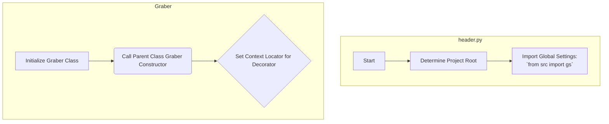

# Проект `hypotez`
# Роль `code explainer`
## ИНСТРУКЦИЯ  :

Анализируй предоставленный код подробно и объясни его функциональность. Ответ должен включать три раздела:  

1. **<алгоритм>**: Опиши рабочий процесс в виде пошаговой блок-схемы, включая примеры для каждого логического блока, и проиллюстрируй поток данных между функциями, классами или методами.  
2. **<mermaid>**: Напиши код для диаграммы в формате `mermaid`, проанализируй и объясни все зависимости, 
    которые импортируются при создании диаграммы. 
    **ВАЖНО!** Убедитесь, что все имена переменных, используемые в диаграмме `mermaid`, 
    имеют осмысленные и описательные имена. Имена переменных вроде `A`, `B`, `C`, и т.д., не допускаются!  
    
    **Дополнительно**: Если в коде есть импорт `import header`, добавьте блок `mermaid` flowchart, объясняющий `header.py`:\
    ```mermaid\
    flowchart TD\
        Start --> Header[<code>header.py</code><br> Determine Project Root]\
    
        Header --> import[Import Global Settings: <br><code>from src import gs</code>] \
    ```

3. **<объяснение>**: Предоставь подробные объяснения:  
   - **Импорты**: Их назначение и взаимосвязь с другими пакетами `src.`.  
   - **Классы**: Их роль, атрибуты, методы и взаимодействие с другими компонентами проекта.  
   - **Функции**: Их аргументы, возвращаемые значения, назначение и примеры.  
   - **Переменные**: Их типы и использование.  
   - Выдели потенциальные ошибки или области для улучшения.  

Дополнительно, постройте цепочку взаимосвязей с другими частями проекта (если применимо).  

Это обеспечивает всесторонний и структурированный анализ кода.
## Формат ответа: `.md` (markdown)


## Твое поведение при анализе кода:
- всегда смотри системную инструкцию для обработки кода проекта `hypotez`;
- анализируй расположение файла в проекте. Это поможет понять его назначение и взаимосвязь с другими файлами. Расположение файла ты найдешь в самой превой строке кода, начинающейся с `## \\file /...`;
- запоминай предоставленный код и анализируй его связь с другими частями проекта `hypotez`;

**КОНЕЦ ИНСТРУКЦИИ**
```md
## Анализ кода `hypotez/src/suppliers/morlevi/graber.py`

### 1. <алгоритм>

1.  **Инициализация**:
    *   Создается экземпляр класса `Graber`, который наследуется от `Graber` (переименован в `Grbr` для избежания конфликта имен) из `src.suppliers.graber`.
    *   Вызывается конструктор родительского класса `Graber` (`Grbr`) с указанием префикса поставщика `'morlevi'`, драйвера веб-браузера (`driver`) и индекса языка (`lang_index`).
    *   Устанавливается локатор для декоратора, который используется для закрытия всплывающих окон, путем присвоения значения атрибута `self.locator.close_pop_up` классу `Context.locator_for_decorator`.

### 2. <mermaid>



### 3. <объяснение>

#### Импорты:

*   `from pathlib import Path`: Используется для работы с путями к файлам и директориям.
*   `from typing import Any, Callable`: Используется для аннотации типов. `Any` обозначает любой тип, `Callable` - тип, представляющий функцию.
*   `from functools import wraps`: Используется для создания декораторов.
*   `import header`: Импортирует модуль `header`, который, вероятно, содержит общие функции или настройки.
*   `from src import gs`: Импортирует глобальные настройки из модуля `gs` в пакете `src`.
*   `from src.suppliers.graber import Graber as Grbr, Context, close_pop_up`: Импортирует родительский класс `Graber` (переименованный в `Grbr`), класс `Context` и функцию `close_pop_up` из модуля `src.suppliers.graber`.
*   `from src.webdriver.driver import Driver`: Импортирует класс `Driver` из модуля `src.webdriver.driver`, который, вероятно, используется для управления веб-драйвером.
*   `from src.utils.image import save_image`: Импортирует функцию `save_image` из модуля `src.utils.image` для сохранения изображений.
*   `from src.logger.logger import logger`: Импортирует объект `logger` для логирования событий.

#### Классы:

*   `class Graber(Grbr)`:
    *   Наследуется от класса `Graber` (импортированного как `Grbr`) из `src.suppliers.graber`.
    *   `supplier_prefix: str = 'morlevi'`: Атрибут класса, определяющий префикс поставщика.
    *   `__init__(self, driver: Driver, lang_index: int)`: Конструктор класса. Принимает экземпляр класса `Driver` и индекс языка. Вызывает конструктор родительского класса `Graber` (`Grbr`) и устанавливает локатор для декоратора из `Context`.

#### Переменные:

*   `supplier_prefix`: Префикс поставщика (строка).
*   `driver`: Экземпляр класса `Driver` (из `src.webdriver.driver`). Используется для управления веб-драйвером.
*   `lang_index`: Индекс языка (целое число).

#### Взаимосвязи с другими частями проекта:

*   Этот модуль зависит от `src.suppliers.graber`, где определен базовый класс `Graber` (`Grbr`) и класс `Context`.
*   Он также использует `src.webdriver.driver` для управления веб-драйвером и `src.utils.image` для работы с изображениями.
*   Для логирования используется `src.logger.logger`.

#### Потенциальные ошибки и области для улучшения:

*   Переименование класса `Graber` в `Grbr` может сбивать с толку. Лучше избегать конфликта имен другими способами, если это возможно.
*   Использование `Context.locator_for_decorator` выглядит как глобальная переменная. Следует рассмотреть возможность использования более явного способа передачи локатора декоратору.
*   В документации модуля указано про декоратор, но он закомментирован. Необходимо либо раскомментировать и реализовать декоратор, либо убрать упоминание о нем.
```