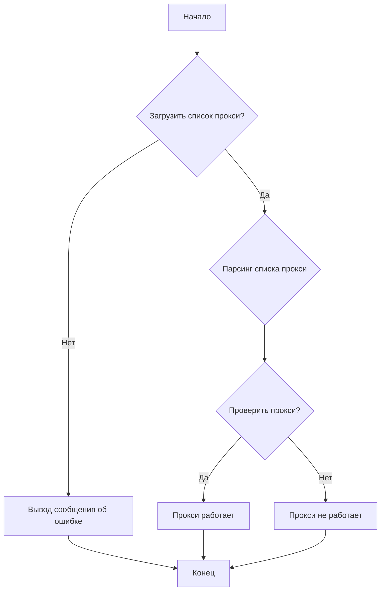
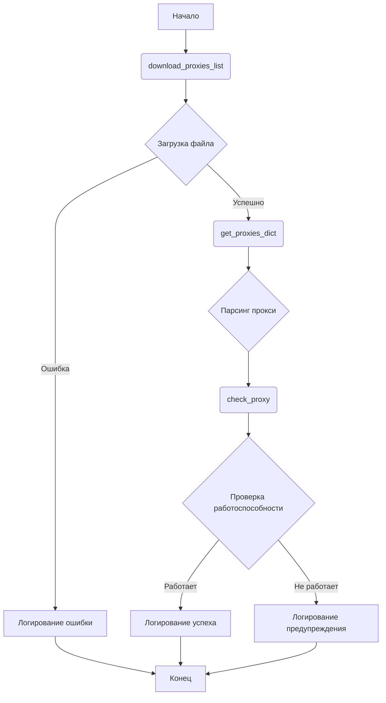
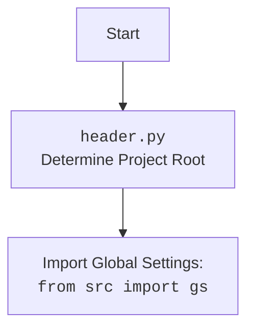

## Анализ кода `hypotez/src/webdriver/proxy.py`

### 1. <алгоритм>

#### Общая схема работы:
1. **Загрузка списка прокси**:
   - Функция `download_proxies_list` загружает текстовый файл со списком прокси-серверов по URL-адресу `https://raw.githubusercontent.com/proxifly/free-proxy-list/main/proxies/all/data.txt` и сохраняет его в файл `proxies.txt`.
   - Если загрузка прошла успешно, возвращается `True`, иначе — `False`.
   - Пример:
     ```python
     if download_proxies_list():
         print("Список прокси успешно загружен")
     else:
         print("Ошибка при загрузке списка прокси")
     ```
2. **Парсинг списка прокси**:
   - Функция `get_proxies_dict` открывает файл `proxies.txt`, читает его построчно и извлекает IP-адреса, порты и типы прокси (HTTP, SOCKS4, SOCKS5) с использованием регулярных выражений.
   - Прокси распределяются по категориям (http, socks4, socks5) в словаре.
   - Пример:
     ```python
     proxies = get_proxies_dict()
     print(proxies)
     # {'http': [{'protocol': 'http', 'host': '1.2.3.4', 'port': '8080'}], 'socks4': [...], 'socks5': [...]}
     ```
3. **Проверка прокси**:
   - Функция `check_proxy` проверяет работоспособность каждого прокси-сервера, отправляя HTTP-запрос на `https://httpbin.org/ip` через данный прокси.
   - Если прокси работает и возвращает статус код 200, возвращается `True`, иначе — `False`.
   - Пример:
     ```python
     proxy = {'protocol': 'http', 'host': '1.2.3.4', 'port': '8080'}
     if check_proxy(proxy):
         print("Прокси работает")
     else:
         print("Прокси не работает")
     ```

#### Блок-схема:



### 2. <mermaid>



#### Зависимости:
- `re`: Используется для парсинга строк с прокси-серверами с помощью регулярных выражений.
- `requests`: Используется для выполнения HTTP-запросов для загрузки списка прокси и проверки их работоспособности.
- `pathlib.Path`: Используется для определения путей к файлам и директориям.
- `typing.Dict, List, Optional, Any`: Используется для аннотации типов.
- `header`: Содержит общие настройки и константы проекта, включая корневой путь.
- `src.gs`: Глобальные настройки проекта.
- `src.utils.printer.pprint`: Функция для "красивой" печати данных.
- `src.logger.logger`: Модуль для логирования событий и ошибок.



### 3. <объяснение>

#### Импорты:
- `re`: Модуль для работы с регулярными выражениями, используется для парсинга строк с прокси-серверами.
- `requests`: Библиотека для отправки HTTP-запросов. Используется для загрузки списка прокси и проверки их работоспособности.
- `requests.exceptions.ProxyError, requests.exceptions.RequestException`: Исключения, возникающие при работе с прокси и выполнении запросов.
- `pathlib.Path`: Класс для представления путей к файлам и директориям.
- `typing.Any, typing.Dict, typing.List, typing.Optional`: Модуль для аннотации типов.
- `header`: Локальный модуль, определяющий корень проекта. Импортируется `__root__` из `header`.
- `src.gs`: Предположительно, глобальные настройки проекта.
- `src.utils.printer.pprint`: Функция для "красивой" печати данных (pretty print).
- `src.logger.logger`: Модуль для логирования.

#### Переменные:
- `url: str`: URL-адрес, по которому можно скачать список прокси. Значение: `'https://raw.githubusercontent.com/proxifly/free-proxy-list/main/proxies/all/data.txt'`.
- `proxies_list_path: Path`: Путь к файлу, в который будет сохранен список прокси. Определяется как `__root__ / 'src' / 'webdriver' / 'proxies.txt'`.

#### Функции:
- `download_proxies_list(url: str = url, save_path: Path = proxies_list_path) -> bool`:
  - Загружает файл по указанному `url` и сохраняет его по пути `save_path`.
  - Возвращает `True` в случае успеха и `False` в случае ошибки.
  - Использует `requests.get` для загрузки файла и `response.iter_content` для чтения файла по частям.
  - Логирует информацию об успехе или ошибке с использованием `logger.info` и `logger.error`.

- `get_proxies_dict(file_path: Path = proxies_list_path) -> Dict[str, List[Dict[str, Any]]]`:
  - Читает файл с прокси-серверами, указанный в `file_path`, и парсит его.
  - Распределяет прокси по типам (http, socks4, socks5) в словаре.
  - Использует регулярные выражения (`re.match`) для извлечения данных о прокси.
  - Возвращает словарь, где ключи — типы прокси, а значения — списки словарей с информацией о каждом прокси.
  - Логирует ошибки, если файл не найден или при парсинге.

- `check_proxy(proxy: dict) -> bool`:
  - Проверяет работоспособность прокси-сервера, отправляя запрос на `https://httpbin.org/ip` через указанный прокси.
  - Принимает словарь `proxy` с данными о прокси (host, port, protocol).
  - Возвращает `True`, если прокси работает, и `False` в противном случае.
  - Использует `requests.get` с параметром `proxies` для отправки запроса через прокси.
  - Логирует информацию о работоспособности прокси с использованием `logger.info` и `logger.warning`.

#### Классы:
- В данном коде классы отсутствуют.

#### Потенциальные ошибки и области для улучшения:
- Обработка исключений: В функциях `download_proxies_list` и `get_proxies_dict` используется общая обработка исключений (`except Exception as ex`). Лучше обрабатывать конкретные типы исключений для более точной обработки ошибок.
- Отсутствует обработка случая, когда список прокси не содержит ни одного валидного прокси.
- В функции `check_proxy` при возникновении `ProxyError` или `RequestException` можно добавить повторные попытки подключения с небольшими задержками.

#### Взаимосвязи с другими частями проекта:
- Модуль `proxy.py` зависит от модулей `header`, `src.gs`, `src.utils.printer` и `src.logger.logger`. Он использует `header` для определения корневого пути проекта, `src.gs` для получения глобальных настроек, `src.utils.printer` для "красивой" печати и `src.logger.logger` для логирования.
- Этот модуль, вероятно, используется другими частями проекта, которым требуется работа с прокси-серверами, например, для обхода блокировок или анонимизации запросов.