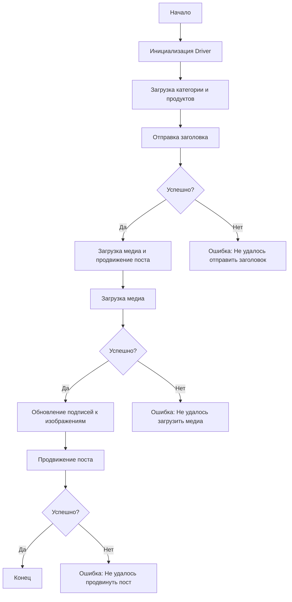

# Сценарий асинхронной публикации сообщения на Facebook

## Обзор

Этот скрипт автоматизирует процесс публикации сообщений на Facebook. Он взаимодействует со страницей Facebook, используя локаторы для выполнения различных действий, таких как отправка сообщений, загрузка медиафайлов и обновление подписей.

## Подробней

Этот скрипт является частью директории `hypotez/src/endpoints/advertisement/facebook/scenarios` и предназначен для автоматизации процесса публикации сообщений на Facebook. Он управляет всем процессом продвижения поста с заголовком, описанием и медиафайлами. Скрипт включает надежную обработку ошибок, чтобы обеспечить продолжение выполнения даже в случае, если некоторые элементы не найдены или если возникли проблемы с веб-страницей.

## Структура модуля



### Легенда

1. **Start**: Начало выполнения скрипта.
2. **InitDriver**: Создание экземпляра класса `Driver`.
3. **LoadCategoryAndProducts**: Загрузка данных категории и продуктов.
4. **SendTitle**: Вызов функции `post_title` для отправки заголовка.
5. **CheckTitleSuccess**: Проверка успешности отправки заголовка.
   - **Да**: Переход к загрузке медиа и продвижению поста.
   - **Нет**: Вывод ошибки "Не удалось отправить заголовок".
6. **UploadMediaAndPromotePost**: Вызов функции `promote_post`.
7. **UploadMedia**: Вызов функции `upload_media` для загрузки медиафайлов.
8. **CheckMediaSuccess**: Проверка успешности загрузки медиа.
   - **Да**: Переход к обновлению подписей к изображениям.
   - **Нет**: Вывод ошибки "Не удалось загрузить медиа".
9. **UpdateCaptions**: Вызов функции `update_images_captions` для обновления подписей.
10. **PromotePost**: Завершение процесса продвижения поста.
11. **CheckPromoteSuccess**: Проверка успешности продвижения поста.
    - **Да**: Конец выполнения скрипта.
    - **Нет**: Вывод ошибки "Не удалось продвинуть пост".

## Функции

### `post_title`

```python
def post_title(d: Driver, category: SimpleNamespace) -> bool:
    """ This if example function
    Args:
        d (Driver): Экземпляр `Driver` для взаимодействия с веб-страницей.
        category (SimpleNamespace): Категория, содержащая заголовок и описание для отправки.
    Returns:
        bool: `True`, если заголовок и описание были успешно отправлены, иначе `None`.

     Raises:
          Ошибка выполнение

     Example:
         Примеры вызовов

    """
    - Не выводи тело функции. только документацию и примеры вызова функции;
```

**Описание**: Отправляет заголовок и описание кампании в поле сообщения на Facebook.

**Параметры**:
- `d` (Driver): Экземпляр `Driver` для взаимодействия с веб-страницей.
- `category` (SimpleNamespace): Категория, содержащая заголовок и описание для отправки.

**Возвращает**:
- `bool`: `True`, если заголовок и описание были успешно отправлены, иначе `None`.

### `upload_media`

```python
def upload_media(d: Driver, products: List[SimpleNamespace], no_video: bool = False) -> bool:
    """ This if example function
    Args:
        d (Driver): Экземпляр `Driver` для взаимодействия с веб-страницей.
        products (List[SimpleNamespace]): Список продуктов, содержащих пути к медиафайлам.
        no_video (bool, optional): Флаг, указывающий, следует ли пропустить загрузку видео. По умолчанию `False`.
    Returns:
        bool: `True`, если медиафайлы были успешно загружены, иначе `None`.

     Raises:
          Ошибка выполнение

     Example:
         Примеры вызовов

    """
    - Не выводи тело функции. только документацию и примеры вызова функции;
```

**Описание**: Загружает медиафайлы на пост Facebook и обновляет их подписи.

**Параметры**:
- `d` (Driver): Экземпляр `Driver` для взаимодействия с веб-страницей.
- `products` (List[SimpleNamespace]): Список продуктов, содержащих пути к медиафайлам.
- `no_video` (bool, optional): Флаг, указывающий, следует ли пропустить загрузку видео. По умолчанию `False`.

**Возвращает**:
- `bool`: `True`, если медиафайлы были успешно загружены, иначе `None`.

### `update_images_captions`

```python
def update_images_captions(d: Driver, products: List[SimpleNamespace], textarea_list: List[WebElement]) -> None:
    """ This if example function
    Args:
        d (Driver): Экземпляр `Driver` для взаимодействия с веб-страницей.
        products (List[SimpleNamespace]): Список продуктов с деталями для обновления.
        textarea_list (List[WebElement]): Список текстовых полей, куда добавляются подписи.
    Returns:
        bool: `True`, если медиафайлы были успешно загружены, иначе `None`.

     Raises:
          Ошибка выполнение

     Example:
         Примеры вызовов

    """
    - Не выводи тело функции. только документацию и примеры вызова функции;
```

**Описание**: Асинхронно добавляет описания к загруженным медиафайлам.

**Параметры**:
- `d` (Driver): Экземпляр `Driver` для взаимодействия с веб-страницей.
- `products` (List[SimpleNamespace]): Список продуктов с деталями для обновления.
- `textarea_list` (List[WebElement]): Список текстовых полей, куда добавляются подписи.

### `promote_post`

```python
def promote_post(d: Driver, category: SimpleNamespace, products: List[SimpleNamespace], no_video: bool = False) -> bool:
    """ This if example function
    Args:
        d (Driver): Экземпляр `Driver` для взаимодействия с веб-страницей.
        category (SimpleNamespace): Детали категории, используемые для заголовка и описания поста.
        products (List[SimpleNamespace]): Список продуктов, содержащих медиа и детали для публикации.
        no_video (bool, optional): Флаг, указывающий, следует ли пропустить загрузку видео. По умолчанию `False`.
    Returns:
        bool: `True`, если пост был успешно продвинут, иначе `None`.

     Raises:
          Ошибка выполнение

     Example:
         Примеры вызовов

    """
    - Не выводи тело функции. только документацию и примеры вызова функции;
```

**Описание**: Управляет процессом продвижения поста с заголовком, описанием и медиафайлами.

**Параметры**:
- `d` (Driver): Экземпляр `Driver` для взаимодействия с веб-страницей.
- `category` (SimpleNamespace): Детали категории, используемые для заголовка и описания поста.
- `products` (List[SimpleNamespace]): Список продуктов, содержащих медиа и детали для публикации.
- `no_video` (bool, optional): Флаг, указывающий, следует ли пропустить загрузку видео. По умолчанию `False`.

**Возвращает**:
- `bool`: `True`, если пост был успешно продвинут, иначе `None`.

## Использование

Для использования этого скрипта выполните следующие шаги:

1. **Инициализация Driver**: Создайте экземпляр класса `Driver`.
2. **Загрузка локаторов**: Загрузите локаторы из JSON-файла.
3. **Вызов функций**: Используйте предоставленные функции для отправки заголовка, загрузки медиа и продвижения поста.

### Пример

```python
from src.webdriver.driver import Driver
from types import SimpleNamespace

# Инициализация Driver
driver = Driver(...)

# Загрузка категории и продуктов
category = SimpleNamespace(title="Заголовок кампании", description="Описание кампании")
products = [SimpleNamespace(local_image_path='путь/к/изображению.jpg', ...)]

# Отправка заголовка
post_title(driver, category)

# Загрузка медиа и продвижение поста
await promote_post(driver, category, products)
```

## Зависимости

- `selenium`: Для веб-автоматизации.
- `asyncio`: Для асинхронных операций.
- `pathlib`: Для обработки путей к файлам.
- `types`: Для создания простых пространств имен.
- `typing`: Для аннотаций типов.

## Обработка ошибок

Скрипт включает надежную обработку ошибок, чтобы обеспечить продолжение выполнения даже в случае, если некоторые элементы не найдены или если возникли проблемы с веб-страницей.

## Вклад

Вклад в этот скрипт приветствуется. Пожалуйста, убедитесь, что любые изменения хорошо документированы и включают соответствующие тесты.

## Лицензия

Этот скрипт лицензирован под MIT License. Подробности смотрите в файле `LICENSE`.