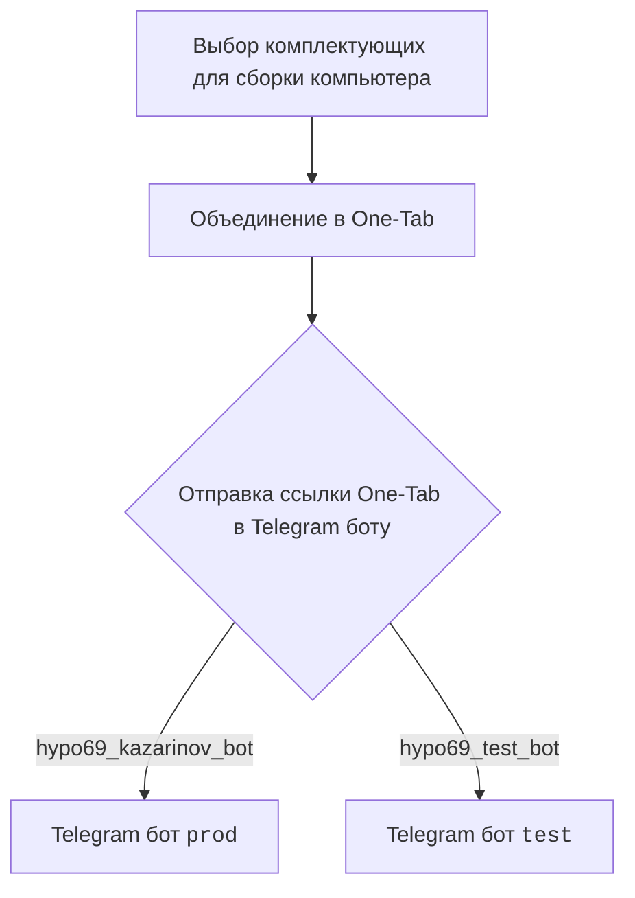
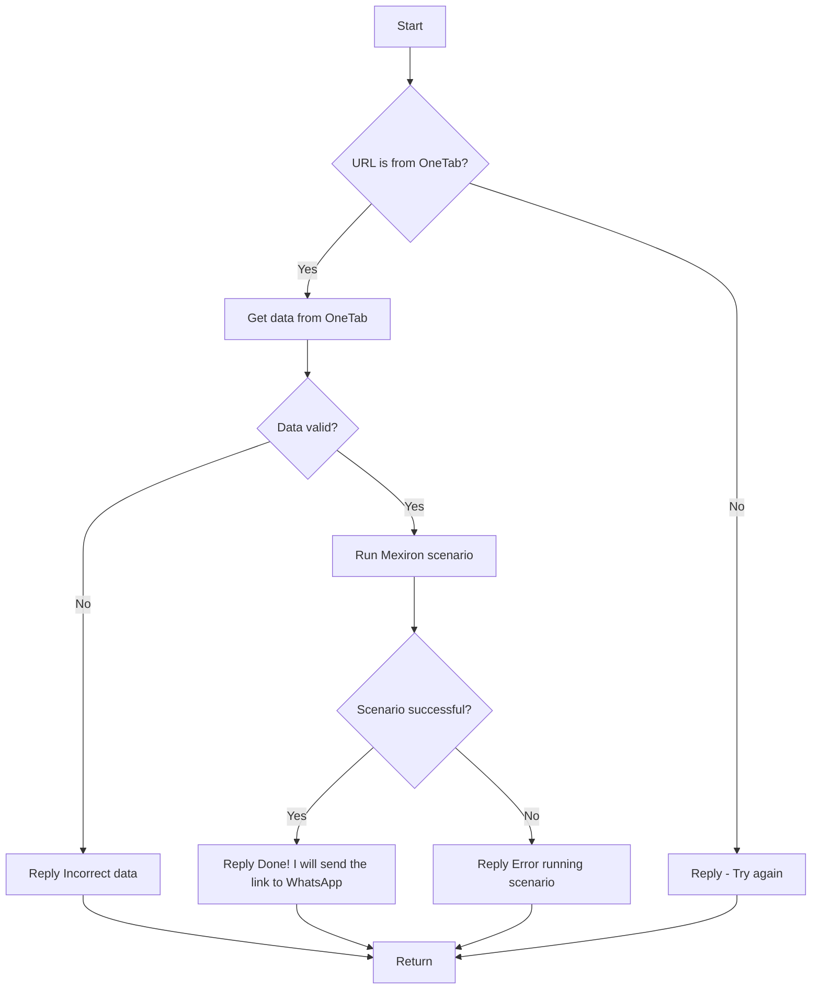

# Документация для модуля `src.endpoints.kazarinov`

## Обзор

Документация предоставляет информацию о создании прайс-листа для Казаринова и описывает взаимодействие с Telegram-ботами `KazarinovTelegramBot` и `BotHandler`. Она включает в себя описание клиентской и серверной частей процесса, а также ссылки на дополнительные ресурсы.

## Подробней

Этот модуль предназначен для автоматизации процесса создания прайс-листов на основе данных, полученных от пользователя через Telegram-бота. Пользователь предоставляет ссылку One-Tab со списком комплектующих для сборки компьютера, бот обрабатывает эти данные и запускает сценарий для формирования прайс-листа.

Код используется для интеграции с Telegram, обработки пользовательских запросов, извлечения и валидации данных из One-Tab, а также запуска сценариев для генерации прайс-листов. Это позволяет автоматизировать процесс, сократить время на обработку запросов и повысить точность предоставляемой информации.

## Диаграммы

### Клиентская часть

### Серверная часть

## Ссылки

- [Казарионв бот](https://github.com/hypo69/hypo/blob/master/src/endpoints/kazarinov/kazarinov_bot.ru.md)
- [Испоолнение сценария](https://github.com/hypo69/hypo/blob/master/src/endpoints/kazarinov/scenarios/readme.ru.md)