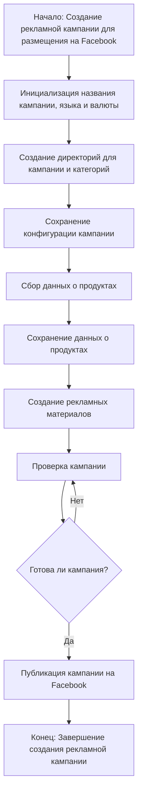

# Модуль campaign

## Обзор

Модуль `campaign` предназначен для управления процессом создания и публикации рекламных кампаний на Facebook. Он включает функционал для инициализации параметров кампании (название, язык, валюта), создания структуры директорий, сохранения конфигураций для новой кампании, сбора и сохранения данных о продуктах через `ali` или `html`, генерации рекламных материалов, проверки кампании и публикации ее на Facebook.

## Подробнее

Данный код используется для автоматизации процесса создания и публикации рекламных кампаний, что позволяет упростить и ускорить процесс запуска рекламы на Facebook. Он предоставляет инструменты для настройки параметров кампании, сбора данных о продуктах, создания рекламных материалов и проверки готовности кампании перед публикацией.

## Функции

### `flowchart`



**Описание**: Визуальное представление процесса создания рекламной кампании для Facebook.

**Параметры**:
- Отсутствуют

**Возвращает**:
- Графическое представление процесса в формате Mermaid.

**Вызывает исключения**:
- Отсутствуют

**Примеры**:

Пример использования flowchart для визуализации процесса:

```mermaid
flowchart TD
    A[Начало: Создание рекламной кампании для размещения на Facebook] --> B[Инициализация названия кампании, языка и валюты]
    B --> C[Создание директорий для кампании и категорий]
    C --> D[Сохранение конфигурации кампании]
    D --> E[Сбор данных о продуктах]
    E --> F[Сохранение данных о продуктах]
    F --> G[Создание рекламных материалов]
    G --> H[Проверка кампании]
    H --> I{Готова ли кампания?}
    I -- Да --> J[Публикация кампании на Facebook]
    I -- Нет --> H
    J --> K[Конец: Завершение создания рекламной кампании]