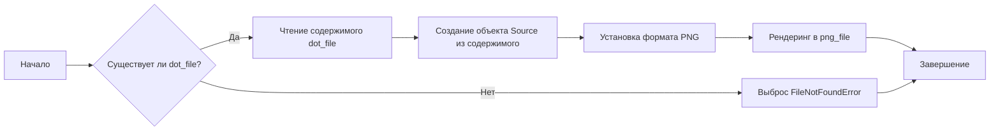

# Модуль dot

## Обзор

Модуль `dot` предназначен для конвертации файлов в формате DOT (Graphviz) в изображения PNG с использованием библиотеки Graphviz. Он содержит функцию `dot2png`, которая выполняет преобразование, обрабатывая возможные исключения, такие как отсутствие входного DOT-файла. Модуль также включает пример использования в качестве скрипта командной строки.

## Подорбней

Этот модуль предоставляет удобный способ автоматизации процесса преобразования DOT-файлов в PNG-изображения. Он использует библиотеку Graphviz для рендеринга графов, описанных в формате DOT, в графические файлы. Модуль полезен для визуализации сложных структур данных и отношений, представленных в виде графов. В контексте проекта `hypotez`, этот модуль может быть использован для визуализации различных этапов обработки данных или структуры моделей.

## Функции

### `dot2png`

```python
def dot2png(dot_file: str, png_file: str) -> None:
    """ Converts a DOT file to a PNG image.

    Args:
        dot_file (str): The path to the input DOT file.
        png_file (str): The path where the output PNG file will be saved.

    Raises:
        FileNotFoundError: If the DOT file does not exist.
        Exception: For other errors during conversion.

    Example:
        >>> dot2png('example.dot', 'output.png')
        
        This converts the DOT file 'example.dot' into a PNG image named 'output.png'.
        
        Sample DOT content for 'example.dot':
        
        ```dot
        digraph G {
            A -> B;
            B -> C;
            C -> A;
        }
        ```
        
        To run the script from the command line:
        
        ```bash
        python dot2png.py example.dot output.png
        ```

        This command will create a PNG file named 'output.png' from the graph defined in 'example.dot'.
    """
    ...
```

**Описание**: Преобразует DOT-файл в PNG-изображение.

**Параметры**:
- `dot_file` (str): Путь к входному DOT-файлу.
- `png_file` (str): Путь, по которому будет сохранено выходное PNG-изображение.

**Возвращает**: None

**Вызывает исключения**:
- `FileNotFoundError`: Если DOT-файл не существует.
- `Exception`: При других ошибках во время конвертации.

**Как работает функция**:



**Примеры**:
```python
dot2png('example.dot', 'output.png')
```
Этот пример преобразует файл 'example.dot' в изображение 'output.png'.
```python
# Пример содержимого DOT-файла ('example.dot'):
# digraph G {
#     A -> B;
#     B -> C;
#     C -> A;
# }
```
```python
# Вызов из командной строки:
# python dot2png.py example.dot output.png
```
Эта команда создаст PNG-файл 'output.png' из графа, определенного в 'example.dot'.