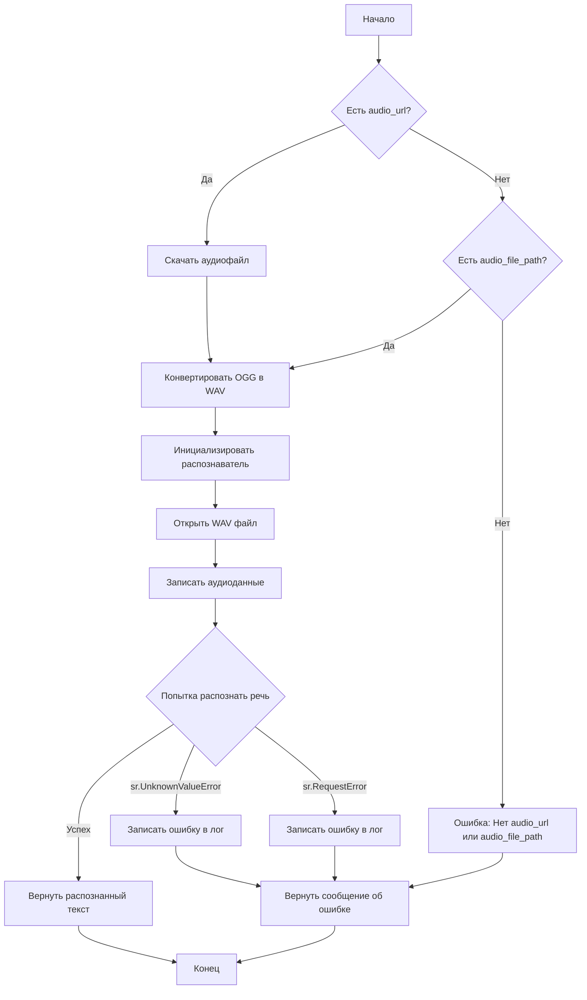
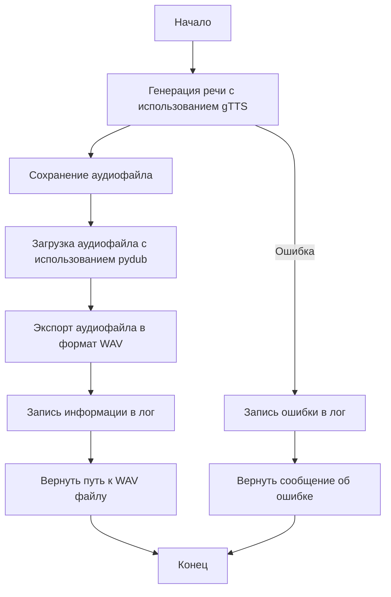

# Модуль `tts`

## Обзор

Модуль `tts` предоставляет функциональность для распознавания речи и преобразования текста в речь. Он включает функции для скачивания аудиофайлов, распознавания речи в них и генерации речи из текста с сохранением в аудиофайлы.

## Подробней

Модуль предназначен для работы с аудиоданными и текстом, позволяя преобразовывать их между собой. Он использует библиотеки `speech_recognition` для распознавания речи и `gTTS` для преобразования текста в речь. Расположение файла в структуре проекта `hypotez` указывает на то, что он является частью утилит для конвертации данных.

## Функции

### `speech_recognizer`

```python
def speech_recognizer(audio_url: str = None, audio_file_path: Path = None, language: str = 'ru-RU') -> str:
    """ Download an audio file and recognize speech in it.

    Args:
        audio_url (str, optional): URL of the audio file to be downloaded. Defaults to `None`.
        audio_file_path (Path, optional): Local path to an audio file. Defaults to `None`.
        language (str): Language code for recognition (e.g., 'ru-RU'). Defaults to 'ru-RU'.

    Returns:
        str: Recognized text from the audio or an error message.

    Example:
        .. code::

            recognized_text = speech_recognizer(audio_url='https://example.com/audio.ogg')
            print(recognized_text)  # Output: "Привет"
    """
```

**Описание**: Распознает речь в аудиофайле, который может быть загружен по URL или указан локальным путем.

**Параметры**:
- `audio_url` (str, optional): URL аудиофайла для скачивания. По умолчанию `None`.
- `audio_file_path` (Path, optional): Локальный путь к аудиофайлу. По умолчанию `None`.
- `language` (str, optional): Языковой код для распознавания (например, 'ru-RU'). По умолчанию 'ru-RU'.

**Возвращает**:
- `str`: Распознанный текст из аудио или сообщение об ошибке.

**Вызывает исключения**:
- `sr.UnknownValueError`: Если Google Speech Recognition не может понять аудио.
- `sr.RequestError`: Если не удается запросить результаты от сервиса Google Speech Recognition.
- `Exception`: При любой другой ошибке во время распознавания речи.

**Как работает функция**:



**Примеры**:

```python
# Пример использования с URL
recognized_text = speech_recognizer(audio_url='https://example.com/audio.ogg')
print(recognized_text)

# Пример использования с локальным файлом
from pathlib import Path
recognized_text = speech_recognizer(audio_file_path=Path('audio.ogg'))
print(recognized_text)
```

### `text2speech`

```python
async def text2speech(text: str, lang: str = 'ru') -> str:
    """ Convert text to speech and save it as an audio file.

    Args:
        text (str): The text to be converted into speech.
        lang (str, optional): Language code for the speech (e.g., 'ru'). Defaults to 'ru'.

    Returns:
        str: Path to the generated audio file.

    Example:
        .. code::

            audio_path = await text2speech('Привет', lang='ru')
            print(audio_path)  # Output: "/tmp/response.mp3"
    """
```

**Описание**: Преобразует текст в речь и сохраняет его в аудиофайл.

**Параметры**:
- `text` (str): Текст для преобразования в речь.
- `lang` (str, optional): Языковой код для речи (например, 'ru'). По умолчанию 'ru'.

**Возвращает**:
- `str`: Путь к сгенерированному аудиофайлу.

**Вызывает исключения**:
- `Exception`: При любой ошибке во время преобразования текста в речь.

**Как работает функция**:



**Примеры**:

```python
# Пример использования
import asyncio
async def main():
    audio_path = await text2speech('Привет', lang='ru')
    print(audio_path)

asyncio.run(main())