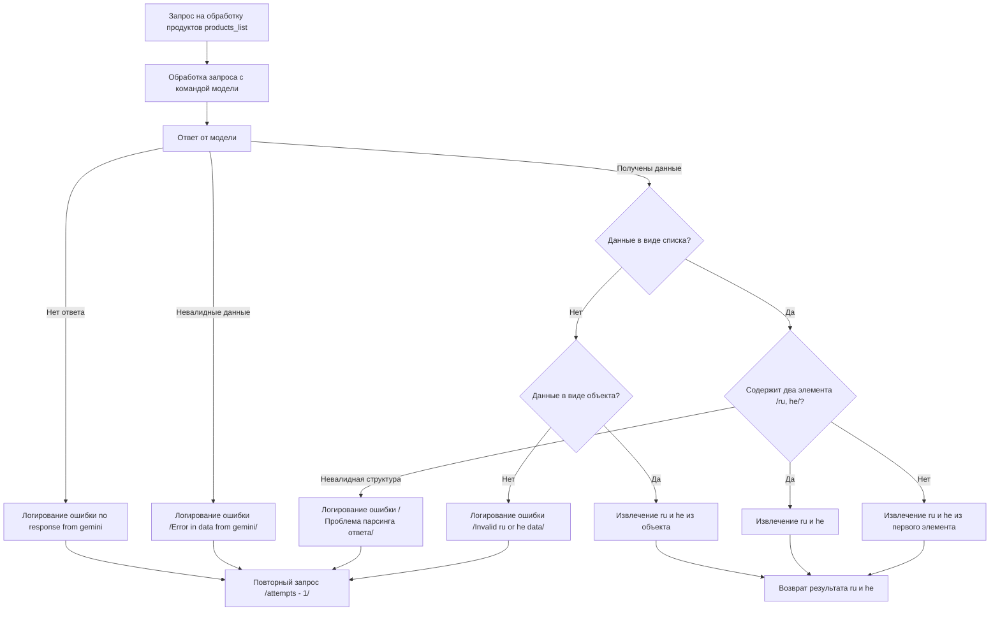

# Описание сценария обработки запроса на обработку продуктов

## Обзор

Этот документ описывает сценарий обработки запроса на обработку списка продуктов `products_list` с использованием AI-модели (предположительно, Google Gemini). Сценарий включает в себя обработку запроса, проверку ответа от модели на валидность данных и структуры, извлечение необходимых данных (ru и he) и логирование ошибок.

## Подробней

Данный сценарий предназначен для автоматизированной обработки и анализа данных о продуктах с использованием AI. Цель сценария - получить структурированные данные (ru и he) из ответа AI-модели, при этом обрабатывая возможные ошибки и невалидные данные.

## Схема процесса

## Описание этапов

### A: Запрос на обработку продуктов `products_list`

Начальный этап, на котором формируется и отправляется запрос на обработку списка продуктов. `products_list` содержит данные, которые необходимо обработать с помощью AI-модели.

### B: Обработка запроса с командой модели

На этом этапе происходит обработка запроса и отправка его в AI-модель (например, Google Gemini). Включает в себя формирование команды для модели и отправку данных на обработку.

### C: Ответ от модели

AI-модель возвращает ответ, который содержит обработанные данные. Дальнейшие шаги зависят от содержимого и формата этого ответа.

### D: Логирование ошибки `no response from gemini`

Если от AI-модели не получен ответ, фиксируется ошибка в логах. Это может быть связано с проблемами сети, ошибками на стороне AI-модели или другими факторами.

### E: Повторный запрос `/attempts - 1/`

После получения ошибки отсутствия ответа делается повторная попытка запроса. Количество попыток ограничено, и при каждой попытке счетчик уменьшается на 1.

### F: Логирование ошибки `/Error in data from gemini/`

Если полученный ответ от AI-модели содержит невалидные данные, фиксируется ошибка в логах. Это может быть связано с неправильным форматированием данных или другими проблемами.

### G: Данные в виде списка?

Проверка формата полученных данных. Определяется, представлен ли ответ от AI-модели в виде списка.

### H: Содержит два элемента `/ru, he/?`

Если данные представлены в виде списка, проверяется, содержит ли список два элемента, которые соответствуют данным на русском (`ru`) и иврите (`he`).

### I: Извлечение `ru` и `he`

Если список содержит два элемента, извлекаются данные на русском (`ru`) и иврите (`he`).

### J: Извлечение `ru` и `he` из первого элемента

Если список не содержит два элемента, делается попытка извлечения данных на русском (`ru`) и иврите (`he`) из первого элемента списка.

### K: Логирование ошибки `/Проблема парсинга ответа/`

Если структура ответа не соответствует ожидаемой, фиксируется ошибка в логах. Это может быть связано с изменением формата ответа AI-модели.

### L: Данные в виде объекта?

Если данные не представлены в виде списка, проверяется, представлены ли они в виде объекта (например, JSON).

### M: Извлечение `ru` и `he` из объекта

Если данные представлены в виде объекта, извлекаются данные на русском (`ru`) и иврите (`he`) из соответствующих полей объекта.

### N: Логирование ошибки `/Invalid ru or he data/`

Если данные на русском (`ru`) или иврите (`he`) не найдены в объекте, фиксируется ошибка в логах.

### O: Возврат результата `ru` и `he`

Конечный этап, на котором возвращаются извлеченные данные на русском (`ru`) и иврите (`he`).