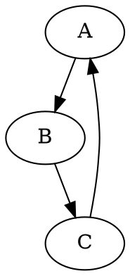

# Модуль `dot`

## Обзор

Модуль `dot` предоставляет функциональность для конвертации файлов в формате DOT (описание графов) в изображения формата PNG с использованием библиотеки Graphviz. Он содержит функцию `dot2png`, которая принимает путь к DOT-файлу и путь для сохранения PNG-файла, выполняя конвертацию и обработку возможных ошибок.

## Подробней

Этот модуль предназначен для автоматической генерации изображений графов из их текстового представления в формате DOT. Это может быть полезно для визуализации сложных структур данных, блок-схем алгоритмов и других графовых моделей.

## Функции

### `dot2png`

```python
def dot2png(dot_file: str, png_file: str) -> None:
    """ Converts a DOT file to a PNG image.

    Args:
        dot_file (str): The path to the input DOT file.
        png_file (str): The path where the output PNG file will be saved.

    Raises:
        FileNotFoundError: If the DOT file does not exist.
        Exception: For other errors during conversion.

    Example:
        >>> dot2png('example.dot', 'output.png')
        
        This converts the DOT file 'example.dot' into a PNG image named 'output.png'.
        
        Sample DOT content for 'example.dot':
        
        ```dot
        digraph G {
            A -> B;
            B -> C;
            C -> A;
        }
        ```
        
        To run the script from the command line:
        
        ```bash
        python dot2png.py example.dot output.png
        ```

        This command will create a PNG file named 'output.png' from the graph defined in 'example.dot'.
    """
```

**Описание**: Конвертирует DOT файл в PNG изображение.

**Как работает функция**:
1. **Чтение DOT файла**: Функция пытается открыть и прочитать содержимое DOT файла, указанного в параметре `dot_file`.
2. **Создание объекта Source**: Создается объект `Source` из библиотеки `graphviz`, используя содержимое DOT файла. Этот объект представляет граф, который будет визуализирован.
3. **Рендеринг в PNG**: Устанавливается формат вывода как PNG, и вызывается метод `render` объекта `Source` для генерации PNG изображения. Параметр `cleanup=True` указывает, что временные файлы, созданные в процессе рендеринга, должны быть удалены.
4. **Обработка исключений**: Если DOT файл не найден, выбрасывается исключение `FileNotFoundError`. В случае любых других ошибок во время конвертации, выбрасывается общее исключение `Exception`.

**Параметры**:
- `dot_file` (str): Путь к входному DOT файлу.
- `png_file` (str): Путь, по которому будет сохранен PNG файл.

**Возвращает**:
- `None`: Функция ничего не возвращает.

**Вызывает исключения**:
- `FileNotFoundError`: Если DOT файл не существует.
- `Exception`: В случае возникновения других ошибок во время конвертации.

**Примеры**:

Преобразование DOT файла 'example.dot' в PNG изображение 'output.png'.

```python
dot2png('example.dot', 'output.png')
```


Пример запуска из командной строки:

```bash
python dot2png.py example.dot output.png
```
```