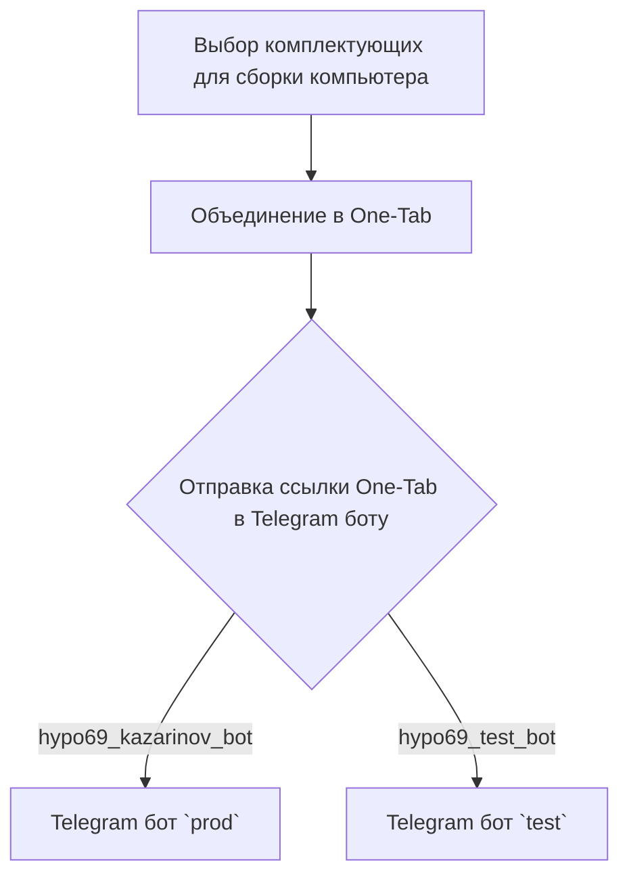
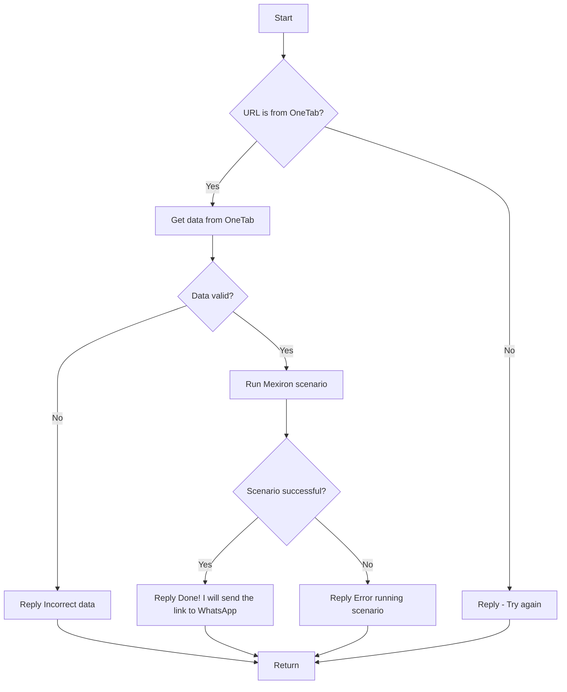

# Анализ кода модуля `README.MD`

## Качество кода:

- **Соответствие стандартам**: 6
- **Плюсы**:
    - Документ содержит подробное описание функциональности модуля `KazarinovTelegramBot`.
    - Наличие Mermaid-диаграмм для наглядного отображения процессов.
    - Ссылки на связанные документы.
- **Минусы**:
    - Документ не является исполняемым кодом и не соответствует требованиям к Python-коду.
    - Используются устаревшие теги HTML (`<TABLE>`, `<TR>`, `<TD>`).
    - Отсутствие форматирования в соответствии со стандартами RST.

## Рекомендации по улучшению:

- Преобразовать HTML-теги в Markdown-синтаксис для лучшей читаемости и соответствия стандартам.
- Избегать использования специфичных HTML-элементов, заменяя их на Markdown, например:
    - `<TABLE>` -> Markdown-таблицы
    - `<A HREF>` -> Markdown-ссылки
-  Улучшить форматирование, чтобы документ был более легким для восприятия.
- Привести документ в соответствие с требованиями к Python-коду, включая использование обратных кавычек (``) вместо одинарных кавычек (`'`).
- Убедиться, что файл не содержит `...`, так как это маркеры кода, которых не должно быть в документации.

## Оптимизированный код:

```markdown
Анализ модуля `src.endpoints.kazarinov`
========================================

Модуль: `KazarinovTelegramBot`
------------------------------

**Описание**:
  - Интеграция с Telegram-ботами для обработки данных, полученных от One-Tab.

Ссылки:
-------
- [Root ↑](https://github.com/hypo69/hypo/blob/master/readme.ru.md)
- [Русский](https://github.com/hypo69/hypo/blob/master/src/endpoints/kazarinov/readme.ru.md)

**Список сайтов**:
- [https://one-tab.co.il](https://one-tab.co.il)
- [https://morlevi.co.il](https://morlevi.co.il)
- [https://grandavance.co.il](https://grandavance.co.il)
- [https://ivory.co.il](https://ivory.co.il)
- [https://ksp.co.il](https://ksp.co.il)

`BotHandler`
------------

**Client side (Kazarinov):**



**Code side:**



Следующие шаги:
---------------
- [Kazarinov bot](https://github.com/hypo69/hypo/blob/master/src/endpoints/kazarinov/kazarinov_bot.md)
- [Scenario Execution](https://github.com/hypo69/hypo/blob/master/src/endpoints/kazarinov/scenarios/README.MD)
```