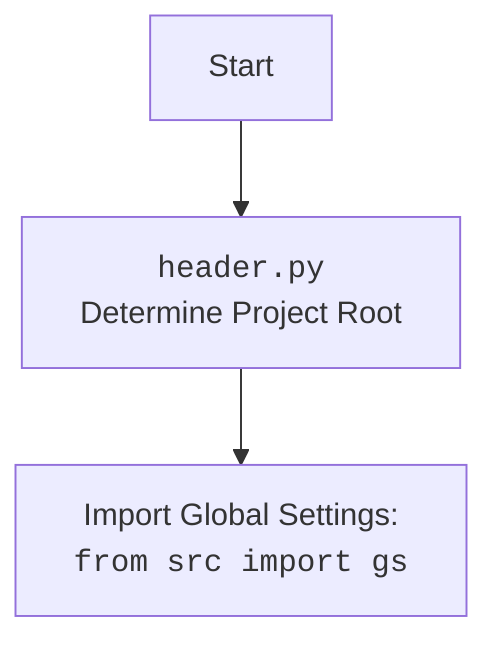

## АНАЛИЗ КОДА: `get_relative_path.py`

### <алгоритм>

1.  **Начало:**
    *   При запуске скрипта `get_relative_path.py` интерпретатор Python начинает выполнение кода.
2.  **Импорт модулей:**
    *   Импортируется модуль `pathlib` для работы с файловыми путями.
    *   Импортируется модуль `header` (предположительно из текущего проекта), который, вероятно, отвечает за определение корневой директории проекта.
    *   Импортируется функция `get_relative_path` из модуля `src.utils.path`.
3.  **Определение абсолютного пути к файлу:**
    *   Создается объект `Path` с путем текущего файла (`__file__`).
    *   Метод `.resolve()` преобразует относительный путь в абсолютный.
        *   Пример: Если `__file__` это `/home/user/hypotez/src/utils/_examples/get_relative_path.py`, то `Path(__file__).resolve()` вернет `/home/user/hypotez/src/utils/_examples/get_relative_path.py`
4.  **Вызов функции `get_relative_path`:**
    *   Вызывается функция `get_relative_path` с двумя аргументами:
        *   Абсолютный путь текущего файла (`/home/user/hypotez/src/utils/_examples/get_relative_path.py`).
        *   Имя целевой директории `hypotez`.
    *   `get_relative_path` вычисляет относительный путь от директории `hypotez` до текущего файла.
5. **Получение относительного пути:**
    * `get_relative_path` возвращает относительный путь в виде строки.
        *  Пример: Если корневая директория проекта `/home/user/hypotez`, то вызов `get_relative_path` с аргументами `/home/user/hypotez/src/utils/_examples/get_relative_path.py` и `'hypotez'` вернет `src/utils/_examples/get_relative_path.py`.
6.  **Вывод относительного пути:**
    *   Полученный относительный путь сохраняется в переменную `relative_path`.
    *   Функция `print` выводит значение `relative_path` в консоль.
7.  **Завершение:**
    *   Скрипт завершает выполнение.

### <mermaid>

```mermaid
flowchart TD
    Start[Начало] --> ImportModules[Импорт модулей: <br><code>pathlib, header, src.utils.path</code>]
    ImportModules --> GetAbsolutePath[Получение абсолютного пути:<br><code>Path(__file__).resolve()</code>]
    GetAbsolutePath --> CallGetRelativePath[Вызов <code>get_relative_path</code>:<br>с абсолютным путем и "hypotez"]
    CallGetRelativePath --> AssignRelativePath[Присваивание результата<br>в <code>relative_path</code>]
    AssignRelativePath --> PrintRelativePath[Вывод <code>relative_path</code><br>через <code>print()</code>]
    PrintRelativePath --> End[Конец]
```



### <объяснение>

#### Импорты:

*   `pathlib`:
    *   Модуль `pathlib` используется для работы с файловыми путями.
    *   Он предоставляет объектно-ориентированный способ взаимодействия с путями, делая код более читаемым и удобным.
*   `header`:
    *   Модуль не является стандартным модулем Python.
    *   Он, скорее всего, является частью текущего проекта (`hypotez`).
    *   Предположительно, он используется для определения корневой директории проекта, что может быть важно для правильной работы `get_relative_path`.
    *   Модуль `header` импортируется для доступа к глобальным настройкам проекта `gs` для определения корневой директории.
*   `src.utils.path.get_relative_path`:
    *   Это функция, которая, как следует из названия, вычисляет относительный путь между двумя директориями.
    *   Она используется для вычисления относительного пути от корневой директории проекта (вероятно, `hypotez`) до текущего файла.
    *   Модуль является частью проекта `hypotez` и предоставляет функции для работы с путями.

#### Переменные:

*   `relative_path`:
    *   Тип: Строка (str).
    *   Назначение: Сохраняет вычисленный относительный путь, который возвращает функция `get_relative_path`.
    *   Используется для хранения и вывода относительного пути в консоль.

#### Функции:

*   `get_relative_path(target_path, project_root_name)`:
    *   Аргументы:
        *   `target_path` (pathlib.Path): абсолютный путь к файлу или директории, относительно которого нужно вычислить путь.
        *   `project_root_name` (str): название корневой директории проекта.
    *   Возвращаемое значение:
        *   `str`: Относительный путь в виде строки.
    *   Назначение: Вычисляет относительный путь от корневой директории проекта до указанного файла или директории.
    *   Пример: `get_relative_path(Path('/home/user/hypotez/src/utils/_examples/get_relative_path.py'), 'hypotez')` вернет `src/utils/_examples/get_relative_path.py`

#### Классы:

*   `pathlib.Path`:
    *   Класс из модуля `pathlib` для представления файловых путей.
    *   Имеет множество методов для работы с путями, таких как `resolve()` для получения абсолютного пути.

#### Потенциальные проблемы и улучшения:

*   **Зависимость от `header`**: Зависимость от кастомного модуля `header` делает код менее переносимым. Если структура проекта изменится или модуль `header` будет недоступен, код сломается. Лучше определить способ для конфигурации корневой директории, например, передавая ее как аргумент в функцию `get_relative_path` или используя переменные окружения.
*   **Явно заданное имя проекта**: Имя корневой директории `'hypotez'` задано явно в коде. Это может стать проблемой, если проект будет переименован. Лучше вычислять название проекта динамически из `header.py`.
*   **Обработка ошибок**: Код не содержит явной обработки ошибок. В случае неправильных путей или других проблем могут возникнуть необработанные исключения. Нужно добавить `try/except` блоки для отлова возможных ошибок и предоставления информативных сообщений.

#### Взаимосвязи:
*   `get_relative_path.py` зависит от `src.utils.path.get_relative_path`, который, в свою очередь, может зависеть от `header.py`, чтобы получить путь до корня проекта.
*   Модуль `header.py` импортирует глобальные настройки `gs`.
*   `get_relative_path` использует класс `pathlib.Path` для манипуляции с путями.

Этот анализ предоставляет всестороннее понимание функциональности предоставленного кода.