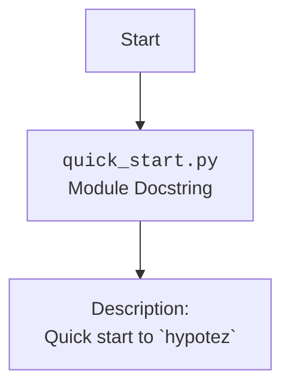

## АНАЛИЗ КОДА `hypotez/src/_examples/quick_start.py`

### 1. <алгоритм>

Блок-схема для файла `quick_start.py` отсутствует, поскольку файл не содержит исполняемого кода, только docstring.  Файл служит примером и в основном предназначен для описания модуля.

### 2. <mermaid>

### 3. <объяснение>

**Импорты:**
  -  В этом конкретном файле нет импортов.

**Классы:**
- В данном файле нет классов.

**Функции:**
- В данном файле нет функций.

**Переменные:**
  - В файле нет переменных, так как основной его контент - это docstring.

**Объяснение:**

Файл `quick_start.py` является примером, демонстрирующим  быстрый старт с библиотекой `hypotez`.  Его основная цель — предоставить описание модуля с помощью docstring.
- Заголовок файла `#! .pyenv/bin/python3` указывает на то, что скрипт должен выполняться в виртуальном окружении Python 3.12.
- Многочисленные комментарии `"""\n\t:platform: Windows, Unix\n\t:synopsis:\n\n"""` и подобные им,  предположительно, являются  docstring-ом  для модуля, который может быть сгенерирован автоматическим генератором документации, но  в данном случае они неинформативны и, скорее всего, требуют доработки.
- Комментарий `""" module: src._examples """` определяет, что файл находится в модуле `src._examples`.
- Docstring `""" Quick start to `hypotez`\n\n"""` описывает предназначение файла, как руководство для быстрого старта в `hypotez`.

**Потенциальные ошибки и области для улучшения:**

- **Отсутствие кода:** Файл не содержит исполняемого кода, что делает его скорее декларацией, чем примером для быстрого старта. Для полноценного примера требуется добавить исполняемый код.
- **Неинформативные Docstrings:** Множественные docstring  содержат только параметры `:platform:` и `:synopsis:`, что не несет смысловой нагрузки. Требуется их пересмотр и добавление осмысленных описаний.
- **Несоответствие имени:**  Файл называется `quick_start.py`, но не содержит кода для быстрого старта. Это может запутать пользователей.

**Взаимосвязи с другими частями проекта:**
- Этот файл является частью модуля `src._examples` и, предположительно, предназначен для демонстрации использования `hypotez`. Для полноценной демонстрации требуется добавить исполняемый код, который использует другие части проекта.