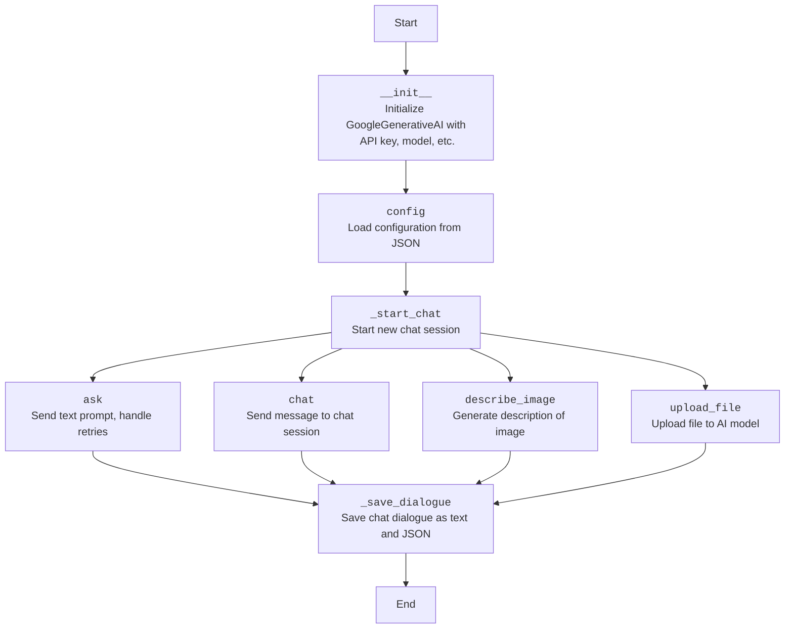

## АНАЛИЗ КОДА: `src/ai/gemini/readme.ru.md`

### 1. **<алгоритм>**
   Этот документ описывает класс `GoogleGenerativeAI`, предназначенный для взаимодействия с моделями Google Generative AI. Алгоритм работы класса можно представить в виде следующей блок-схемы:

   1. **Инициализация (`__init__`)**:
      - Получает `api_key`, `model_name`, `generation_config`, `system_instruction` (опционально) и дополнительные аргументы `kwargs`.
      - Устанавливает ключ API для Google Generative AI.
      - Инициализирует пути для хранения журналов диалогов и истории.
      - Инициализирует модель Google Generative AI.
        - Пример: `ai = GoogleGenerativeAI(api_key="your_api_key", system_instruction="Instruction")`

   2. **Конфигурация (`config`)**:
      - Читает конфигурационный файл `generative_ai.json`.
        - Пример: `config = ai.config()`

   3. **Начало чата (`_start_chat`)**:
      - Инициализирует сессию чата с пустой историей.
        - Пример: `ai._start_chat()`

   4. **Сохранение диалога (`_save_dialogue`)**:
      - Добавляет каждое сообщение диалога в текстовый файл.
      - Добавляет каждое сообщение диалога в JSON файл.
        - Пример: `ai._save_dialogue([{"role":"user", "content":"Привет"}, {"role":"ai", "content":"Привет"}])`

   5. **Запрос (`ask`)**:
      - Принимает текстовый запрос `q` и количество попыток `attempts`.
      - Отправляет запрос в модель Google AI.
        - Обрабатывает ошибки сети и недоступности сервиса.
      - Сохраняет диалог в файлы истории.
      - Возвращает ответ в виде строки.
        - Пример: `response = ai.ask("Как дела?")`

   6. **Чат (`chat`)**:
      - Принимает текстовый запрос `q`.
      - Использует сессию чата, инициализированную методом `_start_chat`.
      - Ведет журнал ошибок и возвращает текст ответа.
        - Пример: `response = ai.chat("Как дела?")`

   7. **Описание изображения (`describe_image`)**:
      - Принимает путь к изображению `image_path`.
      - Кодирует изображение в base64.
      - Отправляет закодированное изображение модели Google AI.
      - Возвращает текстовое описание изображения.
        - Пример: `description = ai.describe_image(Path("/path/to/image.jpg"))`

   8. **Загрузка файла (`upload_file`)**:
      - Принимает путь к файлу `file` и опциональное имя файла `file_name`.
      - Обрабатывает загрузку файла в модель ИИ.
      - Возвращает `True` в случае успеха, `False` в противном случае.
        - Пример: `success = ai.upload_file("/path/to/file.txt", "my_file.txt")`

   9. **Обработка ошибок**:
      - Класс обрабатывает различные типы ошибок: ошибки сети, недоступность сервиса, лимиты квот, ошибки аутентификации, неверный ввод и ошибки API.
      - В случае ошибок используется повторная отправка запроса с экспоненциальной задержкой или логирование ошибки.

   10. **Ведение журнала и истории**:
        - Все взаимодействия с моделью ИИ ведутся в журнале.
        - Диалоги сохраняются в текстовом и JSON форматах.

### 2. **<mermaid>**

   
   **Анализ зависимостей**:
   
   -   `Start`: Начало процесса.
   -   `Init`: Инициализирует класс `GoogleGenerativeAI`, получая API ключ, имя модели и прочие настройки.
   -   `Config`: Загружает конфигурации из JSON файла.
   -   `StartChat`: Создает новую сессию чата.
   -  `Ask`: Отправляет текстовый запрос к модели AI. Эта операция может включать несколько попыток в случае сбоев.
   -   `Chat`: Отправляет сообщение в сессию чата.
   -  `DescribeImage`: Создает текстовое описание изображения.
   -  `UploadFile`: Загружает файл к AI модели.
   -  `SaveDialogue`: Сохраняет историю диалога в текстовом и JSON форматах.
   -   `End`: Завершение процесса.
   
  **Дополнительно**: `header.py` отсутствует в предоставленном контексте, поэтому дополнительный блок mermaid не требуется.

### 3. **<объяснение>**

   - **Импорты**:
     -   `google.generativeai`: Основная библиотека для работы с Google Generative AI. Обеспечивает доступ к моделям и методам для их использования.
     -   `requests`: Библиотека для отправки HTTP запросов, используется для взаимодействия с API, если это необходимо.
     -   `grpc`: Используется для работы с gRPC, протоколом для взаимодействия с Google API.
     -   `google.api_core.exceptions`: Содержит исключения, специфичные для API Google. Помогает обрабатывать ошибки, возникающие при взаимодействии с API.
     -   `google.auth.exceptions`: Содержит исключения, связанные с аутентификацией в Google API. Используется для обработки ошибок аутентификации.
     -   `src.logger`: Модуль для ведения журнала, предоставляет функциональность логирования ошибок и событий.
     -   `src.utils.printer`: Модуль для вывода информации в консоль или журнал.
     -   `src.utils.file`: Модуль для работы с файлами (чтение, запись).
     -   `src.utils.date_time`: Модуль для работы с датой и временем.
     -  `src.utils.convertors.unicode`: Модуль для работы со строками Unicode, возможно, используется для преобразования текста.
     -   `src.utils.jjson`: Модуль для работы с JSON. Используется для чтения и записи данных в формате JSON.
     -   `Path` from `pathlib`: Для работы с путями к файлам и каталогам.
     -  `IOBase` from `io`: Для работы с файлами как с потоками байтов.
     -  `Optional, Dict` from `typing`: Для статической типизации.

   - **Класс `GoogleGenerativeAI`**:
     -   **Роль**: Основной класс для взаимодействия с моделями Google Generative AI.
     -   **Атрибуты**:
         -   `api_key`: Ключ API для доступа к Google Generative AI.
         -   `model_name`: Имя модели, которую нужно использовать.
         -   `generation_config`: Конфигурации для генерации текста.
         -   `system_instruction`: Инструкция для модели AI.
         -   `chat`: Объект сессии чата.
         -   `dialogue_log_path`: Путь к файлу журнала диалогов.
         -   `history_log_path`: Путь к файлу истории.
         -   `model`: Экземпляр модели Google AI.

     -   **Методы**:
         -   `__init__`: Инициализация класса.
         -   `config`: Загрузка конфигурации.
         -   `_start_chat`: Инициализация сессии чата.
         -   `_save_dialogue`: Сохранение диалога.
         -   `ask`: Отправка текстового запроса.
         -   `chat`: Отправка сообщения в сессию чата.
         -   `describe_image`: Генерация описания изображения.
         -   `upload_file`: Загрузка файла в модель.
    
        **Взаимодействие**:
        -   Класс использует `google.generativeai` для взаимодействия с AI.
        -   Использует `src.logger` для записи логов.
        -   Использует модули `src.utils` для работы с файлами, временем и JSON.

   - **Функции**:
      -   `__init__`:
          -   **Аргументы**: `api_key`, `model_name`, `generation_config`, `system_instruction`, `**kwargs`.
          -   **Возвращаемое значение**: None.
          -   **Назначение**: Инициализация экземпляра класса `GoogleGenerativeAI` с заданными параметрами. Настраивает API ключ, модель, логирование, и другие параметры.
          -   **Пример**: `ai = GoogleGenerativeAI(api_key="your_key", model_name="gemini-pro")`
      -   `config`:
          -   **Аргументы**: None.
          -   **Возвращаемое значение**: Dict.
          -   **Назначение**: Загружает настройки из файла `generative_ai.json`.
          -   **Пример**: `settings = ai.config()`
      -   `_start_chat`:
           -   **Аргументы**: None.
           -   **Возвращаемое значение**: None.
           -   **Назначение**: Инициализирует сессию чата с моделью AI.
           -   **Пример**: `ai._start_chat()`
      -   `_save_dialogue`:
          -   **Аргументы**: `dialogue: list`.
          -   **Возвращаемое значение**: None.
          -   **Назначение**: Сохраняет диалог в текстовый и JSON файлы.
          -   **Пример**: `ai._save_dialogue([{'role': 'user', 'content': 'Привет'}, {'role': 'ai', 'content': 'Здравствуйте'}])`
      -   `ask`:
          -   **Аргументы**: `q: str`, `attempts: int = 15`.
          -   **Возвращаемое значение**: `Optional[str]`.
          -   **Назначение**: Отправляет текстовый запрос к модели AI и возвращает ответ. Обрабатывает повторные попытки в случае ошибок.
          -   **Пример**: `answer = ai.ask("Как погода?")`
      -   `chat`:
          -   **Аргументы**: `q: str`.
          -   **Возвращаемое значение**: `str`.
          -   **Назначение**: Отправляет сообщение в сессию чата с моделью AI.
          -   **Пример**: `response = ai.chat("Как дела?")`
      -   `describe_image`:
          -   **Аргументы**: `image_path: Path`.
          -   **Возвращаемое значение**: `Optional[str]`.
          -   **Назначение**: Генерирует описание изображения, используя модель AI.
          -   **Пример**: `description = ai.describe_image(Path("/path/to/image.jpg"))`
      -  `upload_file`:
          -   **Аргументы**: `file: str | Path | IOBase`, `file_name: Optional[str] = None`.
          -   **Возвращаемое значение**: `bool`.
          -   **Назначение**: Загружает файл в модель ИИ.
          -   **Пример**: `success = ai.upload_file("/path/to/file.txt", "my_file.txt")`

   - **Переменные**:
        -  `api_key`: Строка, ключ API для доступа к сервису.
        -   `model_name`: Строка, имя модели для использования.
        -   `generation_config`: Словарь, содержащий настройки генерации.
        -   `system_instruction`: Строка, системная инструкция для модели AI.
        -   `chat`: Объект сессии чата.
        -   `dialogue_log_path`: `Path`, путь к файлу журнала диалогов.
        -   `history_log_path`: `Path`, путь к файлу журнала истории.
        -   `model`: Экземпляр модели Google AI.
        -   `q`: Строка, текстовый запрос пользователя.
        -   `attempts`: Целое число, количество попыток для запроса.
        -   `image_path`: `Path`, путь к файлу изображения.
        -    `file`: Строка или Path или IOBase, путь к файлу.
        -    `file_name`: Опциональная строка, имя файла.

   - **Потенциальные ошибки и улучшения**:
        -   **Отсутствие обработки ошибок**: В представленном коде описана обработка ошибок, но конкретная реализация не представлена, необходимо детально реализовать логику повторных попыток и обработки исключений.
        -   **Зависимости**: Следует убедиться в наличии всех необходимых зависимостей.
        -   **Конфигурация**: Жестко закодированный путь к файлу конфигурации может быть изменен для большей гибкости.
        -   **Безопасность**: Ключ API должен быть защищен (например, через переменные окружения), не следует хранить его в явном виде в коде.
        -   **Асинхронность**: Использование асинхронных операций могло бы повысить производительность.

   - **Взаимосвязи с другими частями проекта**:
     -   Использует `src.logger` для логирования, обеспечивая централизованный журнал для всего проекта.
     -   Использует `src.utils` для работы с файлами, датами и JSON, что позволяет переиспользовать общие утилиты.
     -  Интегрируется с другими частями проекта, которые могут требовать функциональность Google AI, например, для обработки текста, анализа изображений, диалоговых систем и т. д.

   Этот подробный анализ должен обеспечить всестороннее понимание функциональности и взаимосвязей в коде `src.ai.gemini/readme.ru.md`.