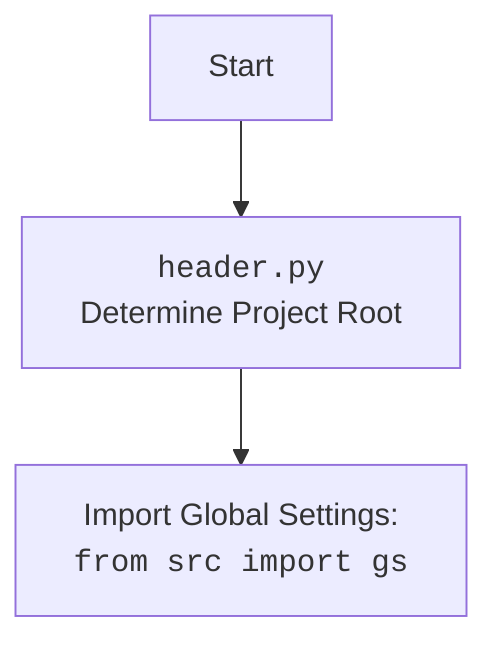

## <алгоритм>

1.  **`set_project_root(marker_files)`**:
    *   Начало: Функция принимает кортеж `marker_files` (по умолчанию `('__root__', '.git')`) для поиска корневой директории проекта.
    *   Определение текущего пути: Получает абсолютный путь к директории, содержащей текущий файл (`__file__`).
    *   Установка начального корневого пути: Присваивает `current_path` переменной `__root__`.
    *   Поиск корневой директории:
        *   Перебирает текущий путь и все его родительские директории.
        *   Для каждой директории проверяет наличие хотя бы одного из файлов/директорий из `marker_files`.
        *   Если маркер найден, обновляет `__root__` и завершает цикл.
    *   Добавление в `sys.path`: Если `__root__` не в списке путей, то добавляет его в начало.
    *   Возврат: Возвращает путь к корневой директории проекта `__root__`.

    **Пример:**
     - Файл: `/Users/user/projects/hypotez/src/ai/myai/header.py`
    - `marker_files = ('__root__', '.git')`
    - Функция перебирает директории от `/Users/user/projects/hypotez/src/ai/myai/` до `/Users/user/projects/hypotez/`
     - Если в `/Users/user/projects/hypotez/` есть `.git` или `__root__`,  то `/Users/user/projects/hypotez/`  становится корневой директорией.
      - Добавляем в `sys.path` путь `/Users/user/projects/hypotez/` и возвращаем его.

2.  **Получение корневой директории**:
    *   Вызывает `set_project_root()` для определения корневой директории и сохраняет результат в `__root__`.
3.  **Чтение файла настроек**:
    *   `settings`: Инициализируется как `None`.
    *   Пытается открыть `settings.json` из `src` в корневом каталоге, загружает данные JSON в словарь `settings`.
    *   Обработка ошибок: Если `FileNotFoundError` или `json.JSONDecodeError`, то ничего не делает (пропускает).
4.  **Чтение документации**:
    *   `doc_str`: Инициализируется как `None`.
    *   Пытается открыть `README.MD` из `src` в корневом каталоге, читает содержимое в `doc_str`.
    *   Обработка ошибок: Если `FileNotFoundError` или `json.JSONDecodeError`, то ничего не делает (пропускает).
5. **Извлечение настроек**:
    *  `__project_name__`:  Извлекает `project_name` из `settings`, иначе устанавливает как `hypotez`.
    *  `__version__`:  Извлекает `version` из `settings`, иначе устанавливает как `''`.
    *  `__doc__`:  Устанавливает  `doc_str`, если  есть,  иначе  `''`.
    *  `__details__`: Устанавливает как `''`.
    *  `__author__`: Извлекает `author` из `settings`, иначе устанавливает как `''`.
    *  `__copyright__`: Извлекает `copyrihgnt` из `settings`, иначе устанавливает как `''`.
     *  `__cofee__`: Извлекает `cofee` из `settings`, иначе устанавливает  значение по умолчанию.

## <mermaid>

```mermaid
flowchart TD
    Start[Начало] --> FindRoot[<code>set_project_root()</code><br>Определить корень проекта]
    FindRoot --> CheckMarkers[Проверка маркеров: <br><code>__root__</code>, <code>.git</code>]
    CheckMarkers --"Маркер найден"--> SetRoot[Установить корень проекта]
    CheckMarkers --"Маркер не найден"--> NextParent[К родительской директории]
    NextParent --> CheckMarkers
    SetRoot --> AddToSysPath[Добавить корень в <code>sys.path</code>]
    AddToSysPath --> ReturnRoot[Вернуть корень проекта]
    ReturnRoot --> ReadSettings[Чтение <code>settings.json</code>]
     ReadSettings --> LoadSettings[Загрузить настройки из JSON]
   
    LoadSettings --"Успешно"--> ReadDoc[Чтение <code>README.MD</code>]
    ReadSettings --"Ошибка"--> SkipSettings[Пропустить чтение настроек]
    SkipSettings--> ReadDoc
    ReadDoc --> LoadDoc[Загрузка документации из файла]
     LoadDoc --"Успешно"--> ExtractConfig[Извлечение настроек]
    LoadDoc --"Ошибка"--> SkipDoc[Пропустить чтение документации]
    SkipDoc --> ExtractConfig
     ExtractConfig --> SetProjectName[Установить <code>__project_name__</code>]
    SetProjectName --> SetVersion[Установить <code>__version__</code>]
    SetVersion --> SetDoc[Установить <code>__doc__</code>]
      SetDoc --> SetDetails[Установить <code>__details__</code>]
      SetDetails --> SetAuthor[Установить <code>__author__</code>]
    SetAuthor --> SetCopyright[Установить <code>__copyright__</code>]
    SetCopyright --> SetCofee[Установить <code>__cofee__</code>]
    SetCofee --> End[Конец]

```



## <объяснение>

**Импорты:**

*   `sys`: Используется для доступа к переменным и функциям, которые взаимодействуют с интерпретатором Python. В частности, для изменения пути поиска модулей (`sys.path`).
*   `json`: Используется для работы с данными в формате JSON, например, для чтения файла настроек `settings.json`.
*   `packaging.version.Version`: Используется для работы с версиями пакетов, но в этом файле не применяется напрямую.
*   `pathlib.Path`: Используется для работы с путями файловой системы.

**Функции:**

*   `set_project_root(marker_files)`:
    *   **Аргументы**:
        *   `marker_files` (tuple): Кортеж имен файлов или директорий, которые используются для определения корневой директории проекта. По умолчанию `('__root__', '.git')`.
    *   **Возвращаемое значение**: `Path`: Объект `Path` корневой директории проекта.
    *   **Назначение**: Находит корневую директорию проекта, начиная с директории текущего файла, и добавляет её в `sys.path`, что позволяет импортировать модули из этого проекта.
    *   **Пример**: Если файл `header.py` находится в `hypotez/src/ai/myai/`, а маркерный файл `.git` в `hypotez`, то функция вернет `Path('/path/to/hypotez')`.

**Переменные:**

*   `__root__`: (`Path`): Путь к корневой директории проекта, полученный в результате вызова `set_project_root()`.
*   `settings`: (`dict` или `None`): Словарь настроек проекта, загруженный из `settings.json`, или `None` при ошибке чтения.
*   `doc_str`: (`str` или `None`): Строка с содержимым документации проекта, загруженная из `README.MD`, или `None` при ошибке чтения.
*   `__project_name__`: (`str`): Название проекта, загружается из `settings`, по умолчанию `hypotez`.
*   `__version__`: (`str`): Версия проекта, загружается из `settings`, по умолчанию `''`.
*   `__doc__`: (`str`): Документация проекта, загружается из `doc_str`, по умолчанию `''`.
*  `__details__`: (`str`): Детали проекта, по умолчанию `''`.
*   `__author__`: (`str`): Автор проекта, загружается из `settings`, по умолчанию `''`.
*   `__copyright__`: (`str`): Авторские права проекта, загружается из `settings`, по умолчанию `''`.
*   `__cofee__`: (`str`): Сообщение о поддержке разработчика, загружается из `settings`, или значение по умолчанию.

**Объяснение:**

Этот код предназначен для определения корневой директории проекта, чтения файла настроек и документации, и определения глобальных переменных.

*   **Поиск корневой директории**: Функция `set_project_root` позволяет программе найти корень проекта независимо от того, где запускается скрипт. Это важно, чтобы код мог правильно находить другие файлы проекта.
*   **Чтение настроек**: Блок `try-except` пытается прочитать файл `settings.json`. Если чтение не удалось, то переменная `settings` останется `None`.
*   **Чтение документации**: Блок `try-except` пытается прочитать файл `README.MD`. Если чтение не удалось, то переменная `doc_str` останется `None`.
*   **Глобальные переменные**: Остальные переменные (`__project_name__`, `__version__`, `__doc__` и т.д.) устанавливаются на основе прочитанных настроек из `settings.json`, используя метод `get`,  который позволяет задать значения по умолчанию в случае отсутствия ключа в словаре `settings`.

**Взаимосвязь с другими частями проекта:**

*   Модуль используется как заголовочный файл, то есть его импортируют другие модули проекта, которые хотят получить доступ к глобальным настройкам и путям.
*   Он обеспечивает настройку `sys.path`, которая позволяет импортировать модули из `src`.
*   Он читает настройки из `src/settings.json` и документацию из `src/README.MD`, которые могут быть использованы другими модулями проекта.
*   Импортирует `from src import gs` - где `gs` является глобальными настройками `src/gs.py`

**Возможные улучшения:**

*   Можно добавить логирование ошибок при чтении файлов настроек и документации, чтобы было легче отлаживать проблемы.
*   Проверка типа для `settings` прежде чем обращаться как к `dict`, на случай если файл не найден.
*   Можно добавить проверку наличия всех необходимых ключей в `settings` и устанавливать значения по умолчанию, если ключи отсутствуют.
*   Добавить документацию в формате docstring для всего файла, а не только для функции.