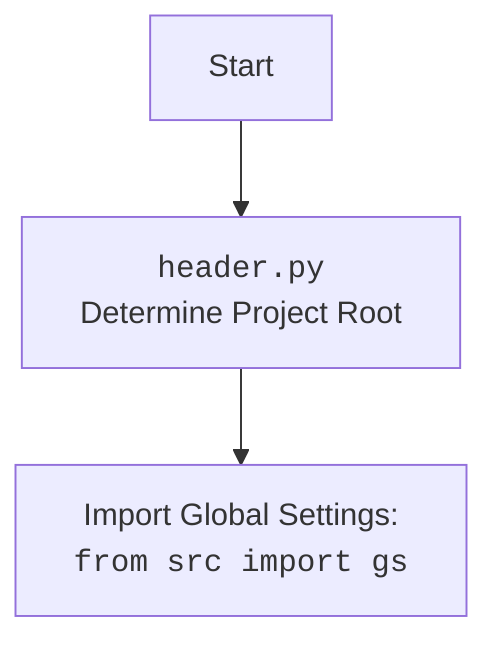

# Проект `hypotez`
# Роль `code explainer`
## АНАЛИЗ КОДА: `hypotez/src/logger/header.py`

### 1. <алгоритм>

#### Шаг 1: Определение корневой директории проекта
1.  Начинаем с текущей директории файла `header.py`.
2.  Ищем маркерные файлы (`__root__`, `.git`) в текущей директории и в родительских директориях.
3.  Если маркерный файл найден, устанавливаем родительскую директорию как корневую директорию проекта.
4.  Если корневая директория не найдена, корневой директорией остается директория, где находится скрипт.
5.  Добавляем корневую директорию в `sys.path`, если её там нет, чтобы обеспечить правильную работу импортов.

```python
def set_project_root(marker_files=('__root__','.git')) -> Path:
    """
    Finds the root directory of the project starting from the current file's directory,
    searching upwards and stopping at the first directory containing any of the marker files.

    Args:
        marker_files (tuple): Filenames or directory names to identify the project root.
    
    Returns:
        Path: Path to the root directory if found, otherwise the directory where the script is located.
    """
    __root__:Path
    current_path:Path = Path(__file__).resolve().parent
    __root__ = current_path
    for parent in [current_path] + list(current_path.parents):
        if any((parent / marker).exists() for marker in marker_files):
            __root__ = parent
            break
    if __root__ not in sys.path:
        sys.path.insert(0, str(__root__))
    return __root__
```

#### Шаг 2: Загрузка настроек из `settings.json`
1.  Пытаемся открыть файл `settings.json`, расположенный в директории `src` относительно корневой директории проекта.
2.  Если файл открыт, загружаем содержимое JSON в словарь `settings`.
3.  Если файл не найден или JSON некорректен, пропускаем этот шаг.

```python
settings:dict = None
try:
    with open(gs.path.root / 'src' /  'settings.json', 'r') as settings_file:
        settings = json.load(settings_file)
except (FileNotFoundError, json.JSONDecodeError):
    ...
```

#### Шаг 3: Загрузка содержимого `README.MD`
1.  Пытаемся открыть файл `README.MD`, расположенный в директории `src` относительно корневой директории проекта.
2.  Если файл открыт, считываем содержимое файла в строку `doc_str`.
3.  Если файл не найден, пропускаем этот шаг.

```python
doc_str:str = None
try:
    with open(gs.path.root / 'src' /  'README.MD', 'r') as settings_file:
        doc_str = settings_file.read()
except (FileNotFoundError, json.JSONDecodeError):
    ...
```

#### Шаг 4: Определение переменных проекта
1.  Получаем значения `project_name`, `version`, `author`, `copyrihgnt`, `cofee` из словаря `settings`, если он был успешно загружен.
2.  Если `settings` не был загружен, устанавливаем значения по умолчанию.
3.  Присваиваем значение `doc_str` переменной `__doc__`, если `doc_str` был успешно загружен.

```python
__project_name__ = settings.get("project_name", 'hypotez') if settings  else 'hypotez'
__version__: str = settings.get("version", '')  if settings  else ''
__doc__: str = doc_str if doc_str else ''
__details__: str = ''
__author__: str = settings.get("author", '')  if settings  else ''
__copyright__: str = settings.get("copyrihgnt", '')  if settings  else ''
__cofee__: str = settings.get("cofee", "Treat the developer to a cup of coffee for boosting enthusiasm in development: https://boosty.to/hypo69")  if settings  else "Treat the developer to a cup of coffee for boosting enthusiasm in development: https://boosty.to/hypo69"
```

### 2. <mermaid>

```mermaid
flowchart TD
    Start --> FindRoot[Найти корневую директорию проекта]
    FindRoot --> CheckMarkerFiles{Проверить маркерные файлы (__root__, .git)}
    CheckMarkerFiles -- Найдено --> SetRoot[Установить корневую директорию]
    CheckMarkerFiles -- Не найдено --> UseCurrentDir[Использовать текущую директорию]
    SetRoot --> AddToSysPath{Добавить в sys.path?}
    UseCurrentDir --> AddToSysPath
    AddToSysPath -- Да --> InsertPath[Вставить путь в sys.path]
    AddToSysPath -- Нет --> End
    InsertPath --> End
    End --> LoadSettings[Загрузить настройки из settings.json]
    LoadSettings -- Успешно --> GetProjectInfo[Получить информацию о проекте]
    LoadSettings -- Ошибка --> SetDefaults[Установить значения по умолчанию]
    GetProjectInfo --> DefineVariables[Определить переменные проекта]
    SetDefaults --> DefineVariables
    DefineVariables --> LoadReadme[Загрузить README.MD]
    LoadReadme -- Успешно --> SetDocString[Установить doc_str]
    LoadReadme -- Ошибка --> SkipDocString[Пропустить doc_str]
    SetDocString --> End2
    SkipDocString --> End2
    End2 --> End
```

**Объяснение зависимостей:**

*   `pathlib.Path`: Используется для работы с путями к файлам и директориям.
*   `sys`: Используется для работы с системными параметрами, такими как `sys.path`.
*   `json`: Используется для загрузки данных из JSON-файла (`settings.json`).
*   `packaging.version.Version`: Используется для сравнения версий.
*   `src.gs`: Используется для доступа к глобальным настройкам проекта.

### 3. <объяснение>

#### Импорты:

*   `sys`: Этот модуль предоставляет доступ к некоторым переменным и функциям, взаимодействующим с интерпретатором Python. В данном случае используется для добавления корневой директории проекта в `sys.path`, чтобы обеспечить правильную работу импортов.
*   `json`: Этот модуль используется для работы с данными в формате JSON. В данном случае применяется для загрузки настроек из файла `settings.json`.
*   `packaging.version.Version`: Этот класс используется для представления и сравнения версий программного обеспечения.
*   `pathlib.Path`: Этот класс предоставляет объектно-ориентированный способ работы с путями к файлам и директориям. Он используется для определения корневой директории проекта и путей к файлам настроек и документации.
*   `from src import gs`: Импортирует глобальные настройки проекта из модуля `gs`.

#### Классы:

*   `pathlib.Path`: Используется для представления путей к файлам и директориям. Методы этого класса используются для определения и манипулирования путями.

#### Функции:

*   `set_project_root(marker_files=('__root__', '.git')) -> Path`:
    *   Аргументы:
        *   `marker_files` (tuple): Кортеж с именами файлов или директорий, которые используются для определения корневой директории проекта. По умолчанию `('__root__', '.git')`.
    *   Возвращаемое значение:
        *   `Path`: Путь к корневой директории проекта.
    *   Назначение:
        *   Функция определяет корневую директорию проекта, начиная с директории текущего файла, и ищет вверх по дереву директорий, пока не найдет директорию, содержащую один из маркерных файлов. Если корневая директория не найдена, возвращается директория, в которой находится скрипт.
    *   Пример:

```python
from pathlib import Path
root_path: Path = set_project_root()
print(root_path)  # Выводит путь к корневой директории проекта
```

#### Переменные:

*   `__root__` (Path): Путь к корневой директории проекта.
*   `settings` (dict): Словарь с настройками проекта, загруженными из файла `settings.json`.
*   `doc_str` (str): Строка с содержимым файла `README.MD`.
*   `__project_name__` (str): Название проекта, полученное из `settings.json` или значение по умолчанию `'hypotez'`.
*   `__version__` (str): Версия проекта, полученная из `settings.json` или пустая строка `''`.
*   `__doc__` (str): Содержимое файла `README.MD`, если он был загружен, или пустая строка `''`.
*   `__details__` (str): Пустая строка `''`.
*   `__author__` (str): Автор проекта, полученный из `settings.json` или пустая строка `''`.
*   `__copyright__` (str): Информация об авторских правах, полученная из `settings.json` или пустая строка `''`.
*   `__cofee__` (str): Сообщение о поддержке разработчика, полученное из `settings.json` или значение по умолчанию `"Treat the developer to a cup of coffee for boosting enthusiasm in development: https://boosty.to/hypo69"`.

#### Потенциальные ошибки и области для улучшения:

*   Обработка исключений при загрузке `settings.json` и `README.MD` выполняется с использованием `...`, что затрудняет отладку. Рекомендуется добавить логирование ошибок с использованием модуля `logger`.
*   Переменные `__details__` всегда присваивается пустая строка. Возможно, это место для добавления дополнительной информации о проекте.
*   Использование `gs.path.root` предполагает, что `gs` уже инициализирован. Следует убедиться, что это так.
*   Определение `__root__:Path` вне функции может привести к проблемам с областями видимости, лучше объявить `__root__` внутри функции.

#### Взаимосвязи с другими частями проекта:

*   Этот модуль устанавливает корневую директорию проекта, что важно для правильной работы импортов в других модулях.
*   Он также загружает настройки из `settings.json`, которые могут использоваться другими модулями для конфигурации.
*   Информация о проекте (название, версия, автор и т.д.) может использоваться в других модулях для отображения информации о проекте.

