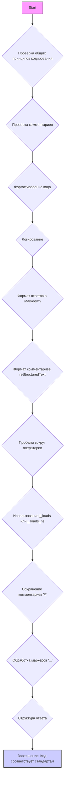

## ИНСТРУКЦИЯ:

Анализируй предоставленный код подробно и объясни его функциональность. Ответ должен включать три раздела:  

1. **<алгоритм>**: Опиши рабочий процесс в виде пошаговой блок-схемы, включая примеры для каждого логического блока, и проиллюстрируй поток данных между функциями, классами или методами.  
2. **<mermaid>**: Напиши код для диаграммы в формате `mermaid`, проанализируй и объясни все зависимости, 
    которые импортируются при создании диаграммы. 
    **ВАЖНО!** Убедитесь, что все имена переменных, используемые в диаграмме `mermaid`, 
    имеют осмысленные и описательные имена. Имена переменных вроде `A`, `B`, `C`, и т.д., не допускаются!  
    
    **Дополнительно**: Если в коде есть импорт `import header`, добавьте блок `mermaid` flowchart, объясняющий `header.py`:\
    ```mermaid
    flowchart TD
        Start --> Header[<code>header.py</code><br> Determine Project Root]
    
        Header --> import[Import Global Settings: <br><code>from src import gs</code>] 
    ```

3. **<объяснение>**: Предоставьте подробные объяснения:  
   - **Импорты**: Их назначение и взаимосвязь с другими пакетами `src.`.  
   - **Классы**: Их роль, атрибуты, методы и взаимодействие с другими компонентами проекта.  
   - **Функции**: Их аргументы, возвращаемые значения, назначение и примеры.  
   - **Переменные**: Их типы и использование.  
   - Выделите потенциальные ошибки или области для улучшения.  

Дополнительно, постройте цепочку взаимосвязей с другими частями проекта (если применимо).  

Это обеспечивает всесторонний и структурированный анализ кода.
## Формат ответа: `.md` (markdown)
**КОНЕЦ ИНСТРУКЦИИ**

### <алгоритм>
Представленный код представляет собой набор инструкций и правил для разработки, анализа и улучшения кода в контексте проекта машинного обучения. Он определяет стандарты для форматирования кода, документирования, использования комментариев, обработки JSON и других аспектов.

**Блок-схема процесса применения этих правил:**

1.  **Начало**: При поступлении нового кода или необходимости анализа существующего, процесс начинается с ознакомления с предоставленными инструкциями.
    
    *   *Пример*: Разработчик начинает работу над новым модулем проекта.
    
2.  **Общие принципы**: Код должен соответствовать общим принципам, таким как:
    *   Соблюдение четкого стиля кодирования.
    *   Обоснование всех изменений и соответствие требованиям.
        
        *   *Пример*: Перед началом работы разработчик убеждается, что он понимает общие принципы кодирования, описанные в правилах.
        
3.  **Комментарии**: Все комментарии должны быть ясными, краткими и точными.
    *   Использование `#` для внутренних комментариев.
    *   Документация для функций, методов и классов в формате **Sphinx** с использованием **reStructuredText (reST)**.
    
    *   *Пример*: Разработчик пишет комментарий `# Этот цикл обрабатывает данные` перед циклом, который обрабатывает данные.
    
4.  **Форматирование кода**:
    *   Использовать одинарные кавычки.
    *   Добавлять пробелы вокруг операторов.
    *   Типизировать все параметры функций.
    *   Избегать `Union`.
        
        *   *Пример*: Разработчик форматирует код `x = 5` вместо `x=5`.
        
5.  **Логирование**:
    *   Использовать модуль `logger` из `src.logger.logger`.
    *   Примеры ошибок должны записываться через `logger.error`.
    
    *   *Пример*: При возникновении ошибки разработчик записывает её `logger.error('Произошла ошибка при чтении файла')`.
    
6.  **Основные требования**:
    *   **Формат Markdown для ответов**: Все ответы должны быть в формате Markdown.
        *   Ответ должен включать:
            *   Исходный код.
            *   Улучшенный код с форматированием и комментариями.
            *   Список изменений с объяснениями.
    
    *   **Формат комментариев**: Использовать описанный стиль комментариев.
        
        *   *Пример*: Применяется пример документирования из инструкции.
        
    *   **Пробелы вокруг операторов присваивания**: Всегда добавлять пробелы вокруг `=`.
    
        *   *Пример*: `x = 5`, а не `x=5`.
        
    *   **Использование `j_loads` или `j_loads_ns`**: Для чтения JSON или конфигурационных файлов.
        *   Заменять стандартный `open` и `json.load` на `j_loads` или `j_loads_ns`.
        
        *   *Пример*: Используется `data = j_loads('config.json')` вместо стандартного `json.load`.
    *   **Сохранение комментариев**: Все существующие комментарии `#` сохраняются в улучшенном коде.
        
        *   *Пример*: Комментарии `#  Не трогать этот код` остаются без изменений.
        
    *   **Обработка `...`**: Маркеры `...` остаются без изменений.
    
7.  **Структура ответа**:
    *   `Улучшенный оптимизированный полный код`.
    *   `Изменения`.
        *   Подробный список всех изменений.
    
    *   *Пример*: После применения правил форматирования, комментариев и других требований, ответ структурируется в соответствии с этими правилами.
    
8.  **Завершение**: Код соответствует всем установленным правилам и стандартам.

### <mermaid>


**Объяснение:**

Диаграмма `mermaid` описывает последовательность проверок и действий, которые необходимо выполнить для обеспечения соответствия кода заданным правилам.

*   `Start` (A): Начальная точка процесса анализа и улучшения кода.
*   `Проверка общих принципов кодирования` (B): Проверка соответствия общим принципам, таким как ясность и обоснованность.
*   `Проверка комментариев` (C): Проверка, что комментарии соответствуют формату и ясности.
*   `Форматирование кода` (D): Проверка и исправление форматирования кода, включая кавычки, пробелы и типы параметров.
*  `Логирование` (E): Проверка правильности использования `logger` для ошибок.
*   `Формат ответов в Markdown` (F): Проверка, что ответы формируются в формате Markdown с нужными секциями.
*   `Формат комментариев reStructuredText` (G): Проверка использования reST для документирования.
*   `Пробелы вокруг операторов` (H): Проверка пробелов вокруг оператора `=`.
*   `Использование j_loads или j_loads_ns` (I): Проверка правильности загрузки JSON файлов.
*   `Сохранение комментариев '#' `(J): Проверка, что комментарии сохраняются при изменениях.
*   `Обработка маркеров '...'` (K): Проверка обработки маркеров `...`.
*   `Структура ответа` (L): Проверка наличия всех нужных секций в ответе.
*   `Завершение: Код соответствует стандартам` (M): Конечная точка, когда код соответствует всем правилам.

**Зависимости:**

В данном контексте диаграмма `mermaid` не имеет внешних зависимостей. Она представляет последовательность шагов, связанных с правилами кодирования и проверки, и не импортирует никаких внешних модулей. В этом случае, нет импортов в самом коде правил.

### <объяснение>

**Обзор**:

Представленный текст представляет собой руководство по стилю и стандартам кодирования, предназначенное для машинного обучения. Он охватывает принципы, формат комментариев, форматирование кода, логирование, обработку JSON и структуру ответов.

**Раздел "Импорты"**:

В самом коде правил нет явных импортов. Однако упоминание `logger` подразумевает, что в проекте `src` есть модуль `src.logger.logger`, который должен быть доступен для использования логирования. Он отвечает за ведение журналов.

*   `src.logger.logger`: Модуль для логирования ошибок и других событий в проекте. Он обеспечивает централизованный способ записи информации о работе программы.

**Раздел "Классы"**:
В предоставленном фрагменте кода отсутствуют определения классов. Код правил в основном состоит из текстовых инструкций.

**Раздел "Функции"**:
В представленном тексте нет определений функций. Однако есть пример функции, документированной в стиле reStructuredText:

```python
def read_text_file(
    file_path: str | Path,
    as_list: bool = False,
    extensions: Optional[list[str]] = None,
    chunk_size: int = 8192
) -> Generator[str, None, None] | str | None:
    """
    Reads the contents of a file (or files from a directory) using a generator for memory efficiency.

    :param file_path: Path to the file or directory.
    :param as_list: If `True`, returns a generator of strings.
    :param extensions: List of file extensions to include when reading a directory.
    :param chunk_size: The size of chunks to read the file in bytes.

    :returns: A string generator, a concatenated string, or `None` in case of error.

    :raises Exception: If an error occurs while reading the file.

    Example:
        >>> from pathlib import Path
        >>> file_path = Path('example.txt')
        >>> content = read_text_file(file_path)
        >>> if content:
        ...    print(f'File content: {content[:100]}...')
        File content: Example text...
    """
    ...
```

*   `read_text_file`: Функция, которая читает содержимое файла или файлов из каталога, используя генератор для эффективного управления памятью.
    *   Аргументы:
        *   `file_path: str | Path`: Путь к файлу или каталогу.
        *   `as_list: bool = False`: Если `True`, функция возвращает генератор строк.
        *   `extensions: Optional[list[str]] = None`: Список расширений файлов для чтения из каталога.
        *   `chunk_size: int = 8192`: Размер блока для чтения файла в байтах.
    *   Возвращает: Генератор строк, строку или `None` в случае ошибки.
    *   Пример использования: Функция показывает, как читать содержимое файла и выводить первые 100 символов.

**Раздел "Переменные"**:
В тексте нет явных объявлений переменных, но есть примеры использования параметров функций.

*   `file_path`: Путь к файлу.
*   `as_list`: Флаг, определяющий, возвращать ли данные в виде списка или строки.
*   `extensions`: Список расширений для фильтрации файлов при чтении каталога.
*   `chunk_size`: Размер блока данных для чтения файла.

**Потенциальные ошибки и области для улучшения:**

1.  **Отсутствие конкретных реализаций**: Правила предоставляют много указаний, но не описывают, как они должны быть реализованы на практике.
2.  **Зависимость от `j_loads` и `j_loads_ns`**: Инструкция требует использования `j_loads` или `j_loads_ns` для JSON, но не объясняет, где и как эти функции определены.
3.  **Неопределенность в обработке ошибок**: Правила требуют логирования ошибок, но не описывают, как обрабатывать или восстанавливаться после них.
4.  **Ограничения в форматировании**: Требование использовать одинарные кавычки может не соответствовать стилю других частей проекта.
5.  **Отсутствие явной структуры для рефакторинга**: Хотя правила предлагают улучшения, нет явного механизма для их автоматического или полуавтоматического применения.

**Взаимосвязь с другими частями проекта:**

*   `src.logger.logger`: Модуль является ключевой частью системы логирования, и правила кодирования гарантируют, что он используется правильно.
*   `j_loads` и `j_loads_ns`: Упоминание этих функций подразумевает их наличие в каком-то из модулей проекта, вероятно, в модуле, отвечающем за чтение конфигурации или JSON.

**Цепочка взаимосвязей:**

1.  Разработчик начинает писать или изменять код.
2.  Правила кодирования (этот файл) применяются для форматирования, документирования и логирования.
3.  Код использует `src.logger.logger` для логирования.
4.  Код использует `j_loads` и `j_loads_ns` для работы с JSON.
5.  Изменения кода записываются в формате Markdown.

**В заключение**:

Представленный код является важным инструментом для стандартизации процесса разработки и анализа кода. Он охватывает широкий спектр аспектов, включая форматирование, документирование, логирование, обработку JSON и структуру ответа. Применение этих правил помогает поддерживать код чистым, читаемым и соответствующим требованиям проекта.