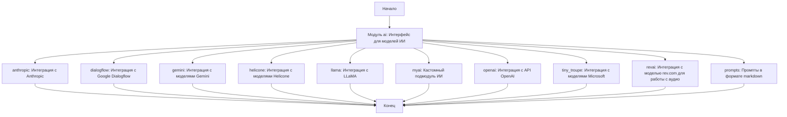

## **Анализ кода**

### <алгоритм>

1.  **Начало**: Пользователь обращается к файлу `readme.ru.md` в директории `src/ai`.
2.  **Обзор модуля ai**: Файл предоставляет общее описание модуля `ai`, который служит интерфейсом для различных моделей искусственного интеллекта (ИИ).
3.  **Подмодули**: Модуль `ai` разделен на несколько подмодулей, каждый из которых отвечает за интеграцию с конкретной моделью или API ИИ.
    *   **anthropic**: Интеграция с моделями Anthropic.
    *   **dialogflow**: Интеграция с Google Dialogflow.
    *   **gemini**: Интеграция с моделями Gemini.
    *   **helicone**: Интеграция с моделями Helicone.
    *   **llama**: Интеграция с моделью LLaMA.
    *   **myai**: Кастомный подмодуль ИИ.
    *   **openai**: Интеграция с API OpenAI.
    *   **tiny\_troupe**: Интеграция с моделями Microsoft.
    *    **revai**: Интеграция с моделью rev.com для работы с аудио.
    *   **prompts**: Содержит системные и командные промпты в формате `markdown`.
4.  **Навигация**: Пользователь может перейти к документации каждого подмодуля по предоставленным ссылкам, например:
    *   `[Перейти к модулю](https://github.com/hypo69/hypo/blob/master/src/ai/anthropic/readme.ru.md)`
5.  **Вклад**: Раздел, призывающий пользователей к сотрудничеству через pull requests и issues.
6.  **Лицензия**: Раздел о лицензии проекта (MIT License), со ссылкой на файл лицензии.
7. **Конец**: Конец документа `readme.ru.md`.

### <mermaid>

**Описание диаграммы:**

*   `Start` (Начало): Начальная точка, когда пользователь открывает `readme.ru.md`.
*   `ModuleAI` (Модуль ai): Центральный модуль, который является контейнером для всех подмодулей ИИ.
*   `Anthropic`, `Dialogflow`, `Gemini`, `Helicone`, `Llama`, `MyAI`, `OpenAI`, `TinyTroupe`, `RevAI`, `Prompts`: Подмодули модуля `ai`, каждый из которых отвечает за интеграцию с конкретным API или моделью ИИ, включая `prompts` - подмодуль для хранения промптов.
*   `End` (Конец): Конечная точка, после ознакомления с содержимым.

**Зависимости:**
Диаграмма показывает структурные зависимости модуля `ai` от его подмодулей. Каждый подмодуль является отдельным блоком и отвечает за свою конкретную интеграцию.

### <объяснение>

**Общая структура:**

Файл `readme.ru.md` в директории `src/ai` служит точкой входа для понимания структуры и назначения модуля `ai`. Он описывает модуль как интерфейс управления различными моделями ИИ. Модуль `ai` разбит на ряд подмодулей, каждый из которых отвечает за интеграцию с конкретной моделью ИИ или API.

**Подмодули:**

*   **anthropic**: Этот подмодуль интегрируется с моделями Anthropic, позволяя использовать их для задач обработки естественного языка.
*   **dialogflow**: Этот подмодуль обеспечивает интеграцию с Google Dialogflow, что позволяет использовать NLU для создания разговорных интерфейсов.
*   **gemini**: Этот подмодуль обеспечивает интеграцию с моделями Gemini, предоставляя доступ к их возможностям.
*   **helicone**: Этот подмодуль интегрируется с моделями Helicone.
*   **llama**: Этот подмодуль предоставляет интерфейс для работы с моделью LLaMA, предназначенной для обработки и генерации текста.
*   **myai**: Этот подмодуль является кастомным и разработан для специфичных конфигураций и потребностей проекта.
*   **openai**: Этот подмодуль интегрируется с API OpenAI и предоставляет доступ к таким моделям, как GPT, для задач генерации текста, классификации и перевода.
*   **tiny\_troupe**: Этот подмодуль обеспечивает интеграцию с моделями Microsoft и предлагает решения для обработки естественного языка с использованием маленьких моделей, оптимизированных для производительности.
*   **revai**: Этот подмодуль интегрируется с моделью rev.com для обработки аудиофайлов.
*    **prompts**: Этот подмодуль содержит системные и командные промпты для моделей ИИ в формате `markdown`.

**Взаимосвязи с другими частями проекта:**

Модуль `ai` является частью общего проекта и, предположительно, взаимодействует с другими модулями проекта для выполнения задач, связанных с ИИ. Точная природа этих взаимодействий зависит от конкретной реализации проекта, но можно предположить, что другие части проекта будут использовать функции и интерфейсы, предоставляемые модулем `ai`, для добавления возможностей ИИ в приложение.
Модуль `ai` не имеет прямой связи с `header.py`, если только какой-либо из подмодулей не импортирует настройки через `src.gs`.

**Дополнительные замечания:**

*   Файл `readme.ru.md` является скорее документацией верхнего уровня, чем реальным кодом. Он предоставляет обзор и структуру модуля `ai`.
*   Файл не содержит ошибок, но может быть улучшен путем добавления более подробной информации о каждом подмодуле, включая примеры использования и конкретные задачи, которые они решают.
*   Добавление раздела с примерами конфигурации и вызовов API могло бы сделать файл еще более полезным для пользователей проекта.
*   Также было бы полезно добавить описание возможных зависимостей между модулями, и возможные пути их использования.
*  Структура `readme.ru.md` указывает на то, что модуль `ai` разработан для интеграции с различными AI сервисами, и его модульная структура позволяет легко расширять его возможности.