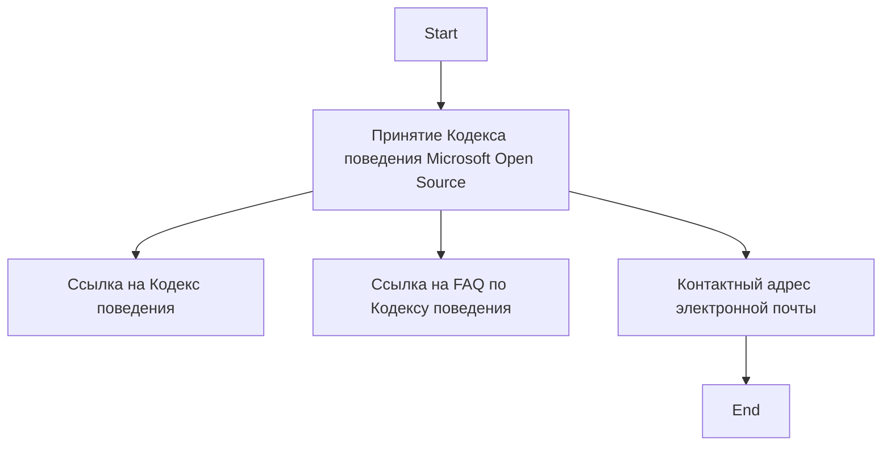

## АНАЛИЗ КОДА: `CODE_OF_CONDUCT.md`

### 1. <алгоритм>

Файл `CODE_OF_CONDUCT.md` не содержит исполняемого кода. Это текстовый файл, содержащий информацию о кодексе поведения проекта, который включает в себя:

1.  **Объявление о принятии кодекса поведения**: Файл начинается с заявления, что проект придерживается Кодекса поведения Microsoft Open Source.
2.  **Ссылки на ресурсы**: Предоставлены ссылки на сам кодекс поведения и часто задаваемые вопросы (FAQ) по нему.
3.  **Контактная информация**: Указан адрес электронной почты для связи в случае возникновения вопросов или проблем, связанных с кодексом поведения.

**Пример логического блока:**

```
Текст начала файла:
    Принять Кодекс поведения Microsoft Open Source.
    Ссылка на Кодекс поведения
    Ссылка на FAQ по Кодексу поведения
    Контактный адрес электронной почты
Конец файла
```

### 2. <mermaid>

Так как файл не содержит исполняемый код, диаграмма mermaid будет отражать только структуру и поток информации в файле.



**Разбор диаграммы `mermaid`:**

*   `flowchart TD`: Определяет тип диаграммы как блок-схему, идущую сверху вниз.
*   `Start`: Начало процесса.
*   `Declaration`: Блок, представляющий заявление о том, что проект принял Кодекс поведения Microsoft Open Source.
*   `CodeOfConductLink`: Блок, содержащий ссылку на сам Кодекс поведения.
*   `CodeOfConductFAQLink`: Блок, содержащий ссылку на FAQ по Кодексу поведения.
*   `ContactEmail`: Блок, содержащий адрес электронной почты для обратной связи.
*   `End`: Конец процесса.

Диаграмма демонстрирует поток информации от начала файла к его концу, показывая, как структурированы различные элементы.

### 3. <объяснение>

**Описание файла `CODE_OF_CONDUCT.md`:**

Этот файл является важной частью проекта, поскольку устанавливает правила поведения для всех участников сообщества. Он обеспечивает безопасную и инклюзивную среду для сотрудничества и способствует продуктивной работе над проектом.

**Разбор содержимого:**

*   **`# Microsoft Open Source Code of Conduct`:** Заголовок, указывающий на то, что данный файл относится к кодексу поведения Microsoft Open Source.
*   **`This project has adopted the [Microsoft Open Source Code of Conduct](https://opensource.microsoft.com/codeofconduct/).`:** Текст, подтверждающий принятие данного кодекса поведения. Это заявление говорит о том, что участники проекта должны соблюдать указанные правила.
*   **`Resources:`:** Заголовок, вводящий список ресурсов.
*   **`- [Microsoft Open Source Code of Conduct](https://opensource.microsoft.com/codeofconduct/)`:** Ссылка на страницу с полным текстом кодекса поведения.
*   **`- [Microsoft Code of Conduct FAQ](https://opensource.microsoft.com/codeofconduct/faq/)`:** Ссылка на страницу с ответами на часто задаваемые вопросы о кодексе поведения.
*   **`Contact [opencode@microsoft.com](mailto:opencode@microsoft.com) with questions or concerns`:** Адрес электронной почты, который можно использовать для обращений по вопросам, связанным с кодексом поведения.

**Импорты:**

Файл не импортирует никаких модулей, поскольку это текстовый файл, а не программный код.

**Классы и функции:**

Файл не содержит классов или функций, так как это файл разметки, а не исполняемый код.

**Переменные:**

Файл не использует переменные в традиционном смысле программирования, так как это файл разметки, а не код.

**Потенциальные ошибки или области для улучшения:**

*   В файле не может быть ошибок, так как это статичный текстовый документ. Тем не менее, можно проверить, что ссылки на внешние ресурсы активны и ведут на правильные страницы.
*   Возможно стоит добавить более подробное описание, как применять данный кодекс поведения в рамках проекта, или добавить примеры ситуаций, на которые этот кодекс распространяется.

**Взаимосвязи с другими частями проекта:**

Файл `CODE_OF_CONDUCT.md` является частью корневой директории проекта, которая содержит общую информацию и руководства по участию в проекте. Он важен для установления стандартов поведения, которые должны соблюдать все участники, и поэтому влияет на атмосферу в сообществе и процесс разработки.