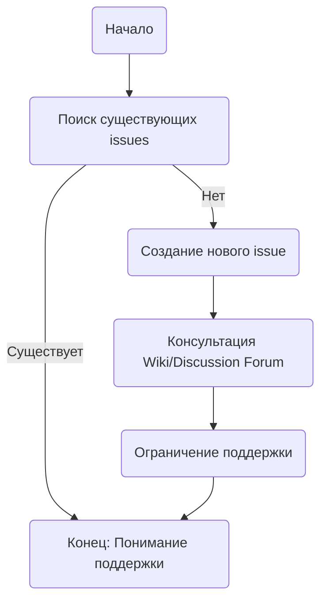

## Анализ файла SUPPORT.md

**<алгоритм>**

1. **Начало**: Пользователь читает документ `SUPPORT.md`.
2. **Поиск существующих issues**: Пользователю рекомендуется поискать существующие issues, чтобы избежать дублирования.
3. **Файл нового issue**: Если не найдено соответствующего issue, пользователю предлагается создать новый issue для сообщения об ошибке или запроса новой функции.
4. **Консультация Wiki/Discussion Forum**: Для получения помощи по использованию проекта, пользователю предлагается обратиться к Wiki или Discussion forum.
5. **Ограничение поддержки**: Документ подчеркивает, что поддержка ограничивается ресурсами, перечисленными выше.
6. **Конец**: Пользователь ознакомлен с информацией о поддержке.

**<mermaid>**

**<объяснение>**

Файл `SUPPORT.md` представляет собой документ, который информирует пользователей о том, как сообщать о проблемах и получать помощь, связанные с проектом `TinyTroupe`.

-   **Поиск существующих issues**: Перед созданием нового отчета о проблеме, пользователи должны проверить, не было ли подобной проблемы уже зарегистрировано. Это делается для избежания дублирования задач и экономии времени разработчиков.
-   **Файл нового issue**: Если проблема не найдена, пользователь должен завести новый issue, где он детально опишет свою проблему или запрос на новую функцию.
-   **Консультация Wiki/Discussion Forum**: Для получения помощи по использованию проекта, пользователю предлагается обратиться к Wiki или Discussion forum, расположенным на GitHub.
-  **Ограничение поддержки**: Документ явно указывает, что поддержка проекта `TinyTroupe` ограничена перечисленными ресурсами, что означает, что команда разработчиков не предоставляет поддержку через другие каналы.

**Взаимосвязь с другими частями проекта:**

Данный файл `SUPPORT.md` является частью документации проекта и не связан непосредственно с кодом, но является важной частью инфраструктуры поддержки пользователей. Он помогает организовать обратную связь и делает поддержку более эффективной. Он связывает проект с сообществом пользователей, указывая, где и как они могут получить помощь и оставить свой отзыв.