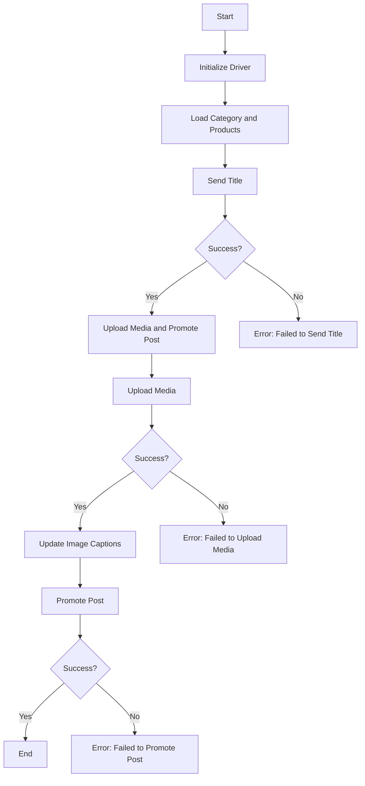

## АНАЛИЗ КОДА: `post_message_async.md`

### 1. <алгоритм>

1.  **Начало:** Запускается скрипт для асинхронной публикации сообщения в Facebook.

    *   Пример: Скрипт `post_message_async.py` начинает выполнение.
2.  **Инициализация драйвера:** Создается экземпляр класса `Driver`, который используется для взаимодействия с веб-страницей Facebook.

    *   Пример: `driver = Driver(...)` создает объект `driver`, управляющий браузером.
3.  **Загрузка данных:** Загружаются данные о категории и продуктах для публикации.

    *   Пример: `category = SimpleNamespace(title="Заголовок", description="Описание")`, `products = [SimpleNamespace(local_image_path='path/to/image.jpg')]`
4.  **Отправка заголовка:** Вызывается функция `post_title` для отправки заголовка и описания в поле сообщения Facebook.

    *   Пример: `post_title(driver, category)` пытается заполнить поле сообщения заголовком и описанием.
5.  **Проверка отправки заголовка:** Проверяется, успешно ли отправлен заголовок.
    *   **Да:**  Переход к загрузке медиа и продвижению поста.
    *   **Нет:** Вывод сообщения об ошибке "Не удалось отправить заголовок".

        *   Пример: `if post_title(driver, category):` - успешная отправка, `else:` - ошибка отправки.
6.  **Загрузка медиа:** Вызывается функция `upload_media` для загрузки медиа-файлов (изображений, видео).

    *   Пример: `upload_media(driver, products)` загружает изображения, указанные в списке `products`.
7.  **Проверка загрузки медиа:** Проверяется, успешно ли загружены медиа-файлы.
    *   **Да:** Переход к обновлению подписей к изображениям.
    *   **Нет:** Вывод сообщения об ошибке "Не удалось загрузить медиа".

        *   Пример: `if upload_media(driver, products):` - успешная загрузка, `else:` - ошибка загрузки.
8.  **Обновление подписей:** Вызывается функция `update_images_captions` для добавления описаний к загруженным медиа-файлам.

    *   Пример: `update_images_captions(driver, products, textarea_list)` добавляет описания к загруженным изображениям.
9.  **Продвижение поста:** Вызывается функция `promote_post`, которая завершает процесс создания поста.

    *   Пример: `promote_post(driver, category, products)` публикует пост с заголовком, описанием и медиа.
10. **Проверка продвижения поста:** Проверяется, успешно ли опубликован пост.
    *   **Да:** Завершение работы скрипта.
    *   **Нет:** Вывод сообщения об ошибке "Не удалось продвинуть пост".

        *   Пример: `if promote_post(driver, category, products):` - успешная публикация, `else:` - ошибка публикации.
11. **Конец:** Завершение работы скрипта.

### 2. <mermaid>

**Объяснение зависимостей:**

*   **Start**: Начало выполнения скрипта. Не зависит от каких-либо других частей, это отправная точка.
*   **InitDriver**: Инициализирует драйвер браузера для управления веб-страницей. Зависит от модуля `src.webdriver.driver`, который предоставляет класс `Driver`.
*   **LoadCategoryAndProducts**: Загружает данные о категории и продуктах, которые нужно опубликовать. Данные обычно представляют собой объекты `SimpleNamespace` и могут зависеть от внешней конфигурации.
*  **SendTitle**: Функция `post_title` принимает `Driver` и данные о категории, отправляет заголовок и описание поста.
* **CheckTitleSuccess**: Проверка успешности отправки заголовка. Управляет потоком выполнения в зависимости от результата.
*   **UploadMediaAndPromotePost**:  Объединяет вызов функций загрузки медиа и продвижения поста.
*  **UploadMedia**: Функция `upload_media` принимает `Driver` и список продуктов, загружает медиа-файлы.
*  **CheckMediaSuccess**: Проверка успешности загрузки медиа. Управляет потоком выполнения в зависимости от результата.
*  **UpdateCaptions**: Функция `update_images_captions` принимает `Driver`, список продуктов и список текстовых полей.
* **PromotePost**: Функция `promote_post` принимает `Driver`, данные категории и продуктов, осуществляет публикацию поста.
*  **CheckPromoteSuccess**: Проверка успешности публикации поста. Управляет потоком выполнения в зависимости от результата.
*   **End**: Завершение выполнения скрипта.

### 3. <объяснение>

**Импорты:**

*   **`selenium`**: Используется для автоматизации взаимодействия с веб-браузерами. В данном случае `selenium` позволяет скрипту взаимодействовать с Facebook, находить элементы на странице, вводить текст и загружать файлы.
*   **`asyncio`**: Библиотека для написания конкурентного кода с использованием асинхронного ввода/вывода. Позволяет выполнять операции асинхронно, что повышает эффективность скрипта при работе с сетью и веб-страницами.
*   **`pathlib`**: Предоставляет классы для представления файловых путей в виде объектов, что упрощает работу с файловой системой.
*   **`types`**: Используется для создания простых пространств имен (`SimpleNamespace`), которые применяются для хранения данных.
*   **`typing`**: Используется для type hinting, позволяя сделать код более читаемым и надежным за счет проверки типов данных на этапе разработки.

**Классы:**

*   **`Driver` (из `src.webdriver.driver`)**:
    *   **Роль**: Класс `Driver` отвечает за управление браузером и взаимодействие с веб-страницами через Selenium. Он инициализирует драйвер браузера, загружает настройки и предоставляет методы для навигации, поиска элементов, ввода данных и т.д.
    *   **Атрибуты:** Могут включать экземпляры драйвера Selenium (`webdriver`) и другие параметры конфигурации.
    *   **Методы**: Методы для работы с браузером: `find_element`, `send_keys`, `click`, и т. д.
    *   **Взаимодействие**: Используется функциями `post_title`, `upload_media`, `update_images_captions` и `promote_post` для выполнения действий на веб-странице Facebook.

**Функции:**

*   **`post_title(d: Driver, category: SimpleNamespace) -> bool`**:
    *   **Аргументы**:
        *   `d`: Экземпляр класса `Driver`.
        *   `category`: Объект `SimpleNamespace`, содержащий заголовок (`title`) и описание (`description`).
    *   **Возвращает**: `True`, если заголовок и описание успешно отправлены, иначе `None`.
    *   **Назначение**: Отправляет заголовок и описание кампании в поле сообщения Facebook.
    *   **Пример**: `post_title(driver, SimpleNamespace(title="Заголовок", description="Описание"))`
*   **`upload_media(d: Driver, products: List[SimpleNamespace], no_video: bool = False) -> bool`**:
    *   **Аргументы**:
        *   `d`: Экземпляр класса `Driver`.
        *   `products`: Список объектов `SimpleNamespace`, содержащих пути к медиа-файлам.
        *   `no_video`: Флаг, указывающий, нужно ли пропускать загрузку видео (по умолчанию `False`).
    *   **Возвращает**: `True`, если медиа-файлы успешно загружены, иначе `None`.
    *   **Назначение**: Загружает медиа-файлы (изображения и видео) в пост Facebook.
    *   **Пример**: `upload_media(driver, [SimpleNamespace(local_image_path='image.jpg')])`
*   **`update_images_captions(d: Driver, products: List[SimpleNamespace], textarea_list: List[WebElement]) -> None`**:
    *   **Аргументы**:
        *   `d`: Экземпляр класса `Driver`.
        *   `products`: Список объектов `SimpleNamespace` с информацией о медиа-файлах.
        *   `textarea_list`: Список элементов textareas, куда нужно добавить подписи.
    *   **Возвращает**: `None`.
    *   **Назначение**: Асинхронно добавляет подписи к загруженным медиа-файлам.
    *   **Пример**: `update_images_captions(driver, [SimpleNamespace(description='Описание')], textareas)`
*   **`promote_post(d: Driver, category: SimpleNamespace, products: List[SimpleNamespace], no_video: bool = False) -> bool`**:
    *   **Аргументы**:
        *   `d`: Экземпляр класса `Driver`.
        *   `category`: Объект `SimpleNamespace`, содержащий заголовок (`title`) и описание (`description`).
        *   `products`: Список объектов `SimpleNamespace`, содержащих информацию о медиа-файлах.
        *   `no_video`: Флаг, указывающий, нужно ли пропускать загрузку видео (по умолчанию `False`).
    *   **Возвращает**: `True`, если пост успешно опубликован, иначе `None`.
    *   **Назначение**: Управляет процессом продвижения поста, включая ввод заголовка, загрузку медиа и публикацию.
    *   **Пример**: `promote_post(driver, SimpleNamespace(title='Заголовок', description='Описание'), [SimpleNamespace(local_image_path='image.jpg')])`

**Переменные:**

*   **`driver`**: Экземпляр класса `Driver`. Используется для управления браузером.
*   **`category`**: Объект `SimpleNamespace`, содержит заголовок и описание поста.
*   **`products`**: Список объектов `SimpleNamespace`, содержащих информацию о медиа-файлах (пути, описания).
*   **`no_video`**: Логическая переменная, управляющая загрузкой видео.

**Потенциальные ошибки и улучшения:**

*   **Обработка ошибок**: Функции возвращают `None`, если произошла ошибка, что не всегда информативно. Лучше возвращать `False` или выбрасывать исключения для более явной обработки ошибок.
*   **Логирование**: Добавить логирование для записи хода выполнения скрипта и возможных ошибок.
*   **Асинхронность**: Функция `update_images_captions` использует асинхронность, но общий поток управления не всегда является асинхронным. Следует рассмотреть возможность полной асинхронизации для повышения эффективности.
*   **Зависимости**:  Убедиться, что все зависимости (`selenium`, `asyncio`, `pathlib`, `types`, `typing`) установлены в среде выполнения.
*   **Стабильность**: Скрипт зависит от веб-страницы Facebook, которая может меняться, что может привести к поломке скрипта. Использовать более стабильные локаторы и проверку элементов.

**Взаимосвязь с другими частями проекта:**

*   Скрипт взаимодействует с модулем `src.webdriver.driver`, который управляет браузером.
*   Используются `SimpleNamespace` из `types` для представления данных.
*   Используется `asyncio` для асинхронных операций.
*   Используются `pathlib` для работы с путями к файлам.

Этот подробный анализ предоставляет четкое понимание функциональности, структуры и зависимостей скрипта, что поможет в его дальнейшем использовании и развитии.