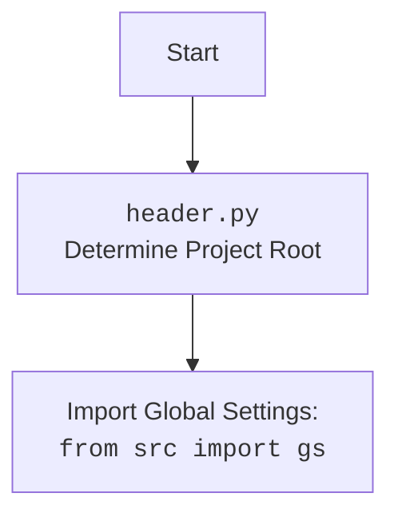

## Анализ кода `hypotez/src/endpoints/advertisement/header.py`

### 1. <алгоритм>

**`set_project_root(marker_files)` Function:**

1.  **Начало:** Функция принимает кортеж `marker_files` (по умолчанию `('__root__', '.git')`) для поиска корневой директории проекта.
    *   _Пример_: `marker_files = ('__root__', '.git')`
2.  **Получить текущий путь:** Определяет абсолютный путь к директории, в которой находится текущий файл (`header.py`).
    *   _Пример_: `__file__` может быть `/path/to/hypotez/src/endpoints/advertisement/header.py`, тогда `current_path` станет `/path/to/hypotez/src/endpoints/advertisement`.
3.  **Инициализация корня:** Предполагает, что текущая директория и есть корневая (`__root__`).
    *   _Пример_: `__root__` инициализируется как `/path/to/hypotez/src/endpoints/advertisement`.
4.  **Итерация по родительским директориям:** Проходит от текущей директории вверх по дереву, включая саму текущую директорию и её предков.
    *   _Пример_: Если `current_path` `/path/to/hypotez/src/endpoints/advertisement`, то цикл пройдёт по `/path/to/hypotez/src/endpoints/advertisement`, `/path/to/hypotez/src/endpoints`, `/path/to/hypotez/src`, `/path/to/hypotez` и т.д.
5.  **Проверка маркеров:** На каждой итерации проверяет наличие любого из `marker_files` в текущей родительской директории.
    *   _Пример_: Проверяется наличие файла `__root__` или директории `.git` в каждой родительской директории.
6.  **Обновление корня:** Если маркер найден, то родительская директория становится новой корневой директорией (`__root__`), и цикл завершается.
    *   _Пример_: Если файл `__root__` найден в директории `/path/to/hypotez`, то `__root__` становится `/path/to/hypotez`, цикл прерывается.
7.  **Добавление в sys.path:** Если определенный `__root__` не находится в `sys.path`, то добавляет его. Это позволяет импортировать модули из корневой директории.
    *   _Пример_: Если `__root__` был `/path/to/hypotez` и его нет в `sys.path`, то он будет добавлен в начало списка путей поиска модулей.
8.  **Возврат корня:** Возвращает найденный путь к корневой директории проекта (`__root__`).
    *   _Пример_: Возвращается `/path/to/hypotez` как корневой путь.

**Загрузка настроек и документации:**

1.  **Вызов `set_project_root()`:** Функция `set_project_root()` вызывается для определения корневой директории.
2.  **Импорт `gs`:** Импортируется модуль `gs` из пакета `src`. Предполагается, что `gs` содержит пути к директориям проекта.
3.  **Загрузка settings.json:** Пытается открыть и загрузить файл `settings.json` из директории `src` относительно корневой директории.
    *   _Пример_: Файл находится по адресу `/path/to/hypotez/src/settings.json`.
4.  **Обработка ошибок:** Если файл не найден или имеет некорректный формат JSON, ошибки игнорируются.
5.  **Загрузка README.MD:** Пытается прочитать содержимое файла `README.MD` из директории `src` относительно корневой директории.
    *   _Пример_: Файл находится по адресу `/path/to/hypotez/src/README.MD`.
6.  **Обработка ошибок:** Если файл не найден или при чтении произошла ошибка, ошибки игнорируются.
7.  **Инициализация переменных:**  Из загруженных `settings` и прочитанного из `README.MD`,  устанавливаются значения глобальных переменных, если `settings` и `doc_str` были успешно загружены.
    *   _Пример_:  `__project_name__` может стать 'my_project', `__version__` '1.0.0', если в `settings.json` были такие значения.

### 2. <mermaid>

```mermaid
flowchart TD
    Start[Начало] --> FindRoot[<code>set_project_root()</code><br>Определение корневой директории]
    FindRoot -- Путь к текущему файлу --> GetParent[Получение родительских директорий]
    GetParent --> CheckMarkers[Проверка маркеров в каждой директории]
    CheckMarkers -- Маркер найден --> UpdateRoot[Обновление корневой директории]
    CheckMarkers -- Маркер не найден --> GetParent
    UpdateRoot --> AddToSysPath[Добавление корневого пути в sys.path]
    AddToSysPath --> ReturnRoot[Возврат корневого пути]
    ReturnRoot -->  ImportGS[Импорт глобальных настроек: <br><code>from src import gs</code>]
    ImportGS --> LoadSettings[Загрузка <code>settings.json</code>]
    LoadSettings -- Успешно --> LoadDoc[Загрузка <code>README.MD</code>]
    LoadSettings -- Ошибка --> LoadDoc
    LoadDoc -- Успешно --> SetVars[Установка глобальных переменных из настроек и документации]
    LoadDoc -- Ошибка --> SetVars
    SetVars --> End[Конец]
```


**Объяснение `mermaid` диаграмм:**

*   **flowchart TD (первая диаграмма):**  Описывает процесс определения корневой директории и загрузки настроек.
    *   `Start`: Начало процесса.
    *   `FindRoot`:  Вызов функции `set_project_root()` для определения корневой директории.
    *   `GetParent`:  Получение родительских директорий относительно текущей.
    *   `CheckMarkers`:  Проверка наличия маркеров в каждой родительской директории.
    *    `UpdateRoot`: Обновление корневой директории при обнаружении маркера.
    *   `AddToSysPath`:  Добавление корневого пути в `sys.path`.
    *   `ReturnRoot`: Возвращение корневого пути.
    *   `ImportGS`: Импорт глобальных настроек из модуля `src.gs`.
    *   `LoadSettings`:  Загрузка настроек из `settings.json`.
    *   `LoadDoc`:  Загрузка документации из `README.MD`.
    *   `SetVars`: Установка глобальных переменных из настроек и документации.
    *   `End`: Конец процесса.

*   **flowchart TD (вторая диаграмма):** Описывает взаимосвязь между файлом `header.py` и импортом глобальных настроек.
    *   `Start`: Начало
    *   `Header`: Указывает на файл `header.py`.
    *    `import`: Показывает импорт `from src import gs`.

### 3. <объяснение>

**Импорты:**

*   `sys`: Предоставляет доступ к некоторым переменным и функциям, взаимодействующим с интерпретатором Python. Используется для добавления пути к корневой директории в `sys.path`, чтобы можно было импортировать модули из этой директории.
*   `json`: Используется для работы с JSON-файлами, такими как `settings.json`. Позволяет загружать и анализировать JSON данные.
*   `packaging.version`: Используется для работы с версиями, сравнения и пр., здесь не используется, что можно удалить.
*   `pathlib.Path`: Предоставляет объектно-ориентированный способ работы с путями к файлам и директориям. Используется для определения путей к файлам и директориям проекта.
*   `from src import gs`: Импортирует модуль `gs` из пакета `src`.  `gs` предположительно содержит глобальные пути и настройки проекта. Это обеспечивает доступ к путям,  необходимым для поиска файлов настроек и документации.

**Функции:**

*   **`set_project_root(marker_files: tuple = ('__root__', '.git')) -> Path`:**
    *   **Аргументы:** `marker_files` - кортеж, определяющий маркерные файлы или директории для поиска корневой директории.
    *   **Возвращает:** Объект `Path`, представляющий путь к корневой директории проекта.
    *   **Назначение:** Функция определяет корневую директорию проекта, начиная от директории текущего файла, двигаясь вверх по иерархии и останавливаясь на первой директории, содержащей один из указанных маркерных файлов.
    *   **Пример**: Если запустить скрипт из директории `/path/to/hypotez/src/endpoints/advertisement`, а в `/path/to/hypotez` есть файл `__root__`, то функция вернёт `/path/to/hypotez`.

**Переменные:**

*   `__root__`:  `Path` -  Содержит путь к корневой директории проекта, определенный функцией `set_project_root()`.
*   `settings`: `dict` -  Словарь, загруженный из файла `settings.json`, если файл найден и успешно прочитан. В противном случае значение `None`.
*    `doc_str`: `str` - Содержимое файла `README.MD`, если файл найден и успешно прочитан. В противном случае значение `None`.
*   `__project_name__`: `str` - Название проекта, полученное из `settings.json` или 'hypotez' по умолчанию.
*   `__version__`: `str` -  Версия проекта, полученная из `settings.json` или '' по умолчанию.
*   `__doc__`: `str` - Содержимое файла `README.MD` или пустая строка по умолчанию.
*   `__details__`: `str` - Пустая строка.
*   `__author__`: `str` - Автор проекта, полученный из `settings.json` или '' по умолчанию.
*   `__copyright__`: `str` - Авторское право проекта, полученное из `settings.json` или '' по умолчанию.
*   `__cofee__`: `str` - Сообщение для поддержки разработчика. Значение берется из `settings.json` или по умолчанию "Treat the developer to a cup of coffee for boosting enthusiasm in development: https://boosty.to/hypo69"

**Цепочка взаимосвязей с другими частями проекта:**

1.  **`set_project_root()`**: Эта функция используется для определения корневой директории проекта, что необходимо для правильной работы импортов и поиска файлов настроек.
2.  **Импорт `gs`**: Позволяет получить доступ к путям и общим настройкам проекта, которые определены в модуле `gs`. Это обеспечивает согласованность путей к файлам проекта.
3.  **Загрузка `settings.json`**:  Файл используется для хранения основных настроек проекта, таких как имя проекта, версия, автор и т.д. Эти данные используются для инициализации глобальных переменных.
4. **Загрузка `README.MD`**: Используется для получения документации проекта.
5.  **Использование глобальных переменных**:  Глобальные переменные, такие как `__project_name__`, `__version__`, `__author__`, `__copyright__`,  используются для предоставления информации о проекте, например, в заголовках модулей, при логировании или выводе справки.

**Потенциальные ошибки или области для улучшения:**

1.  **Обработка ошибок загрузки файлов:**  Использование `try...except...` для обработки `FileNotFoundError` и `json.JSONDecodeError` позволяет избежать сбоев при отсутствии файлов или при некорректном формате JSON, но игнорирование ошибок может скрыть проблемы. Возможно, стоит добавить логирование ошибок.
2.  **Использование `...` в `except`:** Замена `...` на `pass` более явно показывает отсутствие действий в блоке `except`.
3.  **Необязательный импорт `packaging.version`:** Импорт `packaging.version` не используется в данном коде, что является избыточным.
4.  **`__details__`**:  Переменная `__details__`  объявлена как пустая строка, но не используется. Возможно, стоит убрать или использовать в будущем.
5.  **Опечатка `copyrihgnt`**: В коде есть опечатка `copyrihgnt`. Правильное название `copyright`.
6.  **Глобальные переменные**: Использование большого количества глобальных переменных может сделать код менее понятным и усложнить тестирование. Можно рассмотреть возможность использования класса для хранения настроек.
7. **Жесткая привязка к `settings.json` и `README.MD`**:  Код предполагает, что эти файлы всегда находятся в каталоге `src` относительно корневой директории. Это может быть негибким. Возможно, стоит передавать путь к файлам как параметры или использовать конфигурацию.