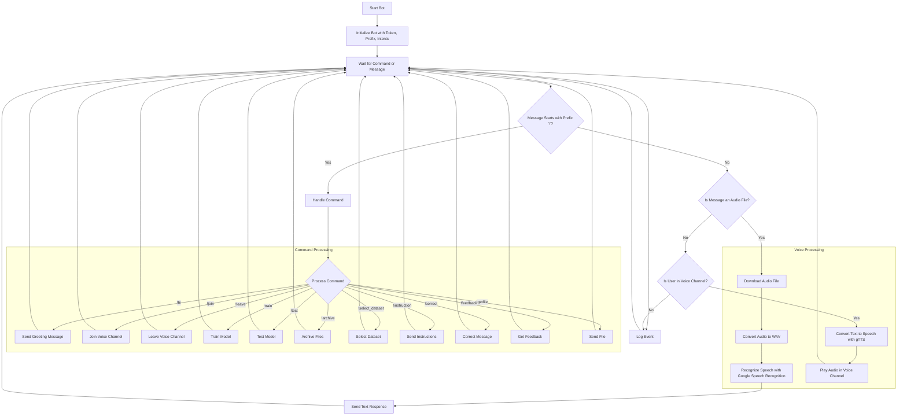

## ИНСТРУКЦИЯ:

Анализируем предоставленный текст, который является описанием функциональности Discord-бота.

**1. <алгоритм>:**

Описание работы бота можно представить в виде следующих этапов:

1.  **Инициализация:**
    *   Бот запускается с определенным токеном доступа.
    *   Устанавливается префикс команд (`!`).
    *   Инициализируются необходимые intents.
2.  **Обработка команд:**
    *   Бот ожидает сообщений, начинающихся с префикса `!`.
    *   Если команда распознана, выполняется соответствующее действие.
        *   `!hi`: Бот отправляет приветствие.
        *   `!join`: Бот подключается к голосовому каналу пользователя.
        *   `!leave`: Бот покидает голосовой канал.
        *   `!train`: Бот запускает обучение модели. Данные могут быть файлом или текстом.
        *   `!test`: Бот запускает тестирование модели.
        *   `!archive`: Бот архивирует файлы из заданной директории.
        *   `!select_dataset`: Бот выбирает датасет.
        *   `!instruction`: Бот отправляет инструкции из файла.
        *   `!correct`: Пользователь исправляет предыдущее сообщение бота.
        *   `!feedback`: Пользователь оставляет отзыв.
        *    `!getfile`: Бот отправляет запрошенный файл.
3.  **Обработка сообщений без команд:**
    *   Бот игнорирует свои собственные сообщения.
    *   Если в сообщении есть аудиофайл, бот скачивает его, преобразует в WAV, распознает речь и отправляет текст в ответ.
    *   Если пользователь находится в голосовом канале, и если бот получил текстовое сообщение, бот генерирует речь и воспроизводит её в голосовом канале.
4.  **Распознавание речи:**
    *   Функция `recognizer` скачивает аудиофайл.
    *   Конвертирует аудио в формат WAV.
    *   Распознает речь с помощью Google Speech Recognition.
5.  **Текст в речь:**
    *   Функция `text_to_speech_and_play` принимает текст.
    *   Генерирует речь с помощью `gTTS`.
    *   Воспроизводит сгенерированную речь в голосовом канале.
6.  **Логирование:**
    *   Модуль `logger` используется для записи всех действий и ошибок бота.

**2. <mermaid>:**

**3. <объяснение>:**

**Импорты:**

*   `discord.py`: Основная библиотека для создания и управления Discord-ботами. Предоставляет классы и методы для взаимодействия с API Discord.
*   `speech_recognition`: Библиотека для распознавания речи. Используется для преобразования аудио в текст.
*   `pydub`: Библиотека для работы с аудиофайлами, например, для конвертации форматов (например, в WAV).
*   `gtts`: Библиотека Google Text-to-Speech, которая преобразует текст в речь.
*   `requests`: Используется для выполнения HTTP-запросов, например, для скачивания файлов.
*   `pathlib`: Предоставляет объектно-ориентированный способ работы с путями к файлам и директориям.
*   `tempfile`: Используется для создания временных файлов и директорий.
*    `asyncio`: библиотека для поддержки написания асинхронного кода.

**Функциональность:**

*   **Инициализация бота:** Бот инициализируется с использованием токена, полученного из `gs.credentials.discord.bot_token`. Бот подключается к Discord API и начинает прослушивание событий.

*   **Обработка команд:** Бот анализирует сообщения, которые начинаются с префикса `!`. В зависимости от команды, выполняется определенная функция.

    *   `!hi`: Отправляет приветственное сообщение.
    *   `!join`: Подключается к голосовому каналу пользователя.
    *   `!leave`: Отключается от голосового канала.
    *   `!train`: Запускает обучение модели машинного обучения. Может принимать данные через файл или текст.
    *   `!test`: Тестирует модель машинного обучения.
    *   `!archive`: Архивирует файлы в указанной директории.
    *    `!select_dataset`:  Выбирает датасет для обучения модели.
    *   `!instruction`: Отправляет инструкции из файла.
    *    `!correct`: Позволяет пользователю исправить предыдущее сообщение бота.
     *   `!feedback`: Позволяет пользователю отправить обратную связь о работе бота.
    *  `!getfile`: Отправляет файл из указанного пути.

*   **Обработка сообщений без команд:** Бот обрабатывает сообщения, не являющиеся командами:

    *   **Аудио:** Если сообщение содержит аудиофайл, бот скачивает его, конвертирует в WAV и распознает речь. Текст отправляется в ответ пользователю.
    *  **Текст:** Если пользователь находится в голосовом канале, текст преобразуется в речь и воспроизводится в голосовом канале.

*   **Распознавание речи:** Функция `recognizer` выполняет распознавание речи, используя Google Speech Recognition.

*   **Текст в речь:** Функция `text_to_speech_and_play` преобразует текст в речь и воспроизводит его в голосовом канале.

*   **Логирование:** Используется модуль `logger` для записи действий и ошибок бота.

**Переменные:**
*   `gs.credentials.discord.bot_token`: токен доступа Discord бота.
*  Имена переменных, используемые в функциях, такие как `audio_file_path`, `text`, `file_path`, служат для временного хранения и передачи данных.

**Потенциальные ошибки и улучшения:**

*   **Обработка ошибок:** Код может нуждаться в более надежной обработке ошибок, особенно при скачивании файлов, распознавании речи, преобразовании текста в речь и других операциях, взаимодействующих с внешними ресурсами.
*   **Асинхронность:**  Использование `asyncio` намекает на асинхронное выполнение задач, но конкретная реализация не показана в предоставленном тексте. Убедитесь, что асинхронные операции обрабатываются правильно для избежания блокировок.
*  **Безопасность:** При обработке пользовательского ввода и файлов, необходима валидация данных для избежания уязвимостей.

**Взаимосвязь с другими частями проекта:**

*   Бот получает токен из `gs.credentials.discord.bot_token`, предполагая, что `gs` – это объект, представляющий глобальные настройки проекта. Это означает, что Модуль зависит от модуля настроек проекта.
*   Бот использует модуль `logger`, который, вероятно, является частью проекта и обеспечивает логирование событий.
*   Модуль `src`, а именно папка `src/endpoints/bots/discord` показывает, что бот является частью более крупной системы и использует ее ресурсы.
*   Методы `train` и `test` указывают на интеграцию с моделью машинного обучения, вероятно, также являющейся частью проекта.

Таким образом, этот Discord-бот является важным компонентом проекта, предоставляя интерфейс для взаимодействия с пользователями, машинным обучением и другими функциями. Он зависит от конфигурации проекта, библиотек для обработки аудио, распознавания речи и синтеза речи, а также от модуля логирования.