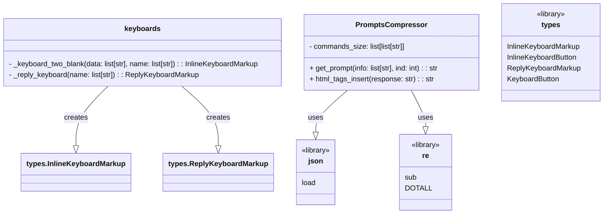

## <алгоритм>

1.  **Класс `keyboards`**:
    *   **`_keyboard_two_blank(data, name)`**:
        *   Принимает два списка: `data` (данные для callback) и `name` (текст кнопок).
        *   Создаёт объект `InlineKeyboardMarkup`.
        *   Создаёт список `buttons` из `InlineKeyboardButton` с текстом из `name` и callback-данными из `data`.
        *   Если количество кнопок четное, добавляет кнопки парами. Если нечетное, добавляет кнопки парами, а последнюю кнопку добавляет отдельно.
        *   Возвращает `InlineKeyboardMarkup`.

        *   **Пример:**
            ```python
            data = ["callback_1", "callback_2", "callback_3"]
            name = ["Кнопка 1", "Кнопка 2", "Кнопка 3"]
            keyboard = keyboards()._keyboard_two_blank(data, name)
            # Результат: InlineKeyboardMarkup с тремя кнопками, расположенными в две строки.
            ```

    *   **`_reply_keyboard(name)`**:
        *   Принимает список `name` (текст кнопок).
        *   Создаёт объект `ReplyKeyboardMarkup` с `resize_keyboard=True`.
        *   Создаёт список `buttons` из `KeyboardButton` с текстом из `name`.
        *   Добавляет все кнопки в `ReplyKeyboardMarkup`.
        *   Возвращает `ReplyKeyboardMarkup`.

        *   **Пример:**
            ```python
            name = ["Кнопка A", "Кнопка B", "Кнопка C"]
            reply_keyboard = keyboards()._reply_keyboard(name)
            # Результат: ReplyKeyboardMarkup с тремя кнопками в виде клавиатуры в Telegram.
            ```

2.  **Класс `PromptsCompressor`**:
    *   **`__init__`**:
        *   Инициализирует атрибут `commands_size` - список, который содержит списки с ключами для промптов.
    *   **`get_prompt(info, ind)`**:
        *   Принимает список `info` (значения для подстановки) и индекс `ind` (индекс нужного промта).
        *   Открывает файл `prompts.json` и загружает из него словарь.
        *   Находит промпт с индексом `ind`.
        *   Заменяет в промпте все вхождения `[КЛЮЧ]` на значения из списка `info`, используя список ключей из `commands_size`.
        *   Возвращает преобразованный промпт.

        *    **Пример**:
            ```python
            info = ["Test", "test_analize", "tone", "struct", "1000", "extra"]
            ind = 0
            prompt = PromptsCompressor().get_prompt(info, ind)
            # Если prompts.json содержит:
            #  {
            #    "commands": [
            #       "Text: [TOPIC], analize: [TA], tone: [TONE], struct: [STRUCT], length: [LENGTH], extra: [EXTRA]"
            #      ]
            #  }
            # Результат: prompt = "Text: Test, analize: test_analize, tone: tone, struct: struct, length: 1000, extra: extra"
            ```

    *   **`html_tags_insert(response)`**:
        *   Принимает строку `response` (текст с markdown).
        *   Создаёт список `patterns` из кортежей (шаблон regex, строка замены).
        *   Последовательно применяет все шаблоны `re.sub` в строке `response` для преобразования markdown в HTML теги.
        *   Возвращает строку `response` с HTML тегами.

        *   **Пример:**
            ```python
            response = "#### Заголовок 1\n### Заголовок 2\n**Жирный текст**\n*Курсивный текст*\n```python\nprint('hello')\n```\n`код`"
            html_response = PromptsCompressor.html_tags_insert(response)
            # Результат: html_response = "<b><u>Заголовок 1</u></b>\n<u>Заголовок 2</u>\n<b>Жирный текст</b>\n<i>Курсивный текст</i>\n<pre><code>\nprint('hello')\n</code></pre>\n<code>код</code>"
            ```

## <mermaid>



**Объяснение:**

*   **`class keyboards`**: Класс отвечает за создание клавиатур для Telegram бота. Имеет два защищенных метода:
    *   `_keyboard_two_blank` создает инлайн клавиатуру (кнопки, привязанные к сообщению). Зависит от `types.InlineKeyboardMarkup` и `types.InlineKeyboardButton`.
    *   `_reply_keyboard` создает обычную клавиатуру (которая отображается снизу). Зависит от `types.ReplyKeyboardMarkup` и `types.KeyboardButton`.

*   **`class PromptsCompressor`**: Класс занимается обработкой и форматированием промптов.
    *   Хранит в `commands_size` структуру шаблонов промптов.
    *   `get_prompt` получает промпт из файла `prompts.json` и заменяет в нем placeholder'ы на значения из списка `info`. Зависит от `json.load`.
    *   `html_tags_insert` конвертирует markdown-подобную разметку в HTML-теги. Зависит от `re.sub` и `re.DOTALL`.

*   **`class types`**: Класс `types` из библиотеки `telebot` содержит определения объектов для создания клавиатур в Telegram.

*   **`class json`**: Библиотека `json` используется для загрузки данных из JSON файла.

*   **`class re`**: Библиотека `re` используется для работы с регулярными выражениями при замене markdown-разметки на HTML-теги. `re.DOTALL` используется для того, чтобы `.` соответствовал и символу переноса строки.

## <объяснение>

**Импорты:**

*   `import json`: Используется для работы с JSON файлами, в частности, для загрузки данных из `prompts.json`.
*   `import re`:  Используется для работы с регулярными выражениями, применяется для поиска и замены markdown-разметки на HTML-теги.
*   `from telebot import types`:  Импортирует класс `types` из библиотеки `pyTelegramBotAPI` для работы с объектами, связанными с Telegram ботом, такими как `InlineKeyboardMarkup`, `KeyboardButton` и `ReplyKeyboardMarkup`.

**Классы:**

1.  **`keyboards`**:
    *   **Роль**:  Генерирует различные типы клавиатур для Telegram-бота.
    *   **Атрибуты**: Отсутствуют.
    *   **Методы**:
        *   `_keyboard_two_blank(data: list[str], name: list[str]) -> types.InlineKeyboardMarkup`:
            *   Аргументы: `data` (список данных для callback кнопок) и `name` (список текста для кнопок).
            *   Возвращает: объект `InlineKeyboardMarkup`, который можно отправить с сообщением в Telegram.
            *   Назначение: создание инлайн клавиатуры, с кнопками в 2 столбца. Если число кнопок нечетное, последняя кнопка добавляется на отдельную строку.
        *   `_reply_keyboard(name: list[str]) -> types.ReplyKeyboardMarkup`:
            *   Аргументы: `name` (список текста для кнопок).
            *   Возвращает: объект `ReplyKeyboardMarkup`, который можно отправить с сообщением в Telegram.
            *   Назначение: создание reply клавиатуры, с кнопками в виде пользовательской клавиатуры в Telegram.
    *   **Взаимодействие**: Использует `types` для создания объектов клавиатуры.

2.  **`PromptsCompressor`**:
    *   **Роль**:  Обрабатывает промпты для генерации текста, подставляя значения и форматируя.
    *   **Атрибуты**:
        *   `commands_size: list[list[str]]`: Список, где каждый элемент это список с ключами для промпта.
    *   **Методы**:
        *   `__init__`: Инициализирует атрибут `commands_size`.
        *    `get_prompt(info: list[str], ind: int) -> str`:
            *   Аргументы: `info` (список данных для подстановки в промпт) и `ind` (индекс промпта).
            *   Возвращает: строку с преобразованным промптом.
            *   Назначение: получает промпт из файла, заменяет плейсхолдеры на данные и возвращает результат.
        *   `html_tags_insert(response: str) -> str`:
            *   Аргументы: `response` (строка с markdown-подобной разметкой).
            *   Возвращает: строка с HTML-тегами.
            *   Назначение: преобразует markdown-подобную разметку в HTML-теги.
    *   **Взаимодействие**:  Использует `json` для загрузки данных из файла и `re` для работы с регулярными выражениями.

**Функции:**

*   **`_keyboard_two_blank`**, **`_reply_keyboard`** и **`get_prompt`**, **`html_tags_insert`** описаны выше в контексте классов.
*   Все функции имеют четкое назначение и возвращают результат, как описано.

**Переменные:**

*   `data: list[str]`:  Список строк, представляющих callback-данные для inline-кнопок.
*   `name: list[str]`: Список строк, представляющих текст кнопок.
*   `keyboard: types.InlineKeyboardMarkup`: Объект инлайн-клавиатуры.
*   `buttons: list[types.InlineKeyboardButton]` или `list[types.KeyboardButton]`: Список объектов кнопок для клавиатуры.
*  `markup: types.ReplyKeyboardMarkup`: Объект reply-клавиатуры.
*   `commands_size: list[list[str]]`:  список списков с ключами для промптов.
*  `commands: str`: строка с промптом из файла `prompts.json`.
*  `info: list[str]`: список строк с информацией, которая будет подставлена в промпт.
*  `ind: int`: индекс промпта.
*  `response: str`: строка с текстом, к которой будет применена замена markdown на HTML.
*   `patterns: list[tuple[str, str]]`: список кортежей с регулярными выражениями и шаблонами замены.

**Потенциальные ошибки и улучшения:**

*   **Обработка ошибок:** Отсутствует обработка ошибок при открытии файла `prompts.json` или при парсинге JSON. Стоит добавить блок `try-except`, который бы отлавливал исключения, связанные с чтением файла.
*   **Расширяемость:**  `commands_size` может быть вынесен в конфигурационный файл.
*   **Универсальность:** `html_tags_insert` в данный момент поддерживает фиксированный набор markdown-тегов. Можно расширить функциональность, добавив поддержку других тегов.
*   **Безопасность:** Использование `re.sub` для замены markdown на HTML может быть потенциально уязвимо для XSS атак, если в промптах будут переданы HTML-теги. Стоит рассмотреть использование более безопасных методов или библиотек.
*   **Читаемость**: В циклах генерации `buttons` и добавления их на клавиатуру можно использовать `map` или генератор списка.
*   **Тестирование**: Не хватает модульных тестов для каждого класса и метода.

**Взаимосвязи с другими частями проекта:**

*   Данный код является частью системы, которая обрабатывает промпты и генерирует клавиатуры для Telegram бота.
*   Класс `PromptsCompressor` может использоваться совместно с другими классами, которые отвечают за отправку сообщений пользователю.
*   Клавиатуры созданные `keyboards`,  используются в боте для взаимодействия с пользователем.
*   Данный код может быть частью более крупной системы, взаимодействующей с LLM (например, OpenAI или другими).

**Цепочка взаимосвязей:**

1.  Пользователь взаимодействует с Telegram-ботом.
2.  Бот использует `keyboards` для создания пользовательских клавиатур.
3.  При взаимодействии пользователя с клавиатурой отправляется запрос на сервер.
4.  `PromptsCompressor` обрабатывает полученный промпт.
5.  `PromptsCompressor` использует `json` для загрузки промптов и `re` для форматирования текста.
6.  Бот отправляет результат пользователю.