## АНАЛИЗ КОДА:

### 1. <алгоритм>

**Блок-схема:**

1.  **Инициализация:**
    *   Импорт необходимых библиотек и модулей (`asyncio`, `base64`, `string`, `random`, `telebot`, `dotenv`, `datetime`, `threading`, `dateutil.relativedelta`).
    *   Загрузка переменных окружения из `.env` файла.
    *   Инициализация глобальных переменных: `N` (количество типов текста), `DATA_PATTERN` (шаблон данных пользователя), `photo_array`.
    *   Создание экземпляров классов `ToolBox` и `DataBase`.
    *   Создание и подключение к базе данных, загрузка данных в переменную `db`.
2.  **Обработчики команд:**
    *   `process_pre_checkout_query`: Обработка запроса перед оплатой, подтверждение запроса.
    *   `successful_payment`: Обработка успешной оплаты, обновление данных пользователя в `db` (активация подписки, начисление токенов, установка даты окончания подписки) и отправка уведомления.
    *   `StartProcessing`: Обработка команды `/start`, инициализация данных пользователя в `db` или загрузка существующих, вызов метода `start_request` у объекта `ToolBox`.
    *   `personal_account`: Обработка команды `/profile`, вывод информации о подписке и количестве доступных запросов.
    *   `show_stat`: Обработка команды `/stat`, вывод статистики (количество пользователей и пользователей с промокодом) для администраторов.
3.  **Генерация промокода:**
    *   `generate_promo_code`: Функция для генерации случайного промокода заданной длины.
4.  **Обработчик callback запросов:**
    *   `CallsProcessing`: Обработка callback-запросов от кнопок.
        *   Проверка наличия пользователя в `db`, если нет - создаёт.
        *   Обработка нажатий кнопок:
            *   `text`, `images`, `free`, `tariff`: Вызов соответствующих методов `ToolBox` для отображения меню, в зависимости от нажатой кнопки.
            *   Размеры изображения: Сохранение выбранного размера изображения в `db`.
            *   `upscale`, `regenerate`: Запуск потоков для увеличения разрешения или перегенерации изображения.
            *   `basic`, `pro`, `promo`, `ref`: Обработка выбора тарифа, промокода или реферального кода.
            *   Кнопки категорий текста: Выбор категории текста, вызов метода `ToolBox`.
            *   Кнопки выхода: Сброс состояния, возврат в главное меню или выход из текущего раздела.
5.  **Обработка текстовых и фото сообщений:**
    *   `TasksProcessing`: Обработка входящих текстовых сообщений и фотографий.
        *   Обработка запросов на генерацию изображений, если выбрана команда генерации.
        *   Обработка выхода из "свободного" режима.
        *   Обработка сообщений в "свободном" режиме с фото и текстом.
        *   Обработка текстовых запросов, генерация текста с учетом выбранных параметров.
        *   Обновление данных пользователя в `db`.
6. **Обработчик токенов и запросов:**
    *  `TokensCancelletionPattern`: Обрабатывает списание токенов или запросов, в зависимости от типа запроса, вызов метода для генерации, проверка баланса, если токенов/запросов нет - отправка уведомления.
7.  **Фоновая задача:**
    *   `end_check_tariff_time`: Проверка истечения срока подписки пользователей, запуск в отдельном асинхронном потоке. Если подписка закончилась, сброс данных пользователя.
8.  **Запуск бота:**
    *   Запуск бота в бесконечном цикле `bot.infinity_polling` в отдельном потоке.
    *   Запуск асинхронной задачи `end_check_tariff_time`.

**Примеры:**

*   **Инициализация:** `db` - это словарь, где ключи - это `user_id`, а значения - это словари с данными пользователя (текст, подписка, токены). `ToolBox` и `DataBase` - объекты, предоставляющие методы для работы с ботом и базой данных.
*   **Команда `/start`:** При первом запуске для пользователя, создается запись в `db` с начальными данными. При повторном запуске данные пользователя обновляются, сохраняя тариф и другие настройки.
*  **Обработка callback:** Нажатие на кнопку "Текст" вызывает функцию `tb.Text_types`, которая отправляет пользователю меню с типами текста.
*  **Обработка текста:** Пользователь отправляет запрос, функция `TasksProcessing` обрабатывает его в зависимости от контекста (свободный режим, генерация текста) и вызывает соответствующую функцию `ToolBox` для генерации текста, списывая токены/запросы в `TokensCancelletionPattern`.
*   **Оплата:** После успешной оплаты вызывается функция `successful_payment`, которая активирует подписку и начисляет токены, сохраняя данные в `db`.

**Поток данных:**

`Telegram Bot` <--> `ToolBox_main.py` <--> `ToolBox.py` / `DataBase.py` <--> `UsersData.db`

```mermaid
flowchart TD
    Start[Start] --> Init[Initialization]
    Init --> LoadEnv[Load Environment Variables]
    LoadEnv --> CreateInstances[Create ToolBox and DataBase Instances]
    CreateInstances --> ConnectDB[Connect to Database and Load Data]

    ConnectDB --> PreCheckoutHandler[Process Pre-Checkout Query]
    PreCheckoutHandler --> SuccessfulPayment[Process Successful Payment]
    SuccessfulPayment --> UpdateDB[Update User Data in DB]
    UpdateDB --> SendPaymentMessage[Send Payment Confirmation]
    SendPaymentMessage --> RestartBot[Restart Bot]

    ConnectDB --> StartCommandHandler[Process Start Command]
    StartCommandHandler --> GetOrCreateUserData[Get or Create User Data in DB]
    GetOrCreateUserData --> UpdateDBStart[Update User Data in DB]
    UpdateDBStart --> StartRequest[ToolBox Start Request]

    ConnectDB --> ProfileCommandHandler[Process Profile Command]
    ProfileCommandHandler --> CheckSubscription[Check User Subscription]
    CheckSubscription --> SendProfileInfo[Send Subscription Information]

    ConnectDB --> StatCommandHandler[Process Stat Command]
    StatCommandHandler --> CheckAdmin[Check Admin Permissions]
    CheckAdmin --> SendStatInfo[Send Statistics Information]

    ConnectDB --> GeneratePromoCode[Generate Promo Code]
    ConnectDB --> CallBackQueryHandler[Process Callback Query]
    CallBackQueryHandler --> CheckUserInDB[Check If User In DB]
    CheckUserInDB -- No --> CreateNewUser[Create New User In DB]
    CreateNewUser --> UpdateDB_Callback[Update User Data In DB]
    CheckUserInDB -- Yes --> CallbackRouter[Callback Router]
    CallbackRouter --> TextButton[Handle Text Button]
    CallbackRouter --> ImageButton[Handle Image Button]
    CallbackRouter --> FreeButton[Handle Free Button]
    CallbackRouter --> TariffButton[Handle Tariff Button]
    CallbackRouter --> ImageSizeButton[Handle Image Size Button]
    CallbackRouter --> UpscaleButton[Handle Upscale Button]
    CallbackRouter --> RegenerateButton[Handle Regenerate Button]
    CallbackRouter --> BasicButton[Handle Basic Button]
    CallbackRouter --> ProButton[Handle Pro Button]
    CallbackRouter --> PromoButton[Handle Promo Button]
     CallbackRouter --> RefButton[Handle Ref Button]
    CallbackRouter --> TextCategoryButton[Handle Text Category Button]
    CallbackRouter --> ExitButton[Handle Exit Button]
    CallbackRouter --> OneTextButton[Handle One Text Button]
    CallbackRouter --> SomeTextButton[Handle Some Text Button]
    
    ConnectDB --> TasksProcessingHandler[Process Tasks Message]
    TasksProcessingHandler --> CheckImageProcessing[Check Image Processing]
    TasksProcessingHandler --> CheckFreeMode[Check Free Mode]
    CheckImageProcessing -- Yes --> ImageProcessing[Handle Image Processing]
    CheckFreeMode -- Yes --> FreeModeProcessing[Handle Free Mode]
    CheckImageProcessing -- No --> CheckFreeMode
    CheckFreeMode -- No --> TextProcessing[Handle Text Processing]
    
    TextProcessing --> TokenCancellation[Token Cancellation Pattern]
    FreeModeProcessing --> TokenCancellation
    ImageProcessing --> GenerateImage[ToolBox Image Generation]

    TokenCancellation --> CheckTokens[Check Tokens or Free Request]
    CheckTokens -- Yes --> TextGeneration[Generate Text or Run Command]
    CheckTokens -- No --> TariffEnd[Handle Tariff End]
    
    ConnectDB --> EndTariffCheck[End Tariff Check]
    EndTariffCheck --> CheckTime[Check Time To End]
    CheckTime --> UpdateTariff[Update User Tariff]
    
    Start --> RunBot[Run Bot in Thread]
    RunBot --> RunAsync[Run Async Task: EndTariffCheck]
     
    classDef classFill fill:#f9f,stroke:#333,stroke-width:2px
        
    style Start classFill
    style Init classFill
    style LoadEnv classFill
    style CreateInstances classFill
    style ConnectDB classFill
    style PreCheckoutHandler classFill
    style SuccessfulPayment classFill
    style StartCommandHandler classFill
    style ProfileCommandHandler classFill
    style StatCommandHandler classFill
    style GeneratePromoCode classFill
    style CallBackQueryHandler classFill
    style TasksProcessingHandler classFill
    style EndTariffCheck classFill
    style RunBot classFill
    style RunAsync classFill
```

### 2. <mermaid>

**Объяснение `mermaid` диаграммы:**

*   Диаграмма `mermaid` типа `flowchart TD` представляет собой блок-схему, отображающую основной поток выполнения программы.
*   **Начало:** Блок `Start` обозначает точку входа программы.
*   **Инициализация:** Блок `Init` представляет инициализацию основных переменных и подключение к базе данных.
*   **Загрузка окружения:**  Блок `LoadEnv` обозначает загрузку переменных среды из `.env` файла.
*   **Создание экземпляров:** Блок `CreateInstances` обозначает создание экземпляров классов `ToolBox` и `DataBase`.
*    **Подключение к базе данных:** Блок `ConnectDB` отвечает за подключение к базе данных и загрузку данных.
*   **Обработчики:**
    *   Блоки `PreCheckoutHandler`, `SuccessfulPayment`, `StartCommandHandler`, `ProfileCommandHandler`, `StatCommandHandler` представляют обработчики команд и событий от Telegram.
    *   Блок `CallBackQueryHandler` обрабатывает callback-запросы от кнопок и ветвится на другие блоки в зависимости от нажатой кнопки.
    *   `TasksProcessingHandler` обрабатывает сообщения от пользователей (текст или фото).
    *   `EndTariffCheck` отвечает за периодическую проверку окончания срока действия подписки.
* **Генерация промокода:** Блок `GeneratePromoCode` отвечает за генерацию случайного промокода.
*   **Обновление базы данных:** Блоки `UpdateDB`, `UpdateDBStart`, `UpdateDB_Callback`, `UpdateTariff` обозначают операции обновления данных в базе данных.
*    **Токены:** Блок `TokenCancellation` отвечает за проверку наличия токенов у пользователя.
*   **Работа с ботом:** Блоки `RestartBot`, `StartRequest`, `SendPaymentMessage`, `SendProfileInfo`, `SendStatInfo` и другие обозначают взаимодействие с Telegram ботом (отправка сообщений, перезапуск).
*   **Управляющие конструкции:** `CheckUserInDB`, `CheckAdmin`, `CheckSubscription` и другие обозначают условные переходы в зависимости от различных условий.
*   **Запуск:** Блоки `RunBot` и `RunAsync` обозначают запуск бота и асинхронной задачи.
*   **Стили:** `classDef classFill` и `style ... classFill` используется для визуального выделения блоков.

**Зависимости:**

Диаграмма показывает зависимости между компонентами, отражая последовательность операций и логику работы бота:
- Все обработчики сообщений и callback-запросов используют данные, загруженные из базы данных.
- Функции из `ToolBox` используются для выполнения конкретных задач, таких как генерация текста или изображений.
- Вся логика работы с данными пользователя (создание, обновление) зависит от функциональности `DataBase`.
- Потоки исполнения обрабатываются через `threading`.

### 3. <объяснение>

**Импорты:**

*   `asyncio`: Библиотека для асинхронного программирования, используется для запуска фоновой задачи проверки истечения срока подписки.
*   `base64`: Библиотека для кодирования и декодирования данных в формат Base64, используется для обработки изображений.
*   `string`: Библиотека для работы со строками, используется для генерации промокодов.
*   `random`: Библиотека для генерации случайных чисел, используется для генерации промокодов и seed для генерации изображений.
*   `telebot`: Библиотека для взаимодействия с Telegram Bot API, используется для создания и управления ботом.
*   `dotenv`: Библиотека для загрузки переменных окружения из файла `.env`.
*   `datetime`: Библиотека для работы с датой и временем, используется для отслеживания срока действия подписки.
*   `threading`: Библиотека для работы с потоками, используется для параллельного выполнения задач.
*  `dateutil.relativedelta`: Библиотека для работы с датой и временем, используется для прибавления месяца или дня.
*   `ToolBox_requests`: Кастомный модуль для реализации логики работы с ботом, включая обработку запросов и генерацию контента.
*   `ToolBox_DataBase`: Кастомный модуль для работы с базой данных пользователей.

**Классы:**

*   `ToolBox`:
    *   **Роль**: Класс содержит методы для взаимодействия с Telegram Bot API и обработки запросов пользователя.
    *   **Атрибуты**: Не указаны в данном коде.
    *   **Методы**: `start_request`, `Text_types`, `ImageSize`, `ImageArea`, `FreeArea`, `TariffArea`, `Basic_tariff`, `Pro_tariff`, `TextCommands`, `SomeTextsCommand`, `FreeCommand`, `TarrifEnd`, `FreeTariffEnd`, `ImageCommand`, `Image_Regen_And_Upscale`, `restart`, `restart_markup`, `TariffExit`, `BeforeUpscale`, `ImageChange`, `SomeTexts` и другие.
    *   **Взаимодействие:** Используется для обработки команд, отправки сообщений, генерации контента (текст, изображения) и работы с интерфейсом бота.
*   `DataBase`:
    *   **Роль**: Класс для работы с базой данных пользователей.
    *   **Атрибуты**: `db_name`, `table_name`, `titles`.
    *   **Методы**: `create`, `load_data_from_db`, `insert_or_update_data`.
    *   **Взаимодействие:** Используется для создания базы данных, загрузки данных, сохранения и обновления данных пользователей.

**Функции:**

*   `process_pre_checkout_query(pre_checkout_query)`:
    *   **Аргументы**: `pre_checkout_query` (объект `telebot.types.PreCheckoutQuery`).
    *   **Возвращаемое значение**: Нет.
    *   **Назначение**: Обработка запроса перед оплатой, подтверждение запроса.
    *   **Пример**: Получает запрос от Telegram перед оплатой, подтверждает его с помощью `bot.answer_pre_checkout_query`.
*   `successful_payment(message)`:
    *   **Аргументы**: `message` (объект `telebot.types.Message`).
    *   **Возвращаемое значение**: Нет.
    *   **Назначение**: Обработка успешной оплаты, обновление данных пользователя и отправка уведомления.
    *   **Пример**: Получает сообщение об успешной оплате, определяет тип подписки, обновляет баланс токенов и дату окончания подписки, отправляет сообщение с благодарностью.
*   `StartProcessing(message)`:
    *   **Аргументы**: `message` (объект `telebot.types.Message`).
    *   **Возвращаемое значение**: Нет.
    *   **Назначение**: Обработка команды `/start`, инициализация данных пользователя или их загрузка.
    *   **Пример**: При первом запуске создает запись пользователя в базе данных, при повторном запуске загружает данные пользователя.
*   `personal_account(message)`:
    *   **Аргументы**: `message` (объект `telebot.types.Message`).
    *   **Возвращаемое значение**: Нет.
    *   **Назначение**: Отображение информации о текущей подписке пользователя.
    *   **Пример**: Выводит сообщение с информацией о тарифе пользователя и количестве доступных запросов, в зависимости от текущей подписки.
*   `show_stat(message)`:
    *   **Аргументы**: `message` (объект `telebot.types.Message`).
    *   **Возвращаемое значение**: Нет.
    *   **Назначение**: Вывод статистики по количеству пользователей и пользователей с промокодом (только для админов).
    *   **Пример**: Если `user_id` находится в списке администраторов, выводит статистику по боту.
* `generate_promo_code(length)`:
    * **Аргументы**: length (integer).
    * **Возвращаемое значение**: promo_code (string).
    * **Назначение**: Генерация случайного промокода.
    * **Пример**: Генерирует и возвращает случайный промокод заданной длины.
*   `CallsProcessing(call)`:
    *   **Аргументы**: `call` (объект `telebot.types.CallbackQuery`).
    *   **Возвращаемое значение**: Нет.
    *   **Назначение**: Обработка callback-запросов от кнопок, переключение между режимами, обработка выбора подписки и т.д.
    *  **Пример**: Вызывает методы `ToolBox` для обработки различных callback данных.
*   `TokensCancelletionPattern(user_id: str, func, message, i: int = None)`:
    *   **Аргументы**: `user_id` (string), `func` (функция), `message` (объект `telebot.types.Message`), `i` (integer, optional).
    *   **Возвращаемое значение**: Нет.
    *   **Назначение**: Обрабатывает списание токенов или запросов, в зависимости от типа запроса.
    *   **Пример**: Вызывает функцию для генерации текста, уменьшает количество токенов/запросов у пользователя, если токены/запросы закончились выводит уведомление.
*   `TasksProcessing(message)`:
    *   **Аргументы**: `message` (объект `telebot.types.Message`).
    *   **Возвращаемое значение**: Нет.
    *   **Назначение**: Обработка текстовых сообщений и фото, перенаправление на соответствующие обработчики.
    *   **Пример**: Получает текстовое сообщение, обрабатывает его в зависимости от состояния пользователя, обрабатывает фото или перенаправляет на текстовый генератор.
*   `end_check_tariff_time()`:
    *   **Аргументы**: Нет.
    *   **Возвращаемое значение**: Нет.
    *   **Назначение**: Асинхронная задача для проверки истечения срока действия подписки, сброс пользовательских данных.
    *   **Пример**: Выполняется в отдельном асинхронном потоке, перебирает всех пользователей, проверяет срок действия подписки, если он истёк - сбрасывает данные.

**Переменные:**

*   `N`: Количество типов текста (константа).
*   `DATA_PATTERN`: Шаблон данных пользователя (lambda-функция), используемый для инициализации данных пользователя.
*   `photo_array`: Массив для хранения изображений (используется?).
*   `tb`: Экземпляр класса `ToolBox`.
*   `bot`: Экземпляр класса `telebot.TeleBot`.
*   `base`: Экземпляр класса `DataBase`.
*   `db`: Словарь, хранящий данные пользователей (ключ - `user_id`, значение - словарь с данными пользователя).
*  `promocode`: Хранит промокод.

**Потенциальные ошибки и области для улучшения:**

*   **Обработка ошибок**: В коде отсутствуют явные блоки `try-except` для обработки возможных ошибок, например, при подключении к базе данных или при работе с Telegram API.
*  **Использование глобальных переменных:** Интенсивное использование `global db` может затруднить понимание кода.
* **Логика промокодов:** Промокод `free24` прописан в коде, можно вынести его в `.env` и проверять не по конкретной строке а по списку. Также проверка реферального промокода не эффективна `message.text == [us['ref'] for us in db.values()]` она будет выполнятся для всех пользователей, можно переписать её, проверяя есть ли такой реф код у пользователей.
*   **Сложная логика `CallsProcessing`**: Обработчик callback-запросов содержит много `if-elif-else` конструкций, что делает его сложным для чтения и понимания, можно переписать через `match`.
*   **Дублирование кода**: Часто встречаются повторяющиеся фрагменты кода, например, обновление данных в БД.
*   **Потоки**: Отдельные потоки создаются и сразу же завершаются `thr.join()`, что снижает эффективность потоков, можно убрать `join()` и обработку ошибок вынести в отдельный поток.
*   **Асинхронность**: Вызов асинхронной функции `end_check_tariff_time` не совсем корректен, так как вызов происходит в синхронном контексте.
*   **Хранение изображений:** Изображения хранятся в базе данных в формате `base64` , что может потребовать больших ресурсов.
*   **Отсутствует обработка edge cases**: Например, что если пользователь отправит некорректный размер изображения.

**Взаимосвязи с другими частями проекта:**

*   Код сильно зависит от модулей `ToolBox_requests` и `ToolBox_DataBase`, которые отвечают за основную логику работы и взаимодействие с базой данных.
*  `ToolBox` и `DataBase` должны быть написаны в парадигме SOLID для легкой поддержки и модификации.
*   Код является частью Telegram бота, поэтому он зависит от Telegram API, но эта зависимость инкапсулирована через `telebot`.
*   Используются env переменные, что позволяет менять конфигурацию не меняя код.

Этот анализ предоставляет всестороннее понимание кода, его функциональности, зависимостей и областей для улучшения.