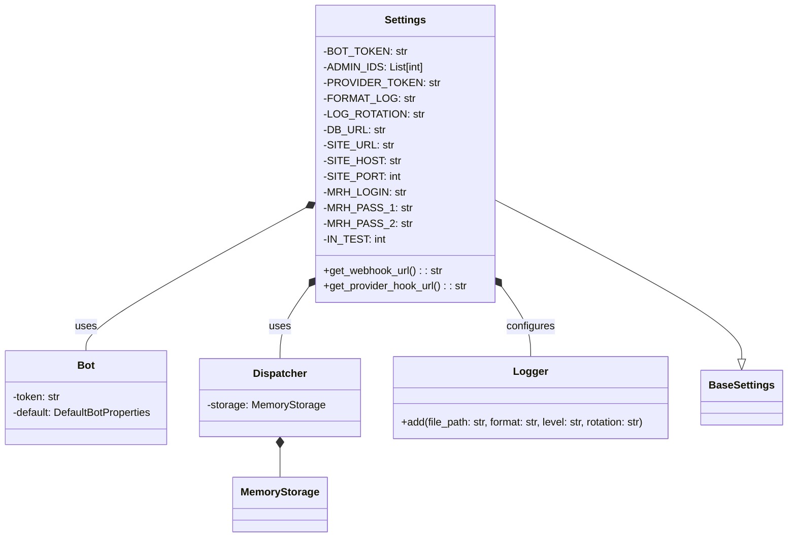

## ИНСТРУКЦИЯ:

Анализируй предоставленный код подробно и объясни его функциональность. Ответ должен включать три раздела:  

1. **<алгоритм>**: Опиши рабочий процесс в виде пошаговой блок-схемы, включая примеры для каждого логического блока, и проиллюстрируй поток данных между функциями, классами или методами.  
2. **<mermaid>**: Напиши код для диаграммы в формате `mermaid`, проанализируй и объясни все зависимости, 
    которые импортируются при создании диаграммы. 
    **ВАЖНО!** Убедитесь, что все имена переменных, используемые в диаграмме `mermaid`, 
    имеют осмысленные и описательные имена. Имена переменных вроде `A`, `B`, `C`, и т.д., не допускаются!  
    
    **Дополнительно**: Если в коде есть импорт `import header`, добавьте блок `mermaid` flowchart, объясняющий `header.py`:\
    ```mermaid\
    flowchart TD\
        Start --> Header[<code>header.py</code><br> Determine Project Root]\
    \
        Header --> import[Import Global Settings: <br><code>from src import gs</code>] \
    ```

3. **<объяснение>**: Предоставьте подробные объяснения:  
   - **Импорты**: Их назначение и взаимосвязь с другими пакетами `src.`.  
   - **Классы**: Их роль, атрибуты, методы и взаимодействие с другими компонентами проекта.  
   - **Функции**: Их аргументы, возвращаемые значения, назначение и примеры.  
   - **Переменные**: Их типы и использование.  
   - Выделите потенциальные ошибки или области для улучшения.  

Дополнительно, постройте цепочку взаимосвязей с другими частями проекта (если применимо).  

Это обеспечивает всесторонний и структурированный анализ кода.
## Формат ответа: `.md` (markdown)
**КОНЕЦ ИНСТРУКЦИИ**
```markdown
## <алгоритм>

1. **Импорт библиотек:**
   - Импортируются необходимые библиотеки: `os`, `typing`, `loguru`, `aiogram`, `pydantic_settings`.

2. **Определение класса `Settings`:**
   - Создается класс `Settings`, наследуемый от `BaseSettings`, для управления настройками приложения.
   - Включает в себя такие поля, как `BOT_TOKEN`, `ADMIN_IDS`, `PROVIDER_TOKEN`, параметры логирования (`FORMAT_LOG`, `LOG_ROTATION`), `DB_URL`,  и параметры сайта.
   - Загружает переменные окружения из файла `.env` (по умолчанию) при создании экземпляра класса.
     - Пример: `.env`:
       ```
       BOT_TOKEN=your_bot_token
       ADMIN_IDS=123456,789012
       PROVIDER_TOKEN=your_provider_token
       SITE_URL=https://your-site.com
       SITE_HOST=your-site.com
       SITE_PORT=80
       MRH_LOGIN=your_mrh_login
       MRH_PASS_1=your_mrh_pass1
       MRH_PASS_2=your_mrh_pass2
       IN_TEST=1
       ```
   - Определяются два свойства (`@property`):
        - `get_webhook_url`: Формирует URL вебхука для Telegram бота. Пример: `"https://your-site.com/your_bot_token"`.
        - `get_provider_hook_url`: Формирует URL вебхука для Robokassa. Пример: `"https://your-site.com/robokassa"`.

3. **Создание экземпляра класса `Settings`:**
   - Создается экземпляр класса `Settings` для доступа к настройкам.
   - Пример: `settings = Settings()`.

4. **Инициализация бота и диспетчера:**
   - Создается экземпляр `aiogram.Bot` с токеном из `settings.BOT_TOKEN` и `ParseMode.HTML`.
   - Создается экземпляр `aiogram.Dispatcher` с использованием `MemoryStorage`.
    - Пример: `bot = Bot(token=settings.BOT_TOKEN, default=DefaultBotProperties(parse_mode=ParseMode.HTML))`
    - Пример: `dp = Dispatcher(storage=MemoryStorage())`

5. **Определение списка администраторов:**
   -  Список администраторов (`admins`) инициализируется из `settings.ADMIN_IDS`.
    - Пример: `admins = settings.ADMIN_IDS`.

6. **Настройка логирования:**
    - Формируется путь к файлу логов.
    - Настраивается логгер `loguru` для записи логов в файл.
      - Пример: `logger.add("log.txt", format="{time:YYYY-MM-DD at HH:mm:ss} | {level} | {message}", level="INFO", rotation="10 MB")`.

7. **Инициализация URL базы данных:**
    - `database_url` получает значение из `settings.DB_URL`.
    - Пример: `database_url = 'sqlite+aiosqlite:///data/db.sqlite3'`.

## <mermaid>



**Объяснение диаграммы:**

- **`Settings`**:  Класс `Settings`, наследуется от `BaseSettings`, отвечает за загрузку и хранение конфигурационных параметров приложения. Он содержит атрибуты для хранения токенов бота, идентификаторов администраторов, URL-адресов, параметров базы данных и прочего. Методы `get_webhook_url()` и `get_provider_hook_url()` формируют URL для вебхуков.
- **`Bot`**: Класс `Bot` из библиотеки `aiogram`, представляющий экземпляр Telegram-бота. Он инициализируется с токеном бота, полученным из `Settings`.
- **`Dispatcher`**: Класс `Dispatcher` из библиотеки `aiogram`, используется для обработки входящих обновлений от Telegram. Он инициализируется с использованием `MemoryStorage` для хранения состояний.
- **`MemoryStorage`**: Класс `MemoryStorage` из библиотеки `aiogram`, предоставляющий хранилище в памяти для состояний FSM (Finite State Machine).
- **`Logger`**: Класс `Logger` из библиотеки `loguru`, отвечает за запись логов в файл. Конфигурационные параметры для него берутся из объекта `Settings`.
- **Связи:**
  - `Settings` наследуется от `BaseSettings`.
  - `Settings` использует `Bot`, `Dispatcher` для инициализации, и настраивает `Logger`.
  - `Dispatcher` использует `MemoryStorage` для хранения состояний.

## <объяснение>

**Импорты:**

- `os`: Модуль для работы с операционной системой, используется для работы с файловыми путями и переменными окружения.
- `typing.List`: Используется для типизации, указывая, что переменная должна быть списком.
- `loguru.logger`:  Используется для логирования.
- `aiogram.Bot`: Основной класс для работы с Telegram Bot API.
- `aiogram.Dispatcher`:  Класс, обрабатывающий входящие обновления от Telegram.
- `aiogram.enums.ParseMode`: Используется для задания режима разметки сообщений (в данном случае HTML).
- `aiogram.fsm.storage.memory.MemoryStorage`: Используется как хранилище данных в оперативной памяти для FSM.
- `aiogram.client.default.DefaultBotProperties`:  Используется для задания настроек бота.
- `pydantic_settings.BaseSettings`, `pydantic_settings.SettingsConfigDict`: Используются для создания класса настроек и загрузки переменных окружения.

**Класс `Settings`:**

- **Роль:**  Класс `Settings` служит для загрузки, хранения и доступа к настройкам приложения. Он использует `pydantic_settings` для загрузки параметров из переменных окружения, что позволяет гибко настраивать приложение без изменения кода.
- **Атрибуты:**
   - `BOT_TOKEN: str`: Токен Telegram-бота.
   - `ADMIN_IDS: List[int]`: Список идентификаторов пользователей, являющихся администраторами.
   - `PROVIDER_TOKEN: str`: Токен платежной системы.
   - `FORMAT_LOG: str`: Формат лог-сообщений (по умолчанию).
   - `LOG_ROTATION: str`: Максимальный размер файла логов перед его ротацией (по умолчанию).
   - `DB_URL: str`: URL для подключения к базе данных.
   - `SITE_URL: str`: URL сайта.
   - `SITE_HOST: str`: Хост сайта.
   - `SITE_PORT: int`: Порт сайта.
   - `MRH_LOGIN: str`: Логин для мерчанта MRH.
   - `MRH_PASS_1: str`: Пароль 1 для мерчанта MRH.
    - `MRH_PASS_2: str`: Пароль 2 для мерчанта MRH.
   - `IN_TEST: int`: Флаг режима тестирования.
- **Методы:**
   - `@property get_webhook_url() -> str`: Формирует URL для вебхука Telegram-бота. Пример: `https://your-site.com/your_bot_token`.
   - `@property get_provider_hook_url() -> str`: Формирует URL для вебхука платежной системы. Пример: `https://your-site.com/robokassa`.
- **Взаимодействие:**
   - Загружает настройки из `.env` файла.
   - Используется для инициализации `Bot`, `Dispatcher`, `logger`, и других частей системы, которым требуются конфигурационные параметры.

**Переменные:**

- `settings`: Экземпляр класса `Settings`, содержит все загруженные настройки.
- `bot`: Экземпляр `aiogram.Bot`, представляющий бота.
- `dp`: Экземпляр `aiogram.Dispatcher`, обрабатывающий сообщения.
- `admins`: Список идентификаторов администраторов бота.
- `log_file_path`: Путь к файлу, где будут сохраняться логи.
- `database_url`: URL для подключения к базе данных.

**Функции:**
- `get_webhook_url`: это свойство (property) класса `Settings`, которое возвращает URL вебхука для бота, динамически формируя его из `SITE_URL` и `BOT_TOKEN`.
- `get_provider_hook_url`: это свойство (property) класса `Settings`, которое возвращает URL вебхука для Robokassa, динамически формируя его из `SITE_URL`.

**Цепочка взаимосвязей:**

1. **Загрузка настроек:** `Settings` загружает настройки из `.env` файла.
2. **Инициализация бота:** `Bot` и `Dispatcher` инициализируются с использованием настроек из `Settings`.
3. **Настройка логирования:** `loguru.logger` настраивается с использованием настроек из `Settings`.
4. **Доступ к настройкам:**  Другие модули могут использовать `settings` для доступа к конфигурационным параметрам.

**Потенциальные ошибки или области для улучшения:**

- **Обработка ошибок загрузки переменных окружения:**
  - Код не обрабатывает случаи, когда файл `.env` отсутствует или содержит некорректные данные. Можно добавить проверку и обработку исключений для более надежной работы.
- **Безопасность:**
  - Хранение токенов и паролей в файле `.env` может быть небезопасным, особенно в production-окружении. Рассмотреть использование более безопасных методов хранения секретов (например, переменные окружения, менеджеры секретов).
- **Валидация данных:**
   - Можно добавить валидацию для значений параметров, например, проверять, что `ADMIN_IDS` является списком целых чисел, `SITE_PORT` - допустимый порт и т.д. Это можно сделать с помощью Pydantic.
- **Динамическое изменение настроек:**
   - Код не предусматривает динамического изменения настроек во время работы приложения.
- **Жесткая привязка к файлу `.env`:**
   - Можно сделать загрузку из переменных окружения более гибкой, позволяя устанавливать пути к `.env` файлу или загружать настройки из переменных окружения.

Этот код является отправной точкой для конфигурации Telegram-бота. Он предоставляет базовую структуру для загрузки настроек, инициализации бота и диспетчера, а также настройки логирования.
```