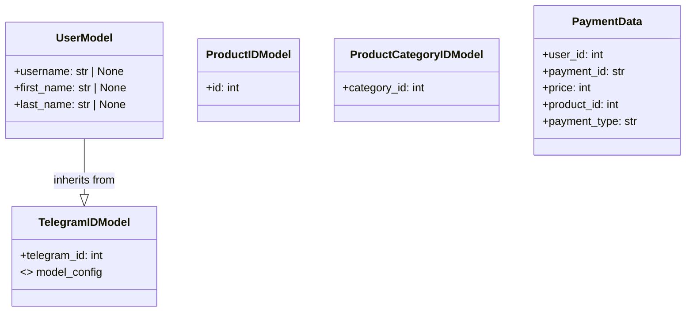

## АНАЛИЗ КОДА

### 1. <алгоритм>

**Блок-схема:**

```mermaid
graph TD
    A[Начало] --> B(TelegramIDModel);
    B --> C{Создание TelegramIDModel};
    C --> D[Атрибут: telegram_id (int)];
    D --> E{Настройка ConfigDict: from_attributes=True};
    E --> F(UserModel);
    F --> G{Наследование от TelegramIDModel};
    G --> H[Атрибуты: username (str | None), first_name (str | None), last_name (str | None)];
    H --> I(ProductIDModel);
     I --> J{Создание ProductIDModel};
    J --> K[Атрибут: id (int)];
    K --> L(ProductCategoryIDModel);
    L --> M{Создание ProductCategoryIDModel};
    M --> N[Атрибут: category_id (int)];
    N --> O(PaymentData);
    O --> P{Создание PaymentData};
    P --> Q[Атрибуты: user_id (int), payment_id (str), price (int), product_id (int), payment_type (str)];
    Q --> R[Описание полей];
    R --> S[Конец];
    
    style A fill:#f9f,stroke:#333,stroke-width:2px
    style S fill:#ccf,stroke:#333,stroke-width:2px
    
```

**Примеры:**

1.  **`TelegramIDModel`**:
    *   Создание экземпляра: `telegram_user = TelegramIDModel(telegram_id=12345)`
    *   Результат: `telegram_user.telegram_id` вернет `12345`
2.  **`UserModel`**:
    *   Создание экземпляра: `user = UserModel(telegram_id=12345, username="test_user", first_name="Ivan", last_name="Ivanov")`
    *   Результат: `user.username` вернет `"test_user"`, `user.first_name` вернет `"Ivan"`
3.  **`ProductIDModel`**:
    *   Создание экземпляра: `product = ProductIDModel(id=1)`
    *   Результат: `product.id` вернет `1`
4.  **`ProductCategoryIDModel`**:
    *   Создание экземпляра: `category = ProductCategoryIDModel(category_id=2)`
    *   Результат: `category.category_id` вернет `2`
5.  **`PaymentData`**:
    *   Создание экземпляра: `payment = PaymentData(user_id=12345, payment_id="pay_123", price=100, product_id=1, payment_type="card")`
    *   Результат: `payment.payment_id` вернет `"pay_123"`, `payment.price` вернет `100`

### 2. <mermaid>



**Объяснение диаграммы:**

*   **`TelegramIDModel`**: Это базовый класс, представляющий модель с идентификатором пользователя Telegram.
    *   `telegram_id`: Целочисленный идентификатор пользователя.
    *   `model_config`: Настройка `ConfigDict` для корректной работы с атрибутами.
*   **`UserModel`**: Класс, представляющий модель пользователя. Наследуется от `TelegramIDModel`.
    *   `username`: Имя пользователя (может быть `None`).
    *   `first_name`: Имя пользователя (может быть `None`).
    *   `last_name`: Фамилия пользователя (может быть `None`).
*   **`ProductIDModel`**: Класс, представляющий модель товара по его идентификатору.
    *   `id`: Целочисленный идентификатор товара.
*    **`ProductCategoryIDModel`**: Класс, представляющий модель категории товара по его идентификатору.
    *   `category_id`: Целочисленный идентификатор категории товара.
*   **`PaymentData`**: Класс, представляющий модель данных об оплате.
    *   `user_id`: Идентификатор пользователя Telegram, совершившего оплату.
    *   `payment_id`: Уникальный идентификатор платежа.
    *   `price`: Сумма платежа в рублях.
    *   `product_id`: Идентификатор оплаченного товара.
    *    `payment_type`: Тип платежа (например, "card", "cash").

### 3. <объяснение>

**Импорты:**

*   `from pydantic import BaseModel, ConfigDict, Field`:
    *   `BaseModel` - базовый класс для моделей Pydantic, используемый для валидации данных.
    *   `ConfigDict` - класс для конфигурации модели, используется для настройки `from_attributes=True`.
    *   `Field` - используется для определения дополнительных параметров полей (например, описание, максимальная длина).

**Классы:**

*   **`TelegramIDModel`**:
    *   **Роль**: Базовая модель для хранения идентификатора пользователя Telegram.
    *   **Атрибуты**:
        *   `telegram_id`: Целочисленный идентификатор.
        *   `model_config`: Настройка `ConfigDict` для корректной работы с атрибутами. Позволяет Pydantic получать значения из атрибутов объекта, а не только из dict.
    *   **Методы**: Нет.
    *   **Взаимодействие**: Используется как базовый класс для `UserModel`.
*   **`UserModel`**:
    *   **Роль**: Модель для хранения информации о пользователе, расширяет `TelegramIDModel`.
    *   **Атрибуты**:
        *   `username`: Имя пользователя (строка или `None`).
        *   `first_name`: Имя (строка или `None`).
        *   `last_name`: Фамилия (строка или `None`).
    *   **Методы**: Нет.
    *   **Взаимодействие**: Наследует от `TelegramIDModel`, используется для представления данных о пользователе.
*  **`ProductIDModel`**:
    *   **Роль**: Модель для хранения идентификатора товара.
    *   **Атрибуты**:
        *   `id`: Целочисленный идентификатор товара.
    *   **Методы**: Нет.
    *   **Взаимодействие**: Используется для передачи идентификатора товара.
*   **`ProductCategoryIDModel`**:
    *   **Роль**: Модель для хранения идентификатора категории товара.
    *   **Атрибуты**:
        *   `category_id`: Целочисленный идентификатор категории товара.
    *   **Методы**: Нет.
    *   **Взаимодействие**: Используется для передачи идентификатора категории товара.
*   **`PaymentData`**:
    *   **Роль**: Модель для хранения информации о платеже.
    *   **Атрибуты**:
        *   `user_id`: Идентификатор пользователя (целое число), обязательное поле.
        *   `payment_id`: Уникальный идентификатор платежа (строка, не более 255 символов), обязательное поле.
        *   `price`: Сумма платежа (целое число), обязательное поле.
        *   `product_id`: Идентификатор товара (целое число), обязательное поле.
        *   `payment_type`: Тип оплаты (строка), обязательное поле.
    *   **Методы**: Нет.
    *   **Взаимодействие**: Используется для передачи данных об оплате.

**Переменные:**

*   В классах определены атрибуты, которые будут использоваться для хранения данных. Все атрибуты имеют типы, которые соответствуют их назначению (int, str, str | None).

**Потенциальные ошибки и области для улучшения:**

1.  **Отсутствие валидации для `username`, `first_name`, `last_name`**: В `UserModel` поля могут быть `None`, но не определены ограничения на длину или формат, если они не `None`. Можно добавить валидацию.
2.  **Недостаточно информации в `PaymentData`**:
    *   Нет информации о дате и времени оплаты.
    *   Нет информации о статусе платежа.
    *   Можно добавить модель для обработки разных типов оплат (например, банковская карта, электронный кошелек).
3.  **Нет обработчика ошибок**: Pydantic будет автоматически генерировать ошибки валидации, но в коде нет обработки этих ошибок.

**Взаимосвязи с другими частями проекта:**

*   Эти модели, скорее всего, будут использоваться в других частях проекта, связанных с обработкой пользовательских данных и данных о платежах.
*   Эти модели используются для валидации данных и передачи их между различными компонентами системы.
*   Возможное использование:
    *   При обработке сообщений от Telegram-бота.
    *   При записи данных в базу данных.
    *   При формировании отчетов.

**Общая оценка:**

Код предоставляет простые модели данных для работы с пользователями, товарами и платежами. Код хорошо структурирован, используется Pydantic для валидации и определения типов данных.  Можно расширить модели и добавить валидации и обработку ошибок для повышения надежности и гибкости.