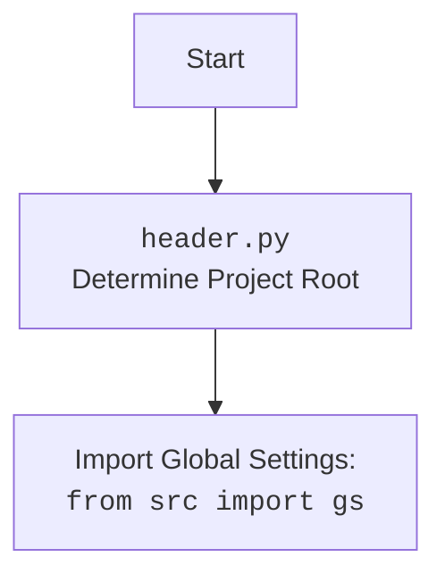

## <алгоритм>

1. **Начало:**
   - Выполняется скрипт `header.py`.
   - **Пример:** Запуск из командной строки: `python src/logger/header.py`.
2. **Определение корня проекта (`set_project_root`):**
   - Функция `set_project_root` вызывается с маркерами (`__root__`, `.git`).
   -   **Пример:** `marker_files = ('__root__', '.git')`
   -   Начальная точка поиска - директория текущего скрипта.
   - **Пример:** `current_path = Path('src/logger')`
   - Поиск родительских директорий, пока не будет найдена директория с одним из маркеров.
    - **Пример:** Если маркер `.git` найден в директории `src`, то `__root__` будет присвоен путь к этой директории.
   -   Если маркер не найден, то `__root__` остается равным директории текущего скрипта.
   -   Если путь до корня проекта не добавлен в `sys.path`, он будет добавлен.
   -   Возвращается `__root__` (путь до корня проекта).
   - **Пример:** `__root__` = `/path/to/project`
3. **Импорт настроек (`settings`)**
   -  Пытаемся открыть и прочитать JSON файл `settings.json` в директории `src`
    -   **Пример:** `path = gs.path.root / 'src' /  'settings.json'`
    -  Если файл не найден или JSON не валиден, `settings` остаётся `None`.
    -  **Пример (успех):** `settings = {"project_name": "hypotez", "version": "1.0.0", ...}`
    -  **Пример (неудача):** `settings = None`
4. **Импорт документации (`doc_str`)**
   - Пытаемся открыть и прочитать файл `README.MD` в директории `src`.
    - **Пример:** `path = gs.path.root / 'src' /  'README.MD'`
    - Если файл не найден, `doc_str` остается `None`.
    - **Пример (успех):** `doc_str = "# Project Hypotez..."`
    - **Пример (неудача):** `doc_str = None`
5. **Инициализация глобальных переменных:**
   -   `__project_name__` извлекается из `settings` (если есть), иначе `hypotez`.
    -   **Пример (с настройками):** `__project_name__ = "hypotez"`
    -   **Пример (без настроек):** `__project_name__ = "hypotez"`
   -   `__version__` извлекается из `settings` (если есть), иначе пустая строка.
    -  **Пример (с настройками):** `__version__ = "1.0.0"`
    -  **Пример (без настроек):** `__version__ = ""`
   -   `__doc__` присваивается `doc_str` (если есть), иначе пустая строка.
    -  **Пример (с документацией):** `__doc__ = "# Project Hypotez..."`
    -  **Пример (без документации):** `__doc__ = ""`
   -   `__details__` инициализируется пустой строкой.
   -   `__author__` извлекается из `settings` (если есть), иначе пустая строка.
    -  **Пример (с настройками):** `__author__ = "John Doe"`
    -  **Пример (без настроек):** `__author__ = ""`
   -   `__copyright__` извлекается из `settings` (если есть), иначе пустая строка.
     -  **Пример (с настройками):** `__copyright__ = "Copyright 2023"`
     -  **Пример (без настроек):** `__copyright__ = ""`
   -   `__cofee__` извлекается из `settings` (если есть), иначе строка по умолчанию.
    -  **Пример (с настройками):** `__cofee__ = "Custom message"`
    -   **Пример (без настроек):** `__cofee__ = "Treat the developer to a cup of coffee for boosting enthusiasm in development: https://boosty.to/hypo69"`
6. **Конец:**
   -   Глобальные переменные `__root__`, `__project_name__`, `__version__`, `__doc__`, `__details__`, `__author__`, `__copyright__`, `__cofee__` готовы к использованию в проекте.

## <mermaid>

```mermaid
flowchart TD
    Start --> FindProjectRoot[set_project_root()\nFind Project Root Directory];
    FindProjectRoot --> CheckMarkerFiles[Check for marker files\n(__root__, .git)];
    CheckMarkerFiles -- Found marker file --> SetRootPath[Set Root Path];
    CheckMarkerFiles -- Not found --> SetDefaultRootPath[Set default root path];
    SetRootPath --> UpdateSysPath[Update sys.path];
    SetDefaultRootPath --> UpdateSysPath;
    UpdateSysPath --> SetGlobalRootVariable[Set __root__ variable];
    SetGlobalRootVariable --> ImportGlobalSettings[Import from src: gs];
    ImportGlobalSettings --> LoadSettingsFile[Load settings.json];
    LoadSettingsFile -- Success --> LoadReadmeFile[Load README.MD];
    LoadSettingsFile -- Failure --> LoadReadmeFile;
    LoadReadmeFile -- Success --> SetGlobalVariables[Set global variables\n(__project_name__, __version__, __doc__...)];
    LoadReadmeFile -- Failure --> SetGlobalVariables;
    SetGlobalVariables --> End;
    End --> |Global variables available|;
```



## <объяснение>

**Импорты:**

*   `sys`: Модуль для доступа к переменным и функциям, связанным с интерпретатором Python. Используется для добавления пути к корню проекта в `sys.path`, чтобы другие модули могли быть импортированы.
*   `json`: Модуль для работы с данными в формате JSON. Используется для чтения настроек из файла `settings.json`.
*  `packaging.version`: Модуль для работы с версиями пакетов.
*   `pathlib.Path`: Модуль для представления путей к файлам и директориям. Используется для работы с путями к директориям и файлам в кроссплатформенном режиме.
*   `src.gs`:  Предположительно, `gs`  это модуль, который содержит глобальные настройки проекта, например, корневой путь.
     - **Взаимосвязь:**  `gs` является важным компонентом, так как `header.py` использует `gs.path.root` для определения местоположения файла настроек и документации, а так же для определения пути до корня проекта. Зависимость циклическая, так как `header.py` определяет `__root__` для `gs`.

**Функция `set_project_root`:**

*   **Аргументы:** `marker_files` (кортеж строк) - имена файлов или директорий, которые указывают на корень проекта. По умолчанию (`'__root__'`, `'.git'`).
*   **Возвращаемое значение:** `Path` -  объект, представляющий путь к корню проекта.
*   **Назначение:**  Находит корень проекта, проходя вверх по дереву директорий.  Останавливается, когда находит один из файлов/директорий-маркеров.  Если не находит, возвращает директорию скрипта.
    - **Пример:**
        ```python
        # если скрипт находится в /home/user/project/src/logger/header.py
        # и файл .git расположен в /home/user/project,
        # то функция вернет Path("/home/user/project")
        ```

**Переменные:**

*   `__root__` (`Path`): Путь к корневой директории проекта. Глобальная переменная, доступная другим модулям.
*   `settings` (`dict` или `None`): Словарь с настройками проекта, загруженный из `settings.json`. Если файл не найден или не валидный JSON, будет `None`.
*    `doc_str` (`str` или `None`): Строка с текстом из `README.MD`.  Если файл не найден, будет `None`.
*   `__project_name__` (`str`): Название проекта, по умолчанию "hypotez".
*   `__version__` (`str`): Версия проекта.
*   `__doc__` (`str`): Описание проекта (из файла `README.MD`).
*   `__details__` (`str`): Детали проекта (в данный момент пустая строка).
*   `__author__` (`str`): Автор проекта.
*   `__copyright__` (`str`): Авторские права проекта.
*   `__cofee__` (`str`): Сообщение о поддержке разработчика.

**Цепочка взаимосвязей:**

1.  `header.py` определяет корень проекта (`__root__`).
2.  `header.py` добавляет путь к корню проекта в `sys.path`, что позволяет другим модулям импортировать модули проекта.
3.  `header.py` импортирует `src.gs` для доступа к глобальным настройкам проекта, которые в свою очередь используют `__root__`, определенный в этом же модуле.
4.  `header.py` читает настройки из файла `settings.json`, используя путь, построенный с помощью `__root__` и `src.gs`.
5.  `header.py` читает документацию из `README.MD` используя путь, построенный с помощью `__root__` и `src.gs`.
6.  `header.py` устанавливает глобальные переменные, используя загруженные настройки.

**Потенциальные ошибки или области для улучшения:**

1.  **Циклическая зависимость:** `header.py` зависит от `src.gs`, а `src.gs` зависит от `__root__`, который устанавливается в `header.py`. Эта проблема может привести к ошибкам при импорте и инициализации модулей. Необходимо пересмотреть архитектуру, чтобы избежать этой циклической зависимости.
2.  **Обработка ошибок:** В коде используются `try...except` блоки для обработки ошибок при чтении файлов `settings.json` и `README.MD`, но при возникновении ошибок `settings` и `doc_str` просто становятся `None`,  в то время как можно было бы выдавать предупреждение или использовать значения по умолчанию.
3.  **Жестко заданные пути:** Путь к файлам настроек и документации (`'src' /  'settings.json'`, `'src' /  'README.MD'`) жёстко прописан в коде. В будущем это может вызвать сложности при изменении структуры проекта.
4. **Отсутствует валидация:** Не проводится валидация содержимого `settings.json`. Это может привести к ошибкам при работе с  неожиданными данными.

**Дополнительно:**

*   Модуль `header.py` является важным компонентом проекта, так как он определяет корень проекта и загружает настройки.
*   Глобальные переменные, объявленные в этом модуле, используются другими модулями для доступа к общей информации.
*   Необходимо улучшить обработку ошибок и валидацию данных.