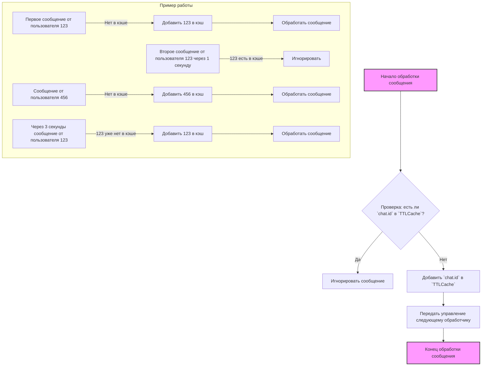
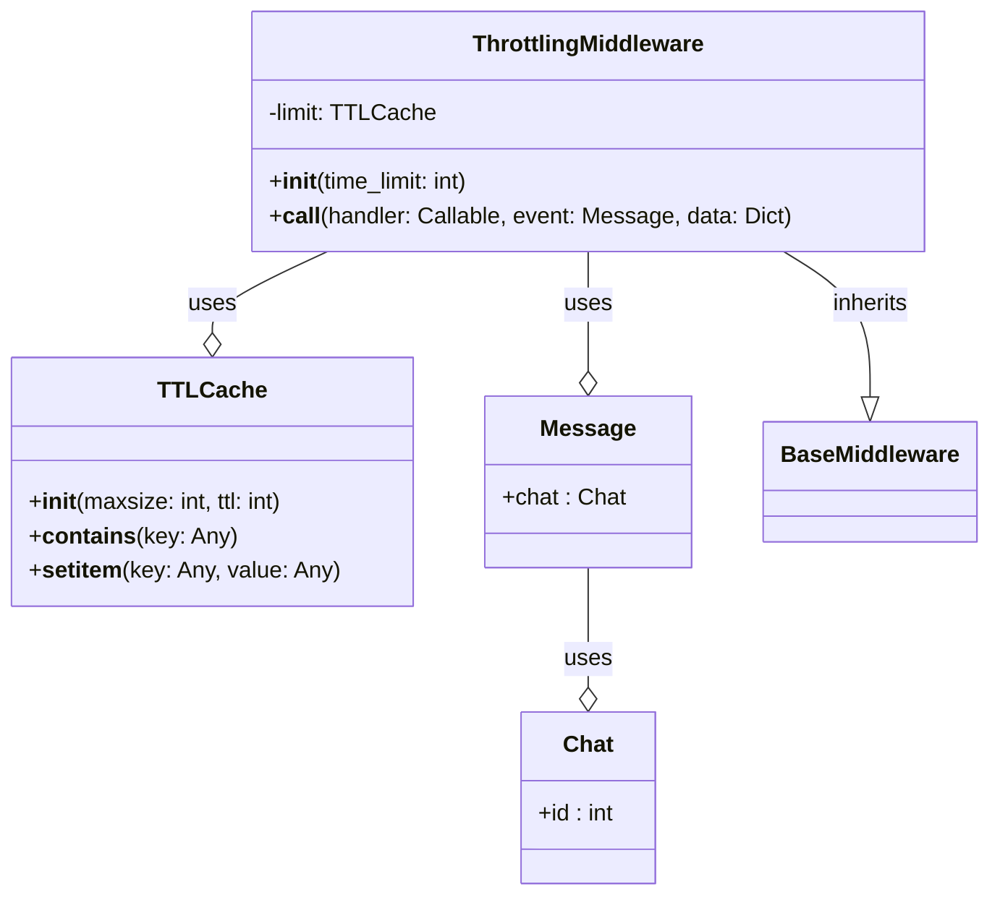

## АНАЛИЗ КОДА: `hypotez/src/endpoints/bots/telegram/movie_bot-main/middlewares/throttling.py`

### 1. <алгоритм>

**Блок-схема:**

**Пояснения к Блок-схеме:**

1.  **Начало:** Мидлварь `ThrottlingMiddleware` перехватывает входящее сообщение от пользователя.
2.  **Проверка в кэше:**  Проверяется, существует ли `chat.id` пользователя в `TTLCache`.
3.  **Игнорирование:** Если `chat.id` найден в кэше, это означает, что пользователь отправлял сообщения слишком часто. Сообщение игнорируется и обработка прерывается.
4.  **Добавление в кэш:** Если `chat.id` не найден, он добавляется в `TTLCache` с текущим временем.
5.  **Передача управления:** Сообщение передаётся следующему обработчику в цепочке.
6.  **Конец:** Обработка сообщения завершается.
    
7.  **Пример работы:**
    -   Первое сообщение от пользователя 123: так как ID нет в кеше он добавляется, сообщение обрабатывается.
    -   Второе сообщение от пользователя 123 через 1 секунду: ID есть в кеше, сообщение игнорируется.
    -   Сообщение от пользователя 456: так как ID нет в кеше, он добавляется, сообщение обрабатывается.
    -   Сообщение от пользователя 123 через 3 секунды: так как время жизни записи истекло, ID нет в кеше, он добавляется, сообщение обрабатывается.

### 2. <mermaid>

**Импорты и зависимости:**

-   `aiogram.BaseMiddleware`: Базовый класс для создания middleware в `aiogram`. `ThrottlingMiddleware` наследуется от него.
-   `aiogram.types.Message`: Тип данных, представляющий сообщение в Telegram. Middleware использует его для получения `chat.id`.
-   `cachetools.TTLCache`: Структура данных для хранения кэша с ограничением по времени жизни (TTL). Используется для реализации троттлинга.

### 3. <объяснение>

**Импорты:**

-   `from typing import Any, Awaitable, Callable, Dict`: Используются для аннотации типов, повышая читаемость и облегчая отладку кода.
    -   `Any`: Тип для любого значения, используется, когда тип неизвестен или неважен.
    -   `Awaitable`: Тип для корутин, которые могут быть вызваны через `await`.
    -   `Callable`: Тип для объектов, которые можно вызвать как функцию.
    -   `Dict`: Тип для словарей.
-   `from aiogram import BaseMiddleware`: Импортируется базовый класс для мидлварей из библиотеки `aiogram`.
-   `from aiogram.types import Message`: Импортируется класс `Message`, представляющий сообщение от пользователя, используется для доступа к идентификатору чата.
-   `from cachetools import TTLCache`: Импортируется класс `TTLCache` для кэширования с TTL, который используется для ограничения скорости сообщений.

**Класс `ThrottlingMiddleware`:**

-   **Роль:** Реализует механизм троттлинга для бота, чтобы предотвратить перегрузку от частых запросов.
-   **Атрибуты:**
    -   `limit: TTLCache`: Кэш, хранящий `chat.id` пользователей, которые недавно отправляли сообщения. Ключом является ID чата, а значение не имеет значения (используется `None`). Время жизни записей в кэше определяется параметром `ttl`.
-   **Методы:**
    -   `__init__(self, time_limit: int = 2)`: Конструктор класса, принимает аргумент `time_limit`, устанавливающий время в секундах, на которое пользователь будет "забанен" после отправки сообщения. Создаёт экземпляр `TTLCache` с максимальным размером `10000` и заданным `ttl`.
    -   `__call__(self, handler: Callable, event: Message, data: Dict) -> Any`: Метод, вызываемый при обработке сообщения.
        -   **Аргументы**:
            -   `handler`: Функция-обработчик, которая будет вызвана, если сообщение не попало под троттлинг.
            -   `event`: Объект сообщения типа `Message`.
            -   `data`: Словарь с дополнительными данными, которые могут понадобиться обработчику.
        -   **Возвращает**: Результат вызова обработчика (`handler`).
        -   **Логика**: Проверяет, есть ли `chat.id` пользователя в кэше. Если есть, то сообщение игнорируется. Если нет, добавляет `chat.id` в кэш и вызывает обработчик.

**Переменные:**

-   `time_limit`: Целочисленная переменная, определяющая время в секундах, в течение которого сообщения от пользователя будут игнорироваться, если они были отправлены слишком часто.
-   `limit`: Объект `TTLCache`, хранящий ID чатов, для которых применяется троттлинг.

**Потенциальные ошибки и области для улучшения:**

-   **Обработка ошибок:** В коде нет обработки ошибок. Было бы полезно добавить логирование или обработку исключений, которые могут возникнуть при работе с `TTLCache`.
-   **Конфигурируемость:** Параметр `maxsize` кэша жёстко закодирован (`10_000`). Его можно сделать параметром конструктора, чтобы можно было настраивать максимальный размер кэша.
-   **Логирование**: Было бы полезно добавить логирование для отслеживания событий троттлинга.

**Взаимосвязи с другими частями проекта:**

-   Этот middleware используется в боте Telegram, как часть цепочки обработки входящих сообщений.
-   Он взаимодействует с `aiogram` для обработки сообщений и с `cachetools` для реализации кэширования.

**Цепочка взаимосвязей:**

1.  Сообщение пользователя поступает в Telegram Bot API.
2.  `aiogram` получает сообщение.
3.  `ThrottlingMiddleware` перехватывает сообщение.
4.  Производится проверка на наличие пользователя в кэше.
5.  Если пользователь в кэше, сообщение игнорируется, иначе добавляется в кэш и управление передаётся дальше.
6.  Сообщение проходит через другие мидлвари.
7.  Сообщение обрабатывается хендлерами (`handler`).
8.  Результат отправляется обратно пользователю через Telegram Bot API.