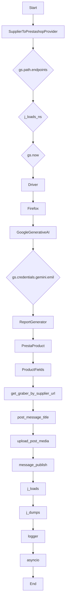
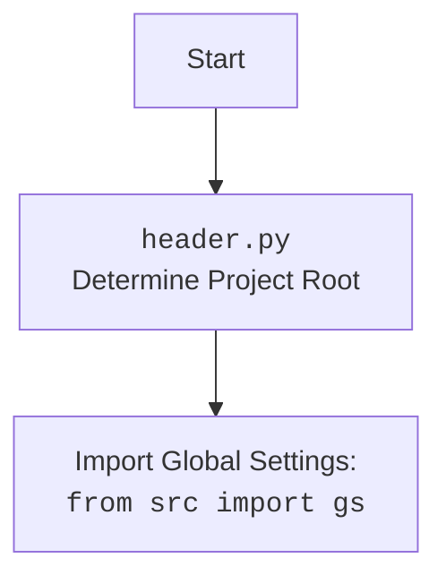

## Проект `hypotez`
# Роль `code explainer`
## ИНСТРУКЦИЯ  :

Анализируй предоставленный код подробно и объясни его функциональность. Ответ должен включать три раздела:  

1. **<алгоритм>**: Опиши рабочий процесс в виде пошаговой блок-схемы, включая примеры для каждого логического блока, и проиллюстрируй поток данных между функциями, классами или методами.  
2. **<mermaid>**: Напиши код для диаграммы в формате `mermaid`, проанализируй и объясни все зависимости, 
    которые импортируются при создании диаграммы. 
    **ВАЖНО!** Убедитесь, что все имена переменных, используемые в диаграмме `mermaid`, 
    имеют осмысленные и описательные имена. Имена переменных вроде `A`, `B`, `C`, и т.д., не допускаются!  
    
    **Дополнительно**: Если в коде есть импорт `import header`, добавьте блок `mermaid` flowchart, объясняющий `header.py`:\
    ```mermaid
    flowchart TD
        Start --> Header[<code>header.py</code><br> Determine Project Root]
    
        Header --> import[Import Global Settings: <br><code>from src import gs</code>] 
    ```

3. **<объяснение>**: Предоставь подробные объяснения:  
   - **Импорты**: Их назначение и взаимосвязь с другими пакетами `src.`.  
   - **Классы**: Их роль, атрибуты, методы и взаимодействие с другими компонентами проекта.  
   - **Функции**: Их аргументы, возвращаемые значения, назначение и примеры.  
   - **Переменные**: Их типы и использование.  
   - Выдели потенциальные ошибки или области для улучшения.  

Дополнительно, постройте цепочку взаимосвязей с другими частями проекта (если применимо).  

Это обеспечивает всесторонний и структурированный анализ кода.
## Формат ответа: `.md` (markdown)


## Твое поведение при анализе кода:
- всегда смотри системную инструкцию для обработки кода проекта `hypotez`;
- анализируй расположение файла в проекте. Это поможет понять его назначение и взаимосвязь с другими файлами. Расположение файла ты найдешь в самой превой строке кода, начинающейся с `## \\file /...`;
- запоминай предоставленный код и анализируй его связь с другими частями проекта `hypotez`;

**КОНЕЦ ИНСТРУКЦИИ**
```md
## Анализ кода `hypotez/src/endpoints/emil/scenarios/from_supplier_to_prestashop.py`

### 1. <алгоритм>

```mermaid
graph LR
    subgraph SupplierToPrestashopProvider
        A[Инициализация класса SupplierToPrestashopProvider] --> B{Загрузка конфигурации из JSON}
        B -- Да --> C[Инициализация WebDriver и AI модели]
        B -- Нет --> Z[Логирование ошибки загрузки конфигурации]

        C --> D{Цикл по URL}
        D --> E{Определение грабера по URL}
        E -- Грабер найден --> F[Получение данных о товаре с помощью грабера]
        E -- Грабер не найден --> G[Логирование отсутствия грабера]

        F -- Успешно --> H[Преобразование полей товара]
        F -- Ошибка --> I[Логирование ошибки получения полей]

        H -- Успешно --> J[Сохранение данных о товаре]
        H -- Ошибка --> K[Логирование ошибки преобразования полей]

        J -- Успешно --> L[Добавление товара в список]
        J -- Ошибка --> M[Логирование ошибки сохранения данных]

        L --> D
        D --> N{Конец цикла по URL}
        N --> O{Обработка списка товаров через AI (process_ai)}
        O --> P{Сохранение товаров в Prestashop (save_in_prestashop)}
        P --> Q{Публикация в Facebook (post_facebook)}
        Q --> R{Создание отчета (create_report)}
        R --> S[Конец сценария]
    end

    subgraph main
        U[Чтение JSON со списком товаров] --> V[Создание экземпляра SupplierToPrestashopProvider]
        V --> W[Сохранение товаров в Prestashop]
    end

    style A fill:#f9f,stroke:#333,stroke-width:2px
    style U fill:#ccf,stroke:#333,stroke-width:2px
```

### 2. <mermaid>



**Объяснение зависимостей:**

-   `SupplierToPrestashopProvider`: Основной класс, управляющий сценарием.
-   `gs.path.endpoints`: Используется для доступа к путям файлов конфигурации и инструкций. `gs` предполагает глобальные настройки.
-   `j_loads_ns`, `j_loads`, `j_dumps`: Методы для работы с JSON файлами, упрощающие чтение и запись данных.
-   `gs.now`: Получение текущего времени для использования в сценарии (например, для создания уникальных идентификаторов).
-   `Driver`, `Firefox`: Компоненты для управления браузером Firefox, используемые для веб-скрапинга и взаимодействия с веб-сайтами.
-   `GoogleGenerativeAI`: Класс для взаимодействия с AI моделью Gemini, используемый для обработки данных.
-   `gs.credentials.gemini.emil`: Доступ к ключам API для Gemini.
-   `ReportGenerator`: Класс для создания отчетов в форматах HTML и PDF.
-   `PrestaProduct`: Класс для взаимодействия с API Prestashop, добавления товаров.
-   `ProductFields`: Класс, определяющий поля продукта Prestashop.
-   `get_graber_by_supplier_url`: Функция, возвращающая грабер в зависимости от URL поставщика.
-   `post_message_title`, `upload_post_media`, `message_publish`: Функции для публикации контента в Facebook.
-   `logger`: Модуль для логирования событий и ошибок.
-   `asyncio`: Модуль для асинхронного выполнения операций.



### 3. <объяснение>

**Импорты:**

-   `os`: Работа с операционной системой, например, для доступа к переменным окружения.
-   `asyncio`: Для асинхронного выполнения кода.
-   `random`: Для генерации случайных чисел.
-   `shutil`: Для операций с файлами, например, копирования.
-   `pathlib.Path`: Для работы с путями к файлам и директориям.
-   `tkinter.SEL`: Импорт из библиотеки tkinter (GUI), здесь используется константа `SEL`.
-   `typing.Optional`, `typing.List`: Для аннотации типов.
-   `types.SimpleNamespace`: Для создания объектов, атрибуты которых доступны через точку.
-   `header`: Модуль, определяющий корень проекта.
-   `src.gs`: Глобальные настройки проекта.
-   `src.endpoints.prestashop.product_fields.ProductFields`: Класс для представления полей продукта в Prestashop.
-   `src.endpoints.prestashop.product.PrestaProduct`: Класс для взаимодействия с API Prestashop.
-   `src.webdriver.driver.Driver`: Абстрактный класс для управления веб-драйвером.
-   `src.webdriver.firefox.Firefox`: Класс для управления браузером Firefox.
-   `src.ai.gemini.GoogleGenerativeAI`: Класс для взаимодействия с моделью Google Gemini.
-   `src.endpoints.emil.report_generator.ReportGenerator`: Класс для создания отчетов.
-   `src.endpoints.advertisement.facebook.scenarios`: Модуль для работы с Facebook.
-   `src.suppliers.get_graber_by_supplier.get_graber_by_supplier_url`: Функция для получения грабера на основе URL поставщика.
-   `src.utils.jjson`: Модуль для работы с JSON.
-   `src.utils.file`: Модуль для работы с файлами.
-   `src.utils.image`: Модуль для работы с изображениями.
-   `src.utils.convertors.unicode`: Модуль для работы с Unicode.
-   `src.utils.printer.pprint`: Функция для красивого вывода данных.
-   `src.logger.logger`: Модуль для логирования.

**Классы:**

-   `SupplierToPrestashopProvider`:
    -   **Роль**: Управляет процессом получения данных от поставщиков, обработки их с помощью AI и сохранения в Prestashop.
    -   **Атрибуты**:
        -   `driver`: Экземпляр WebDriver для управления браузером.
        -   `export_path`: Путь для экспорта данных.
        -   `mexiron_name`: Название мехирона.
        -   `price`: Цена.
        -   `timestamp`: Временная метка.
        -   `products_list`: Список товаров.
        -   `model`: Экземпляр AI модели.
        -   `config`: Конфигурация.
        -   `local_images_path`: Путь к локальным изображениям.
        -   `lang`: Язык.
        -   `gemini_api`: API ключ для Gemini.
        -   `presta_api`: API ключ для Prestashop.
        -   `presta_url`: URL Prestashop.
    -   **Методы**:
        -   `__init__`: Инициализация класса.
        -   `initialise_ai_model`: Инициализация AI модели Gemini.
        -   `run_scenario`: Запуск основного сценария.
        -   `save_product_data`: Сохранение данных о товаре.
        -   `process_ai`: Обработка данных с помощью AI.
        -   `read_data_from_json`: Чтение данных из JSON.
        -   `save_in_prestashop`: Сохранение товаров в Prestashop.
        -   `post_facebook`: Публикация в Facebook.
        -   `create_report`: Создание отчета.

**Функции:**

-   `main`:
    -   **Аргументы**: `suppier_to_presta`.
    -   **Возвращаемое значение**: None.
    -   **Назначение**: Чтение данных о товарах из JSON и сохранение их в Prestashop.

**Переменные:**

-   `ENDPOINT`: Константа, определяющая endpoint (значение: `'emil'`).
-   `USE_ENV`: Флаг, определяющий, откуда брать ключи API (из `.env` или из базы данных).

**Потенциальные ошибки и области для улучшения:**

1.  Обработка ошибок: Многие блоки `try...except` содержат только логирование ошибки и `...`. Необходимо добавить более детальную обработку ошибок, чтобы предотвратить сбой сценария.
2.  Логирование: Добавить больше логов для отслеживания хода выполнения программы.
3.  Не все поля товара заполняются. Требуется заполнение всех необходимых полей.
4.  В методе `process_ai` при неудачной попытке получения ответа от модели происходит рекурсивный вызов `await self.process_ai(products_list, lang, attempts -1 )`, что может привести к переполнению стека при большом количестве неудачных попыток.
5.  Метод `read_data_from_json` только загружает JSON и выводит его в консоль, но не используется в дальнейшем.

**Взаимосвязи с другими частями проекта:**

-   Сценарий использует модули из `src.utils` для работы с JSON, файлами и изображениями.
-   Использует `src.ai.gemini.GoogleGenerativeAI` для обработки данных с помощью AI.
-   Взаимодействует с `src.endpoints.prestashop.product.PrestaProduct` для сохранения данных в Prestashop.
-   Использует `src.endpoints.advertisement.facebook.scenarios` для публикации контента в Facebook.
-   Использует `src.logger.logger` для логирования.