## ИНСТРУКЦИЯ:

Анализируй предоставленный код подробно и объясни его функциональность. Ответ должен включать три раздела:  

1.  **<алгоритм>**: Опиши рабочий процесс в виде пошаговой блок-схемы, включая примеры для каждого логического блока, и проиллюстрируй поток данных между функциями, классами или методами.  
2.  **<mermaid>**: Напиши код для диаграммы в формате `mermaid`, проанализируй и объясни все зависимости, 
    которые импортируются при создании диаграммы. 
    **ВАЖНО!** Убедитесь, что все имена переменных, используемые в диаграмме `mermaid`, 
    имеют осмысленные и описательные имена. Имена переменных вроде `A`, `B`, `C`, и т.д., не допускаются!  
    
    **Дополнительно**: Если в коде есть импорт `import header`, добавьте блок `mermaid` flowchart, объясняющий `header.py`:\
    ```mermaid
    flowchart TD
        Start --> Header[<code>header.py</code><br> Determine Project Root]
    
        Header --> import[Import Global Settings: <br><code>from src import gs</code>] 
    ```

3.  **<объяснение>**: Предоставьте подробные объяснения:  
    - **Импорты**: Их назначение и взаимосвязь с другими пакетами `src.`.  
    - **Классы**: Их роль, атрибуты, методы и взаимодействие с другими компонентами проекта.  
    - **Функции**: Их аргументы, возвращаемые значения, назначение и примеры.  
    - **Переменные**: Их типы и использование.  
    - Выделите потенциальные ошибки или области для улучшения.  

Дополнительно, постройте цепочку взаимосвязей с другими частями проекта (если применимо).  

Это обеспечивает всесторонний и структурированный анализ кода.
## Формат ответа: `.md` (markdown)
**КОНЕЦ ИНСТРУКЦИИ**

## <алгоритм>

Представленный JSON-код описывает структуру запроса для чат-бота Gemini (простого чата). Вот пошаговая блок-схема обработки этого JSON:

1. **Начало**: Получение JSON-запроса.

2. **`cachedContent`**: (Пример: `"cachedContent": "some cached content"`) -  Строка, представляющая кешированное содержимое.

3. **`contents`**: Массив сообщений. Каждый элемент представляет собой сообщение пользователя или системы.
   - **`role`**: (Пример: `"role": "user"`) - Роль отправителя сообщения (например, "user", "system").
   - **`parts`**: Массив контента в сообщении.
     - **`text`**: (Пример: `"text": "Hello, Gemini!"`) - Текстовое содержимое сообщения.
     - **`inlineData`**: (Пример: `"inlineData": { "mimeType": "image/png", "data": "base64_encoded_image_data" }`) - Встроенные данные (например, изображения) с MIME-типом и закодированными данными.
     - **`fileData`**: (Пример: `"fileData": { "mimeType": "audio/mpeg", "fileUri": "/path/to/audio.mp3" }`) - Данные файла с MIME-типом и URI файла.
     - **`videoMetadata`**: (Пример: `"videoMetadata": { "startOffset": { "seconds": 0, "nanos": 0 }, "endOffset": { "seconds": 10, "nanos": 0 } }`) - Метаданные видео, включая начальное и конечное смещения.

4. **`systemInstruction`**:  Инструкция для системы.
   - **`role`**: (Пример: `"role": "system"`) - Роль инструкции, обычно "system".
   - **`parts`**: Массив частей инструкции.
      - **`text`**: (Пример: `"text": "You are a helpful assistant."`) - Текстовое содержимое инструкции.

5. **`tools`**: Массив инструментов, доступных чат-боту.
    - **`functionDeclarations`**: Массив описаний функций.
      - **`name`**: (Пример: `"name": "getWeather"`) - Имя функции.
      - **`description`**: (Пример: `"description": "Gets the current weather."`) - Описание функции.
      - **`parameters`**: (Пример: `"parameters": { "object" }`) - Параметры функции (объект, структура которого должна быть определена).

6. **`safetySettings`**: Настройки безопасности.
   - **`category`**: (Пример: `"category": "HARM_CATEGORY_HATE_SPEECH"`) - Категория вредоносного содержимого.
   - **`threshold`**: (Пример: `"threshold": "BLOCK_LOW_AND_ABOVE"`) - Порог для блокировки контента.

7. **`generationConfig`**: Конфигурация генерации ответов.
    - **`temperature`**: (Пример: `"temperature": 0.9`) - Температура (случайность) генерации.
    - **`topP`**: (Пример: `"topP": 0.95`) - Top P (вероятность) для генерации.
    - **`topK`**: (Пример: `"topK": 40`) - Top K (количество) для генерации.
    - **`candidateCount`**: (Пример: `"candidateCount": 3`) - Количество кандидатов для генерации.
    - **`maxOutputTokens`**: (Пример: `"maxOutputTokens": 1024`) - Максимальное количество токенов в ответе.
    - **`presencePenalty`**: (Пример: `"presencePenalty": 0.5`) - Штраф за повторение слов.
    - **`frequencyPenalty`**: (Пример: `"frequencyPenalty": 0.5`) - Штраф за частоту слов.
    - **`stopSequences`**: (Пример: `"stopSequences": ["\n\n"]`) - Последовательности для остановки генерации.
    - **`responseMimeType`**: (Пример: `"responseMimeType": "text/plain"`) - MIME тип для ответа.
    - **`responseSchema`**: (Пример: `"responseSchema": "schema"`) - Схема для ответа (структура должна быть определена).
    - **`seed`**: (Пример: `"seed": 12345"`) - Начальное значение для генерации случайных чисел.
    - **`responseLogprobs`**: (Пример: `"responseLogprobs": true`) - Включать вероятности токенов в ответ.
    - **`logprobs`**: (Пример: `"logprobs": 5`) - Количество токенов для вероятностей.
    - **`audioTimestamp`**: (Пример: `"audioTimestamp": true`) - Включать временные метки для аудио.
     
8. **`labels`**: (Пример: `"labels": { "user_id": "123", "session_id": "abc" }`) -  Словарь меток.
     - **`string`**: (Пример: `"user_id": "123"`) -  Ключ-значение для меток.

9. **Конец**: Запрос готов к отправке.

```mermaid
flowchart TD
    Start(Start) --> RequestData[Request Data: JSON];
    RequestData --> CachedContent[cachedContent: string];
    RequestData --> Messages[contents: array];
    Messages --> Message[Message: object];
    Message --> Role[role: string];
    Message --> Parts[parts: array];
    Parts --> TextContent[text: string];
    Parts --> InlineData[inlineData: object];
    InlineData --> MimeTypeInline[mimeType: string];
    InlineData --> DataInline[data: string];
    Parts --> FileData[fileData: object];
    FileData --> MimeTypeFile[mimeType: string];
    FileData --> FileUri[fileUri: string];
    Parts --> VideoMetadata[videoMetadata: object];
    VideoMetadata --> StartOffset[startOffset: object];
    StartOffset --> StartSeconds[seconds: integer];
    StartOffset --> StartNanos[nanos: integer];
    VideoMetadata --> EndOffset[endOffset: object];
    EndOffset --> EndSeconds[seconds: integer];
    EndOffset --> EndNanos[nanos: integer];
    RequestData --> SystemInstruction[systemInstruction: object];
    SystemInstruction --> SystemRole[role: string];
    SystemInstruction --> SystemParts[parts: array];
    SystemParts --> SystemText[text: string];
    RequestData --> Tools[tools: array];
    Tools --> FunctionDeclaration[functionDeclarations: array];
    FunctionDeclaration --> FunctionName[name: string];
    FunctionDeclaration --> FunctionDescription[description: string];
    FunctionDeclaration --> FunctionParameters[parameters: object];
    RequestData --> SafetySettings[safetySettings: array];
    SafetySettings --> HarmCategory[category: enum];
    SafetySettings --> HarmThreshold[threshold: enum];
    RequestData --> GenerationConfig[generationConfig: object];
    GenerationConfig --> Temperature[temperature: number];
    GenerationConfig --> TopP[topP: number];
    GenerationConfig --> TopK[topK: number];
    GenerationConfig --> CandidateCount[candidateCount: integer];
    GenerationConfig --> MaxOutputTokens[maxOutputTokens: integer];
     GenerationConfig --> PresencePenalty[presencePenalty: float];
     GenerationConfig --> FrequencyPenalty[frequencyPenalty: float];
    GenerationConfig --> StopSequences[stopSequences: array];
    StopSequences --> StopSequence[string];
    GenerationConfig --> ResponseMimeType[responseMimeType: string];
    GenerationConfig --> ResponseSchema[responseSchema: schema];
    GenerationConfig --> Seed[seed: integer];
    GenerationConfig --> ResponseLogprobs[responseLogprobs: boolean];
    GenerationConfig --> Logprobs[logprobs: integer];
    GenerationConfig --> AudioTimestamp[audioTimestamp: boolean];
    RequestData --> Labels[labels: object];
    Labels --> LabelKey[string];
    Labels --> LabelValue[string];
    RequestData --> End(End);

```

## <mermaid>



## <объяснение>

**Импорты:**

В данном коде нет явных импортов, так как он представлен в формате JSON. Это описание структуры данных, а не исполняемый код Python. Однако, если бы этот JSON-файл использовался в Python-приложении, он, вероятно, использовался бы в сочетании с библиотеками для работы с JSON, такими как `json` из стандартной библиотеки.

**Классы:**

В данном случае нет классов. JSON определяет структуру данных, которые могут быть представлены в виде словарей и списков в Python, но само по себе не является классом.

**Функции:**

Так как это JSON, то здесь нет функций. Но в контексте приложения, которое использует эту структуру, функции будут обрабатывать эти данные. Например:

- Функция для отправки запроса в Gemini API.
- Функция для парсинга JSON в структуру данных Python.
- Функции для валидации структуры JSON.
- Функции для обработки данных перед отправкой запроса.

**Переменные:**

JSON описывает структуру данных, поэтому "переменные" здесь представлены в виде **ключей** и **значений**. Рассмотрим основные типы данных и их значения:

-   **`cachedContent`**: Строка (`string`), представляющая кешированное содержимое.
-   **`contents`**: Массив (`array`) объектов сообщений, где каждый объект включает в себя:
    -   **`role`**: Строка (`string`), обозначающая роль отправителя сообщения ("user", "system").
    -   **`parts`**: Массив (`array`) частей сообщения, которые могут включать в себя:
        -   **`text`**: Строка (`string`) с текстовым содержимым сообщения.
        -   **`inlineData`**: Объект (`object`) со встроенными данными:
            -   **`mimeType`**: Строка (`string`) с MIME-типом данных.
            -   **`data`**: Строка (`string`) с закодированными данными.
        -   **`fileData`**: Объект (`object`) с данными файла:
            -   **`mimeType`**: Строка (`string`) с MIME-типом файла.
            -   **`fileUri`**: Строка (`string`) с URI файла.
        -   **`videoMetadata`**: Объект (`object`) с метаданными видео:
            -   **`startOffset`**: Объект (`object`) с начальным смещением:
                -   **`seconds`**: Целое число (`integer`) секунд.
                -   **`nanos`**: Целое число (`integer`) наносекунд.
            -   **`endOffset`**: Объект (`object`) с конечным смещением:
                 -   **`seconds`**: Целое число (`integer`) секунд.
                 -   **`nanos`**: Целое число (`integer`) наносекунд.
-   **`systemInstruction`**: Объект (`object`) с системными инструкциями:
     -   **`role`**: Строка (`string`), обозначающая роль инструкции ("system").
     -   **`parts`**: Массив (`array`) частей инструкции:
          -  **`text`**: Строка (`string`) с текстовым содержимым инструкции.
-    **`tools`**: Массив (`array`) объектов с инструментами.
    -   **`functionDeclarations`**: Массив (`array`) описаний функций:
        -   **`name`**: Строка (`string`) с именем функции.
        -   **`description`**: Строка (`string`) с описанием функции.
        -   **`parameters`**: Объект (`object`), описывающий параметры функции.
-   **`safetySettings`**: Массив (`array`) настроек безопасности:
    -   **`category`**: Enum (`enum`), представляющий категорию вредоносного содержимого.
    -   **`threshold`**: Enum (`enum`), представляющий порог блокировки.
-   **`generationConfig`**: Объект (`object`) с конфигурацией генерации:
    -   **`temperature`**: Число (`number`), определяющее случайность генерации.
    -   **`topP`**: Число (`number`) top P для генерации.
    -   **`topK`**: Число (`number`) top K для генерации.
    -   **`candidateCount`**: Целое число (`integer`) - количество вариантов ответа.
    -   **`maxOutputTokens`**: Целое число (`integer`), задающее максимальное количество токенов в ответе.
    -   **`presencePenalty`**: Число с плавающей точкой (`float`), штраф за повторяющиеся слова.
    -    **`frequencyPenalty`**: Число с плавающей точкой (`float`), штраф за частоту слов.
    -   **`stopSequences`**: Массив (`array`) строк (`string`), определяющие последовательности остановки генерации.
    -   **`responseMimeType`**: Строка (`string`) с MIME-типом ответа.
    -   **`responseSchema`**: Строка (`schema`) со схемой ответа.
    -   **`seed`**: Целое число (`integer`), используемое для генерации случайных чисел.
    -  **`responseLogprobs`**: Булево значение (`boolean`), указывающее, нужно ли включать вероятности токенов в ответ.
    -  **`logprobs`**: Целое число (`integer`) - количество токенов для вероятностей.
     -  **`audioTimestamp`**: Булево значение (`boolean`), указывающее, нужно ли включать временные метки для аудио.
-   **`labels`**: Объект (`object`) со словарем меток, где ключи и значения — строки (`string`).

**Потенциальные ошибки и области для улучшения:**

1.  **Отсутствие валидации:** JSON описывает структуру, но не гарантирует правильность данных. Валидация (например, с помощью JSON Schema) необходима для проверки типов и допустимых значений.
2.  **Недостаток контекста:** JSON сам по себе не дает контекста для обработки. Нужно знать, как API Gemini обрабатывает эти данные и как он их интерпретирует.
3.  **`parameters` в `functionDeclarations`:** Параметры функции указаны как `"object"`, но их структура не определена. Необходима конкретизация.
4.  **`responseSchema`:** Схема ответа указана как `"schema"`, но её конкретный вид не определен.
5.  **Обработка `inlineData` и `fileData`:** Нужен механизм обработки закодированных данных (`data` в `inlineData`) и файлов (указанных через `fileUri` в `fileData`).

**Цепочка взаимосвязей:**

1.  Этот JSON-запрос используется для взаимодействия с API Gemini для простых чатов.
2.  JSON  обрабатывается в Python (или другом языке) для создания запроса, отправляемого в API.
3.  Ответ от API Gemini также будет иметь структуру, которая может быть использована для дальнейшей обработки или отображения.

В итоге, этот JSON-код — это спецификация структуры данных для запроса к API Gemini, которая требует дальнейшей обработки, валидации и интерпретации в контексте приложения.