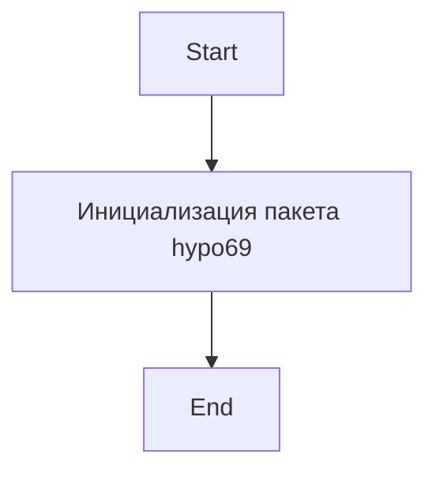

## ИНСТРУКЦИЯ:

Анализируй предоставленный код подробно и объясни его функциональность. Ответ должен включать три раздела:  

1. **<алгоритм>**: Опиши рабочий процесс в виде пошаговой блок-схемы, включая примеры для каждого логического блока, и проиллюстрируй поток данных между функциями, классами или методами.  
2. **<mermaid>**: Напиши код для диаграммы в формате `mermaid`, проанализируй и объясни все зависимости, 
    которые импортируются при создании диаграммы. 
    **ВАЖНО!** Убедитесь, что все имена переменных, используемые в диаграмме `mermaid`, 
    имеют осмысленные и описательные имена. Имена переменных вроде `A`, `B`, `C`, и т.д., не допускаются!  
    
    **Дополнительно**: Если в коде есть импорт `import header`, добавьте блок `mermaid` flowchart, объясняющий `header.py`:\
    ```mermaid\
    flowchart TD\
        Start --> Header[<code>header.py</code><br> Determine Project Root]\
    \
        Header --> import[Import Global Settings: <br><code>from src import gs</code>] \
    ```\

3. **<объяснение>**: Предоставьте подробные объяснения:  
   - **Импорты**: Их назначение и взаимосвязь с другими пакетами `src.`.  
   - **Классы**: Их роль, атрибуты, методы и взаимодействие с другими компонентами проекта.  
   - **Функции**: Их аргументы, возвращаемые значения, назначение и примеры.  
   - **Переменные**: Их типы и использование.  
   - Выделите потенциальные ошибки или области для улучшения.  

Дополнительно, постройте цепочку взаимосвязей с другими частями проекта (если применимо).  

Это обеспечивает всесторонний и структурированный анализ кода.
## Формат ответа: `.md` (markdown)
**КОНЕЦ ИНСТРУКЦИИ**

## <алгоритм>

Данный файл `__init__.py` в директории `hypo69` является файлом инициализации пакета Python. В текущем виде он содержит только комментарии и закомментированные импорты, что означает, что данный пакет в основном является местом для будущей функциональности.

Поскольку активного кода нет, то и блок-схема будет очень простой:

```
Start --> Init[Инициализация пакета hypo69] --> End
```

В будущем, если закомментированные импорты будут раскомментированы, тогда блок схема станет более сложной.

Пример с импортом `CodeAssistant`:
```
Start --> Init[Инициализация пакета hypo69] --> ImportCodeAssistant[Импорт CodeAssistant из .code_assistant] --> End
```
Пример с импортом `small_talk_bot`:
```
Start --> Init[Инициализация пакета hypo69] --> ImportSmallTalkBot[Импорт small_talk_bot из .small_talk_bot] --> End
```
Если будут присутствовать оба импорта, схема будет выглядеть так:
```
Start --> Init[Инициализация пакета hypo69] --> ImportCodeAssistant[Импорт CodeAssistant из .code_assistant] --> ImportSmallTalkBot[Импорт small_talk_bot из .small_talk_bot] --> End
```
## <mermaid>



**Объяснение:**

- `Start`: Начало процесса инициализации пакета.
- `InitPackage`: Этап инициализации пакета `hypo69`. В данном случае, это просто означает, что Python знает о существовании пакета в указанной директории.
- `End`: Завершение процесса.

**Зависимости:**

В текущем состоянии, код не имеет каких-либо зависимостей, так как все импорты закомментированы. Если бы импорты были активны, мы бы увидели зависимости от `code_assistant` и `small_talk_bot`, которые, вероятно, находятся в том же пакете.
  
## <объяснение>

**Импорты:**

В текущем виде, импорты закомментированы. 
- `from .code_assistant import CodeAssistant`: Предполагает импорт класса `CodeAssistant` из модуля `code_assistant.py`, который находится в той же директории, что и файл `__init__.py`. Это подразумевает наличие функциональности ассистента для работы с кодом.
- `from .small_talk_bot import bot as small_talk_bot`: Импортирует переменную `bot` из модуля `small_talk_bot.py` и переименовывает ее в `small_talk_bot`. Скорее всего, это объект бота, предназначенного для диалоговых взаимодействий.

**Классы:**

В текущем виде классы не определены.  Если импорт `CodeAssistant` был бы активным, то класс `CodeAssistant` был бы доступен для использования в рамках пакета `hypo69`.
 
**Функции:**

В текущем виде функции отсутствуют. Если бы импорт `small_talk_bot` был активным, переменная `small_talk_bot` могла бы ссылаться на объект или функцию, но сейчас это неявно из этого кода.

**Переменные:**

- В текущем виде переменные не определены. Если бы импорт `small_talk_bot` был активным, `small_talk_bot` был бы переменной, содержащей объект бота.

**Потенциальные ошибки и области для улучшения:**

- **Отсутствие функциональности:** В текущем виде файл `__init__.py` не содержит никакой функциональности, кроме комментариев. Это может быть приемлемо, если пакет предназначен только для хранения других модулей.
- **Закомментированные импорты:** Импорты закомментированы, что говорит о том, что функциональность может быть не готова к использованию или находится на этапе разработки.
- **Недостаточная документация:** Документация `.. module::`  указывает на наличие документации, но в коде она не видна.

**Взаимосвязи с другими частями проекта:**

- Пакет `hypo69` находится в структуре проекта `src/endpoints`. Это предполагает, что данный пакет отвечает за функциональность какого-либо эндпоинта.
- Комментированные импорты намекают на взаимодействие с модулями `code_assistant` и `small_talk_bot`, которые также являются частью проекта.

В заключение, файл `__init__.py` в текущем состоянии является точкой входа для пакета `hypo69`, но сам по себе не содержит никакого исполняемого кода. Его главная функция состоит в подготовке пакета к будущему использованию и предоставлении места для импорта модулей.